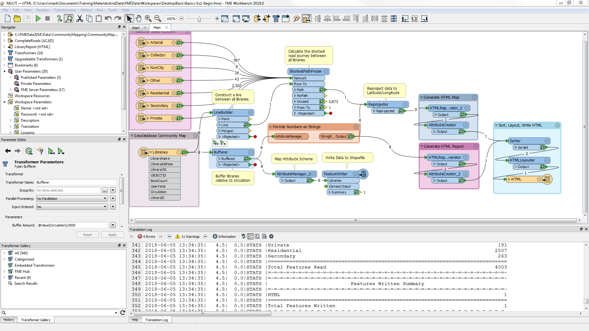
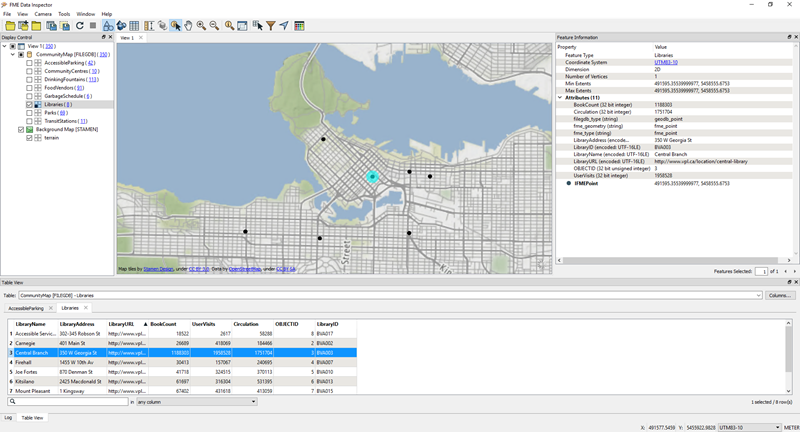

# FME Desktop组件

本课程是关于FME Desktop的。FME Desktop用于桌面级别的数据转换和变换（与FME Server相反，后者是基于Web的企业级产品）。

FME Desktop包含许多不同的工具和应用程序。两个关键应用程序是**FME Workbench**和**FME Data Inspector**。

## FME Workbench

FME Workbench是定义数据转换和数据变换的主要工具。它具有直观的点击式图形界面，可以将转换图形化地描述为数据流。

Workbench不是一个独立的工具。它完全集成，可与其他FME桌面应用程序（如FME Data Inspector）进行交互。

## FME Data Inspector

FME Data Inspector是一种用于查看任何FME支持格式的数据的工具。它主要用于在转换之前预览数据或在转换后查看数据。

  
地图瓦片由[Stamen Design](https://stamen.com/)提供，许可由[CC-BY-3.0](https://creativecommons.org/licenses/by/3.0)。数据提供由[OpenStreetMapt](http://openstreetmap.org/)，许可由[CC-BY-SA](http://creativecommons.org/licenses/by-sa/3.0)。

## FME工具

除了Workbench和Data Inspector之外，还有其他几个FME实用程序。

* **FME帮助**
  * 用于浏览FME的各种帮助文档的工具。
* **FME快速转换器**
  * FME Workbench的前身，仅用于无需数据变换的快速转换。
* **FME集成控制台**
  * 用于将FME功能嵌入到其他GIS和CAD应用程序（如ArcGIS，AutoCAD，Geomedia和MapInfo）中的工具。
* **FME许可助理**
  * 管理FME许可的申请。

## 其他FME Desktop组件

其他组件也包含在FME Desktop（专业版或更高版本）中。

* **FME命令行引擎**
  * FME命令行引擎允许在命令行级别启动转换。
* **FME Plug-In SDK**
  * FME Plug-In SDK允许开发人员向FME核心添加格式和功能。

