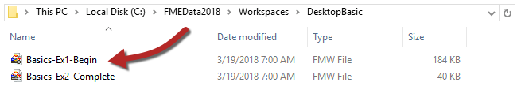
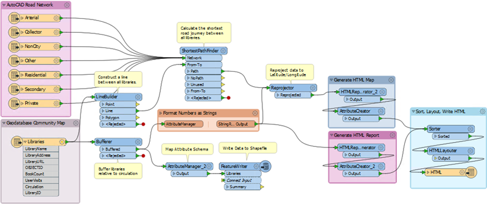
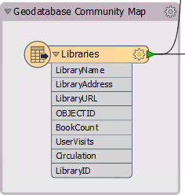
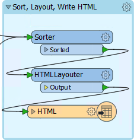
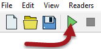
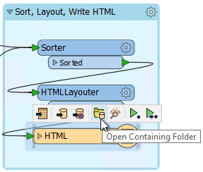
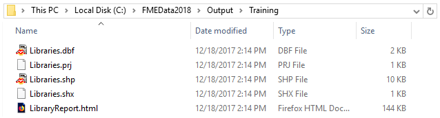

# 练习：探索FME

|  练习1 |  打开和运行工作空间 |
| :--- | :--- |
| 数据 | 库（Esri Geodatabase） 道路（AutoCAD DWG） |
| 总体目标 | 打开并运行FME工作空间以探索它可以对数据执行的操作 |
| 演示 | 打开并运行工作空间 |
| 启动工作空间 | C:\FMEData2018\Workspaces\DesktopBasic\Basics-Ex1-Begin.fmw |
| 结束工作空间 | N / A |

不要试图解释FME是什么和做什么，而是让我们自己尝试一下！

**1）查找工作空间文件**  
在FME中定义转换和变换时，可以将它们保存在.fmw文件中。

使用文件资源管理器，浏览到上面列出的文件：

双击该文件。它将打开一个名为FME Workbench的应用程序。

  
**2）探索FME工作空间**  
在FME Workbench中，通过单击“不再显示我”来关闭可能打开的任何“开始”对话框。

该应用程序的主要部分将如下所示：

这部分我们称之为画布。它是以图形方式定义数据的转换和变换的地方。虽然它可能看起来很复杂，但使用FME创建此类型的工作流程并不需要太多练习。

检查画布的左侧：

这个区域是我们读取数据的地方，在本例中是Esri地理数据库中的一个库表。它是ETL的“E”（Extract）部分。

现在看右边：

这个区域是我们编写数据的地方，在本例中，是HTML格式的库报告。它是ETL的“L”（加载）部分。

读模块和写模块之间是转换数据的对象。它们代表ETL的“T”（变换）部分。

标签和其他注释向我们展示了工作空间的功能。它：

* 读取道路（AutoCAD DWG）和库（Esri Geodatabase）
* 计算所有图书馆的最短道路路线
* 创建直径相对于图书馆图书流通的圆圈
* 创建HTML报告和库的HTML映射
* 将数据写入HTML以及Esri Shapefile

|  警察局长Webb-Mapp说...... |
| :--- |
|  我是警察局长，负责追查针对FME的犯罪行为。  所以，让我们确保您获得正确的术语。应用程序本身称为FME“Workbench”，但在画布窗口中定义的过程称为“工作空间”。条款非常相似，很容易混淆，但请不要。否则，我将不得不派我的语法小队逮捕你！  虽然虐待FME术语是一种轻微的冒犯，但被抓住的耻辱是持久的！ |

  
**3）运行FME工作空间**  
让我们运行此工作空间。要执行此操作，请单击Workbench工具栏上的绿色运行按钮：

工作空间现在将运行。当它这样做时，您将在日志窗口中看到消息传递。您还可能会在画布连接上看到数字，并在每个对象上看到绿色带注释的图标。我们将在以后了解这些内容！

  
**4）找到并检查输出**  
转换完成后，单击画布上的HTML写模块对象。选择打开包含文件夹的选项：

在打开的资源管理器对话框中，您将找到HTML输出和Shapefile数据集：

打开Firefox或Chrome等Web浏览器。打开由FME创建的输出文件（通常是Ctrl + O或文件&gt;打开是最简单的方法）。您将看到一个库表，一个库统计图表，以及一个显示库所在位置的交互式地图。所有这些都是由FME从传入的地理数据库点和属性生成的：

|  Vector小姐说...... |
| :--- |
|  这个小型演示展示了FME的强大功能。此工作空间从多个空间数据集中读取数据，并以空间和“表”格式将其写入数据集。在它之间进行了一系列的转换和空间分析，缓冲和重新投影数据，并创造附加价值和信息。 |

<table>
  <thead>
    <tr>
      <th style="text-align:left">恭喜</th>
    </tr>
  </thead>
  <tbody>
    <tr>
      <td style="text-align:left">
        
通过完成本练习，您已学会如何：
           
        

        <ul>
          <li>打开FME工作空间</li>
          <li>运行FME工作空间</li>
          <li>找到FME工作空间的输出</li>
        </ul>
      </td>
    </tr>
  </tbody>
</table>