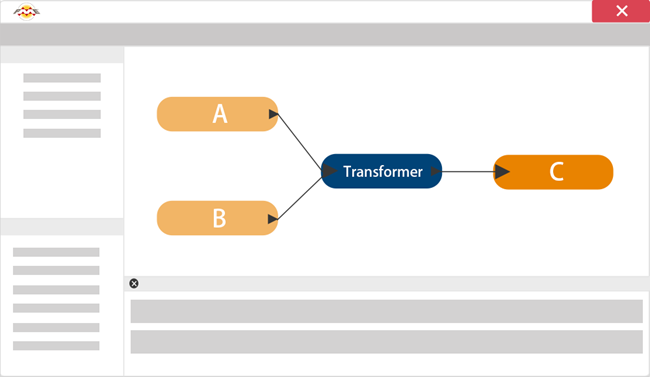

# 什么是FME？

**FME（要素操作引擎）**是一种数据转换和变换工具，用于解决数据互操作性问题，无需编码。

## 提取，转换和加载

FME有时被归类为**ETL**应用程序。ETL代表Extract，Transform和Load。它是一个数据仓库工具，可以从多个源（此处为A和B）提取数据，对其进行转换以满足用户的需求并将其加载到目标（C）中：

虽然大多数ETL工具仅处理表格数据，但FME还具有处理空间数据所需的处理能力，因此称为**空间ETL**。

## FME如何工作

FME的核心是一个支持一系列空间和表格数据类型和格式的引擎; GIS，CAD，BIM，Point Cloud，XML，Raster，数据库[等等](https://www.safe.com/integrate/#!)。

通过处理所有可能的属性和几何类型的丰富数据模型，可以支持如此多的数据类型。

最重要的是，数据转换过程对用户是无缝的; FME根据需要自动在数据类型之间进行转换，并自动将一种属性或几何类型替换为目标格式不支持的另一种属性或几何类型。

|  Vector小姐说...... |
| :--- |
|  学生们注意了！我是Vector，FME教师。我来这里测试你关于FME。我希望你不要弄错这些问题！  Q）ETL是......的首字母缩写？  [1.地外生命形态](http://52.73.3.37/fmedatastreaming/Manual/QAResponse2017.fmw?chapter=1&question=1&answer=1&DestDataset_TEXTLINE=C%3A%5CFMEOutput%5CQAResponse.html) [2.提取，转换，加载](http://52.73.3.37/fmedatastreaming/Manual/QAResponse2017.fmw?chapter=1&question=1&answer=2&DestDataset_TEXTLINE=C%3A%5CFMEOutput%5CQAResponse.html) [3.快速收费车道](http://52.73.3.37/fmedatastreaming/Manual/QAResponse2017.fmw?chapter=1&question=1&answer=3&DestDataset_TEXTLINE=C%3A%5CFMEOutput%5CQAResponse.html) [4.吃，变换，爱](http://52.73.3.37/fmedatastreaming/Manual/QAResponse2017.fmw?chapter=1&question=1&answer=4&DestDataset_TEXTLINE=C%3A%5CFMEOutput%5CQAResponse.html)   Q）FME可以在如此多的格式之间无缝转换，因为它有......  [1.一个有知觉的数据字典](http://52.73.3.37/fmedatastreaming/Manual/QAResponse2017.fmw?chapter=1&question=2&answer=1&DestDataset_TEXTLINE=C%3A%5CFMEOutput%5CQAResponse.html) [2.一个复古增压器](http://52.73.3.37/fmedatastreaming/Manual/QAResponse2017.fmw?chapter=1&question=2&answer=2&DestDataset_TEXTLINE=C%3A%5CFMEOutput%5CQAResponse.html) [3.丰富的数据模型](http://52.73.3.37/fmedatastreaming/Manual/QAResponse2017.fmw?chapter=1&question=2&answer=3&DestDataset_TEXTLINE=C%3A%5CFMEOutput%5CQAResponse.html) [4.独角兽头发的核心](http://52.73.3.37/fmedatastreaming/Manual/QAResponse2017.fmw?chapter=1&question=2&answer=4&DestDataset_TEXTLINE=C%3A%5CFMEOutput%5CQAResponse.html) |

