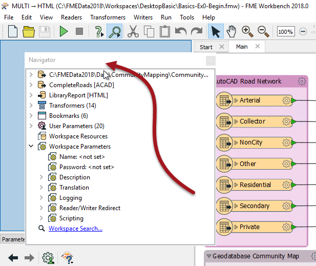

# Workbench中的窗口控件

Workbench中的所有窗口都可以从其默认位置分离并存放在自定义位置。要执行此操作，只需单击窗口框架并将其拖动到新位置即可。

  
如果窗口放在现有窗口的顶部，那么这两个窗口将成为**选项卡式的**。

如果窗口放在现有窗口旁边（或两个现有窗口之间），则它们将**堆叠在一起**。

在上面的屏幕截图中，用户将导航器放在Workbench左侧的位置，堆叠在参数编辑器的顶部。

|  FireFighter Mapp说...... |
| :--- |
|  你好。我是你友好的街区消防队员，给你一个热门的技巧。不要因缺乏画布空间而感到沮丧。按F11将较少使用的窗口发送到一侧，并将画布窗口展开到惊人的大小！ |

|  Vector小姐说...... |
| :--- |
|  尝试使用Workbench窗口（在View菜单下查看）来回答以下问题：  这些中的哪个是一个FME Workbench窗口？  [1.数学窗口](http://52.73.3.37/fmedatastreaming/Manual/QAResponse2017.fmw?chapter=1&question=5&answer=1&DestDataset_TEXTLINE=C%3A%5CFMEOutput%5CQAResponse.html) [2.地理窗口](http://52.73.3.37/fmedatastreaming/Manual/QAResponse2017.fmw?chapter=1&question=5&answer=2&DestDataset_TEXTLINE=C%3A%5CFMEOutput%5CQAResponse.html) [3.英国文学窗口](http://52.73.3.37/fmedatastreaming/Manual/QAResponse2017.fmw?chapter=1&question=5&answer=3&DestDataset_TEXTLINE=C%3A%5CFMEOutput%5CQAResponse.html) [4.历史窗口](http://52.73.3.37/fmedatastreaming/Manual/QAResponse2017.fmw?chapter=1&question=5&answer=4&DestDataset_TEXTLINE=C%3A%5CFMEOutput%5CQAResponse.html)  哪些不是FME Workbench中的窗口排列？  [1.堆叠](http://52.73.3.37/fmedatastreaming/Manual/QAResponse2017.fmw?chapter=1&question=6&answer=1&DestDataset_TEXTLINE=C%3A%5CFMEOutput%5CQAResponse.html) [2.浮动](http://52.73.3.37/fmedatastreaming/Manual/QAResponse2017.fmw?chapter=1&question=6&answer=2&DestDataset_TEXTLINE=C%3A%5CFMEOutput%5CQAResponse.html) [3.双层玻璃](http://52.73.3.37/fmedatastreaming/Manual/QAResponse2017.fmw?chapter=1&question=6&answer=3&DestDataset_TEXTLINE=C%3A%5CFMEOutput%5CQAResponse.html) [4.选项卡式的](http://52.73.3.37/fmedatastreaming/Manual/QAResponse2017.fmw?chapter=1&question=6&answer=4&DestDataset_TEXTLINE=C%3A%5CFMEOutput%5CQAResponse.html) |

