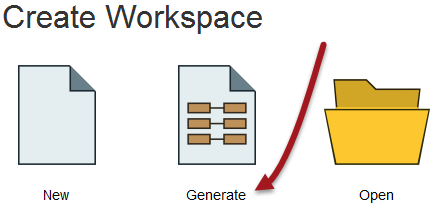
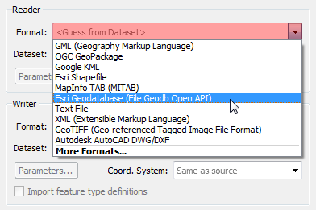

# 创建转换

Workbench的直观界面使您可以轻松设置和运行简单的格式到格式（“快速”）转换。

## “开始”选项卡

FME Workbench中的“开始”选项卡包含创建或打开工作空间的不同方法。最简单的方法是Generate Workspace：

## 生成工作空间对话框

“生成工作空间”对话框将所有选项压缩为单个对话框。它具有用于定义要读取的数据和要写入的数据的格式和位置的字段。

FME对话框中的红色着色表示必填字段。用户必须在这些字段中输入数据才能继续。在大多数对话框中，“确定”按钮将被取消激活，直到必填字段完成。

### 格式和数据集选择

关键要求是源数据的格式。FME中的所有格式选择字段都是下拉菜单和文本输入字段。

文本输入字段允许您直接键入格式名称。它具有“智能完成”功能，可在您键入时选择紧密匹配。

下拉列表显示了一些最常用的格式，因此可以立即获得许多喜爱的格式：

单击“更多格式”，将打开一个表格，显示FME支持的所有格式。

源数据集是另一个关键要求。数据集选择字段是文本输入字段，但具有浏览按钮以打开类似于资源管理器的文件选择对话框。

同样，写模块格式和数据集在此对话框中定义：

|  Vector小姐说...... |
| :--- |
|  这是一个你无法用'a'，'b'，'c'或'd'回答的问题！在“生成工作空间”对话框中，为什么在浏览源数据之前设置数据格式有用呢？  在设置格式类型之前尝试浏览数据集，看看是否可以[检测到差异。](http://52.73.3.37/fmedatastreaming/Manual/QAResponse2017.fmw?chapter=1&question=7&answer=1&DestDataset_TEXTLINE=C%3A%5CFMEOutput%5CQAResponse.html) |

## 要素类型对话框

单击“生成工作空间”对话框上的“确定”会导致FME生成已定义的工作空间。但是，只要源数据集包含多个图层，就会首先提示用户选择要转换的图层。

这是通过“选择要素类型”对话框实现的。在FME中，_**要素类型**_是_图层的_另一个术语。只有选定的图层显示在工作空间中。

例如，这是一个“选择要素类型”对话框，其中用户已选择在工作空间中包含所有可用图层。

