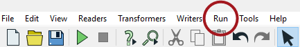
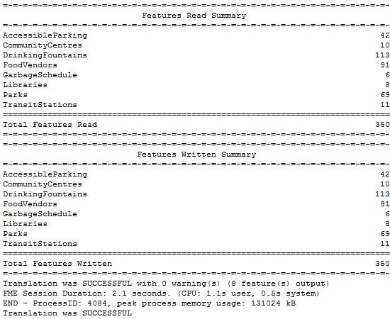

# 运行工作空间

## 运行工作空间

Workbench工具栏上的绿色箭头（或“播放”按钮）启动转换：

或者，在菜单栏上的运行下查看：

菜单栏和工具栏上都会显示相同的工具栏选项。请注意，可以使用快捷方式选项F5：

|  技巧 |
| :--- |
|  “运行”按钮的操作可以通过一系列选项进行修改，包括提示用户输入的功能（使用提示符运行），缓存中间数据的功能（使用完全检查运行）以及在调试模式下运行的功能（断点运行）。这些是可以随意打开和关闭的切换选项。 |

## 工作空间结果

运行工作空间后，可在转换日志中找到相关信息和统计信息，该日志显示在Workbench日志窗口中。

转换日志显示转换是成功还是失败，从源读取多少要素并写入目标，以及执行转换所需的时间。

在此示例中，日志文件显示已读取350个要素（来自Esri地理数据库）并已写出（到GML数据集）。

整个过程取得了成功，没有任何警告。转换的经过时间是2.1秒。

|  Vector小姐说...... |
| :--- |
|  我打赌你到目前为止所有的问题都是正确的！做得好。现在看看你是否可以得到这些：  其中哪一个不是设置转换格式的方法？  [1.键入格式名称](http://52.73.3.37/fmedatastreaming/Manual/QAResponse2017.fmw?chapter=1&question=8&answer=1&DestDataset_TEXTLINE=C%3A%5CFMEOutput%5CQAResponse.html) [2.从下拉列表中选择格式](http://52.73.3.37/fmedatastreaming/Manual/QAResponse2017.fmw?chapter=1&question=8&answer=2&DestDataset_TEXTLINE=C%3A%5CFMEOutput%5CQAResponse.html) [3.浏览格式库中的格式](http://52.73.3.37/fmedatastreaming/Manual/QAResponse2017.fmw?chapter=1&question=8&answer=3&DestDataset_TEXTLINE=C%3A%5CFMEOutput%5CQAResponse.html) [4.选择具有已知文件扩展名的数据集](http://52.73.3.37/fmedatastreaming/Manual/QAResponse2017.fmw?chapter=1&question=8&answer=4&DestDataset_TEXTLINE=C%3A%5CFMEOutput%5CQAResponse.html) [5.以上都不是（它们都是设置格式的有效方式）](http://52.73.3.37/fmedatastreaming/Manual/QAResponse2017.fmw?chapter=1&question=8&answer=5&DestDataset_TEXTLINE=C%3A%5CFMEOutput%5CQAResponse.html)  哪个键是运行工作空间的快捷方式？  [1. F4](http://52.73.3.37/fmedatastreaming/Manual/QAResponse2017.fmw?chapter=1&question=9&answer=1&DestDataset_TEXTLINE=C%3A%5CFMEOutput%5CQAResponse.html) [2. F5](http://52.73.3.37/fmedatastreaming/Manual/QAResponse2017.fmw?chapter=1&question=9&answer=2&DestDataset_TEXTLINE=C%3A%5CFMEOutput%5CQAResponse.html) [3. F5.6](http://52.73.3.37/fmedatastreaming/Manual/QAResponse2017.fmw?chapter=1&question=9&answer=3&DestDataset_TEXTLINE=C%3A%5CFMEOutput%5CQAResponse.html) [4. F＃](http://52.73.3.37/fmedatastreaming/Manual/QAResponse2017.fmw?chapter=1&question=9&answer=4&DestDataset_TEXTLINE=C%3A%5CFMEOutput%5CQAResponse.html) |

