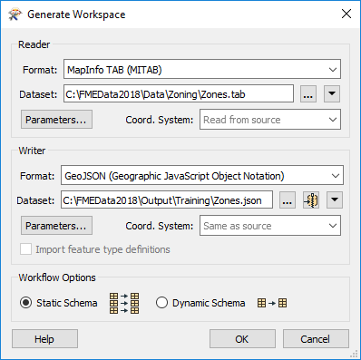
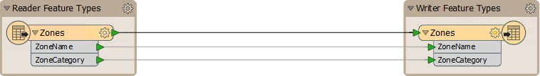
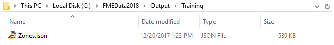

# 练习：基本工作空间创建

|  练习2 |  基本工作空间创建 |
| :--- | :--- |
| 数据 | 分区数据（MapInfo TAB） |
| 总体目标 | 创建工作空间以将MapInfo TAB格式的分区数据转换为GeoJSON（地理JavaScript对象表示法） |
| 演示 | 使用FME Workbench创建基本工作空间 |
| 启动工作空间 | 无 |
| 结束工作空间 | C:\FMEData2018\Workspaces\DesktopBasic\Basics-Ex2-Complete.fmw |

恭喜！您刚刚在当地城市的GIS部门担任技术分析师。你的老教师，Vector小姐，给了你一个参考，所以不要让她失望！

在第一天，您被要求进行简单的文件格式转换。

我们已经概述了您需要采取的所有操作，尽管FME的界面非常直观，您应该能够在不需要这些分步说明的情况下进行练习。

**1）启动FME Workbench**  
如果它尚未打开，请从Windows开始菜单中选择它来启动FME Workbench。您可以在开始&gt; FME Desktop 2018.0&gt; FME Workbench 2018.0下找到它。

如果Workbench已打开，请单击主画布上方的“开始”选项卡。

  
**2）选择生成工作空间**  
在开始页面的生成工作空间部分中选择生成（工作空间）选项。或者，您可以使用快捷键Ctrl + G.

  
**3）定义转换**  
 生成工作空间工具打开一个对话框，用于定义要执行的转换。填写此对话框中的字段，如下所示：

| 读模块格式 | MapInfo TAB（MITAB） |
| :--- | :--- |
| 读模块数据集 | C:\FMEData2018\Data\Zoning\Zones.tab |
| 作家格式 | GeoJSON（地理JavaScript对象表示法） |
| 作家数据集 | C:\FMEData2018\Output\Training\Zones.json |

对话框如下所示：

请记住，您可以通过键入名称，从下拉列表中选择格式，或选择“更多格式”并从完整格式表中选择格式来设置格式。现在，忽略工作流选项并保留默认的“静态模式”。

  
**4）生成并检查工作空间**  
单击“确定”关闭“生成工作空间”对话框。将在FME Workbench画布中生成一个新工作空间：

单击每个对象上的箭头图标即可显示属性列表。

  
**5）运行工作空间**  
通过单击工具栏上的运行按钮或使用菜单栏上的“运行”&gt;“运行转换”来运行工作空间。工作空间运行，日志文件报告成功转换：

  
**6）定位输出**  
在Windows资源管理器中找到目标数据，以证明它已按预期写入（不要忘记练习1中的“打开包含文件夹”按钮）。在下一节中，我们将介绍如何直观地检查数据集以确保它是正确的。

  
**7）保存工作空间**  
保存工作空间。我们将在以后的练习中使用它。请记住，有一个工具栏保存按钮，在菜单上有文件&gt;另存为。

|  技巧 |
| :--- |
|  如果在没有调整的情况下立即运行转换，则称为“快速转换”。因为FME是一个“语义”转换器，具有增强的数据模型，考虑到目标格式的功能，快速转换的输出尽可能接近结构和意义上的源数据。 |

<table>
  <thead>
    <tr>
      <th style="text-align:left">恭喜</th>
    </tr>
  </thead>
  <tbody>
    <tr>
      <td style="text-align:left">
        
通过完成本练习，您已学会如何：
           
        

        <ul>
          <li>创建FME工作空间</li>
          <li>运行FME工作空间</li>
        </ul>
      </td>
    </tr>
  </tbody>
</table>