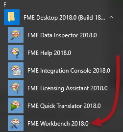
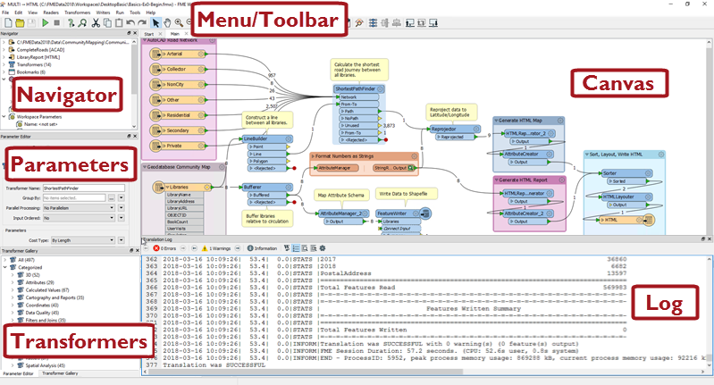
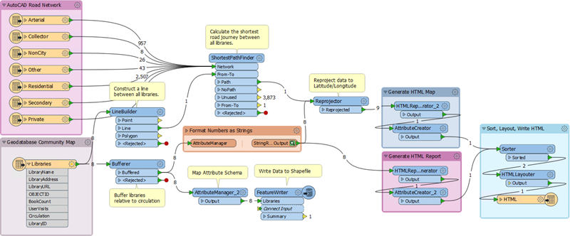

# FME Workbench简介

让我们仔细看看FME Workbench，首先是如何启动它。要启动Workbench - 除了双击fmw文件外 - 在Windows开始菜单中找到Workbench：

## FME Workbench的主要组件

FME Workbench用户界面有许多主要组件：

### 画布

正如我们所见，FME Workbench画布是定义转换的地方。它是Workbench中的主要窗口：

默认情况下，工作空间从左到右读取; 左侧的数据源，中间的转换工具和右侧的数据目标。每个项目之间的连接表示数据流，可以分支在不同的方向，合并在一起，或两者兼而有之。

### 菜单/工具栏

菜单栏和工具栏包含许多工具：例如，用于在Workbench画布周围导航，控制管理任务以及添加或删除读模块/写模块的工具：

### 导航器

“导航”窗口是一个结构化的参数列表，用于表示和控制转换的所有组件：

### 转换器库

转换器库是用于定位和选择FME转换工具的工具。

转换器的数量（以上，484）将根据FME的版本和安装的任何可选定制转换器而有所不同：

### 转换日志

转换日志报告转换和其他操作。信息包括任何警告或错误消息，转换状态，转换长度以及处理的要素数量：

### 参数编辑器窗口

参数编辑器窗口用于编辑画布窗口上对象的参数：

如下一节所示，您可以随意打开或关闭这些窗口，或者将它们重新排列为您喜欢的任何配置。

|  Vector小姐说...... |
| :--- |
|  随着课程的深入，问题会变得越来越难。不过，这些非常简单：  以下哪些应用程序不属于FME Desktop？  [1. FME Workbench](http://52.73.3.37/fmedatastreaming/Manual/QAResponse2017.fmw?chapter=1&question=3&answer=1&DestDataset_TEXTLINE=C%3A%5CFMEOutput%5CQAResponse.html) [2. FME集成控制台](http://52.73.3.37/fmedatastreaming/Manual/QAResponse2017.fmw?chapter=1&question=3&answer=2&DestDataset_TEXTLINE=C%3A%5CFMEOutput%5CQAResponse.html) [3. FME Server控制台](http://52.73.3.37/fmedatastreaming/Manual/QAResponse2017.fmw?chapter=1&question=3&answer=3&DestDataset_TEXTLINE=C%3A%5CFMEOutput%5CQAResponse.html) [4. FME Data Inspector](http://52.73.3.37/fmedatastreaming/Manual/QAResponse2017.fmw?chapter=1&question=3&answer=4&DestDataset_TEXTLINE=C%3A%5CFMEOutput%5CQAResponse.html)   FME Workbench允许您以哪种方式定义数据流...  [1.图形化地](http://52.73.3.37/fmedatastreaming/Manual/QAResponse2017.fmw?chapter=1&question=4&answer=1&DestDataset_TEXTLINE=C%3A%5CFMEOutput%5CQAResponse.html) [2.心灵感应地](http://52.73.3.37/fmedatastreaming/Manual/QAResponse2017.fmw?chapter=1&question=4&answer=2&DestDataset_TEXTLINE=C%3A%5CFMEOutput%5CQAResponse.html) [3.有问题地](http://52.73.3.37/fmedatastreaming/Manual/QAResponse2017.fmw?chapter=1&question=4&answer=3&DestDataset_TEXTLINE=C%3A%5CFMEOutput%5CQAResponse.html) [4.通过编写大量代码用C ++或Java](http://52.73.3.37/fmedatastreaming/Manual/QAResponse2017.fmw?chapter=1&question=4&answer=4&DestDataset_TEXTLINE=C%3A%5CFMEOutput%5CQAResponse.html)  |

