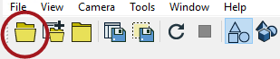
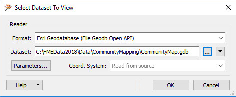
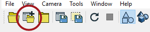

# 在FME Data Inspector中查看数据

使用FME Data Inspector，可以轻松打开和查看任意数量的数据集并查询其中的要素。

## 查看数据

FME Data Inspector提供了两种查看数据的方法：打开或添加。

_**打开**_ 一个数据集将打开一个新的视图窗口，供其显示。 _**添加**_ 一个数据集将在现有视图窗口中显示数据; 这样，可以同时查看多个数据集。

### 打开一个数据集

可以通过多种方式在FME Data Inspector中打开数据集。

* 从菜单栏中选择“文件”&gt;“打开数据集”
* 选择工具栏按钮打开数据集。
* 将文件拖放到任何窗口（“视图”窗口除外）
* 从Workbench中打开

只需右键单击画布要素类型（源或目标）并选择“检查”选项，即可在FME Workbench中打开数据。

所有这些方法都会导致在FME Data Inspector中打开一个对话框，用于定义要查看的数据集。

### 添加数据集

打开数据集会导致创建新的“视图”选项卡并显示数据。要在现有视图选项卡中打开数据集，需要使用工具添加数据集。

* 从菜单栏中选择“文件”&gt;“添加数据集”
* 选择工具栏按钮添加数据集
* 将文件拖放到视图窗口中

### 窗口工具

一旦在FME Data Inspector中打开数据后，有许多工具可用于更改视图。

* 拖动
* 放大
* 缩小
* 缩放到所选要素
* 缩放到数据的完整范围

|  技巧 |
| :--- |
|  按键盘上的Shift键，它将激活Inspector中的放大工具。按Ctrl键，将激活缩小工具。释放键以恢复到以前的工具。   此功能允许用户在按键时快速在查询和导航模式之间切换，因此无需在菜单栏或工具栏上的查询和导航工具之间进行单击。 |

