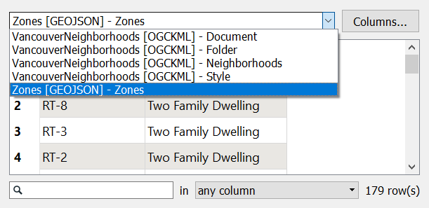

# 查询FMEData Inspector中的数据

FME Data Inspector包含多个查询工具，但其中两个特别重要：

* 查询个别要素
* 在视图窗口中测量距离

查询工具按钮就像一个切换键。默认情况下，它在您启动FME Data Inspector时处于活动状态; 如果再次单击它 - 或选择窗口工具 - 则关闭查询工具。

要素查询的结果显示在“要素信息”窗口中。

## 要素信息窗口

此窗口的上半部分报告有关该要素的一般信息; 它所属的要素类型（图层/表格），它所处的坐标系，是二维还是三维，以及它拥有多少个顶点。

中间部分报告与该要素关联的属性，包括用户属性和格式属性（例如_fme\_type_）。

下半部分报告要素的几何形状。它包括几何类型和构成要素的坐标列表。

## 表视图窗口

还有一个名为表视图的窗口。

表视图是一种以表格式电子表格式布局检查数据的方法。虽然它没有信息窗口所示的相同信息深度，但表格视图对于同时检查多个要素的属性值特别有用。

您可以通过单击表视图顶部的下拉菜单在表视图中的要素类型之间来回切换。

|  技巧 |
| :--- |
|  为了提高性能，只有从下拉列表中选择或在当前视图窗口中查询时，才会自动显示表格。 |

|  Vector小姐说...... |
| :--- |
|  启动FME Data Inspector并打开数据集。在“表视图”窗口中，右键单击记录和列标题以查看上下文菜单。以下哪项不是可用的菜单选项：  [1.排序（按字母顺序或数字顺序）](http://52.73.3.37/fmedatastreaming/Manual/QAResponse2017.fmw?chapter=1&question=11&answer=1&DestDataset_TEXTLINE=C%3A%5CFMEOutput%5CQAResponse.html) [2.检查值](http://52.73.3.37/fmedatastreaming/Manual/QAResponse2017.fmw?chapter=1&question=11&answer=2&DestDataset_TEXTLINE=C%3A%5CFMEOutput%5CQAResponse.html) [3.剪切/复制/粘贴](http://52.73.3.37/fmedatastreaming/Manual/QAResponse2017.fmw?chapter=1&question=11&answer=3&DestDataset_TEXTLINE=C%3A%5CFMEOutput%5CQAResponse.html) [4.将所选数据另存为](http://52.73.3.37/fmedatastreaming/Manual/QAResponse2017.fmw?chapter=1&question=11&answer=4&DestDataset_TEXTLINE=C%3A%5CFMEOutput%5CQAResponse.html) |

