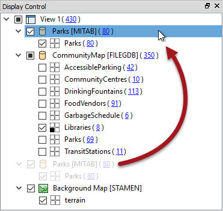
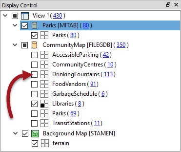
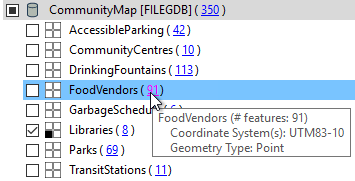
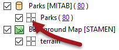
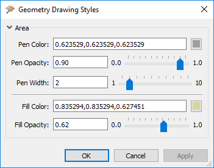

# Data Inspector显示控件

FME Data Inspector具有许多控件以帮助以有序的方式显示数据。

## 显示控制窗口

要素显示顺序的管理在“显示控制”窗口中执行。

可以将每个数据集和要素类型拖到任何其他数据集和要素上，以在“视图”窗口中提升其显示顺序：

要素类型只能在其容器数据集中进行排序。

在显示中，“库”可以提升到“GarbageSchedule”之上，但它们本身不能提升到单独的Parks数据集之上。

## 显示状态

“显示控制”窗口的每个级别都有一个复选框，用于在该级别打开和关闭数据：

您可以选择一次关闭单个图层或整个数据集。

## 要素计数

“显示控制”窗口中的每个“要素类型”都标有其包含的要素数，位于要素类型名称后面的括号中。因此，在上一张图片中，我们可以看到温哥华市有113个饮水机（或113个名为DrinkFountains的要素）。

单击要素计数将选择要在“要素信息”和“表格视图”窗口中显示的所有要素，并激活工具“文件”&gt;“将所选数据另存为：”：

## 样式

可以为每种要素类型指定适用于其几何类型的不同颜色或样式。要访问此要素，请在“显示控制”窗口中单击该要素类型的样式图标：

“绘图样式”对话框允许您为要素设置所有方式的符号系统。这包括要素颜色（和透明度），点图标/符号，点大小，线条粗细等：

请注意，该对话框仅显示可用几何类型的符号系选项。示例是一个多边形要素。其他几何类型显示不同的选项。

