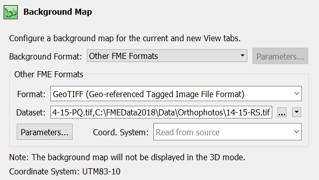
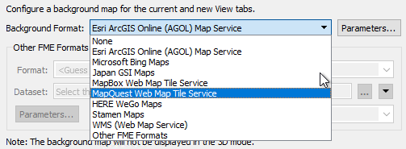
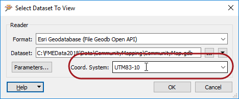

# Data Inspector中的背景地图

过菜单栏上的工具&gt; FME选项下的工具激活将地图（或其他图像）作为背景查看空间数据的功能。

背景地图对话框允许用户选择（用于任何FME支持的格式）的现有数据集作为背景，如下所示：

也可以使用按需提供映射的Web服务。其中一些 - 例如ArcGIS Online - 需要已有帐户：

## 坐标系

必须使用有效坐标系引用源数据才能使用背景地图查看它。如果坐标系未记录在数据集本身中，则可以在打开数据集时将其输入到字段中：

即使存在多个不同坐标系的源数据集，FME也可以根据背景地图显示源数据。FME通过将数据重新投影到背景地图使用的坐标系来完成此操作。因此，建议您在想要检查原始形式的数据时关闭背景地图。

|  警察局长Webb-Mapp说... |
| :--- |
|  您可以在“显示控制”窗口中调整背景地图的符号系统和显示顺序，就像对任何普通数据集一样。 |

