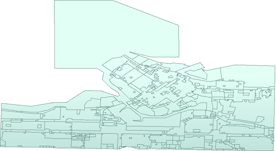
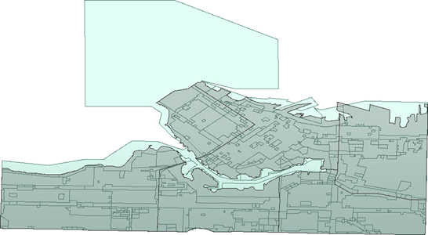

# 练习：基本数据检查

|  练习3 |  基本数据检查 |
| :--- | :--- |
| 数据 | 分区数据（GeoJSON） 街区（Google KML） |
| 总体目标 | 检查先前转换的输出 |
| 演示 | 使用FME Data Inspector进行基本数据检查 |
| 启动工作空间 | 无 |
| 结束工作空间 | 无 |

在上一个练习中，您被要求在格式之间转换一些数据。在发送转换后的数据之前，您应该检查它以确保它是正确的。让我们通过检查快速转换的输出来了解FME Data Inspector接口的工作原理。

**1）启动FME Data Inspector**  
从Windows开始菜单中选择FME Data Inspector，启动它。您可以在“开始”&gt;“FME Desktop 2018.0”&gt;“FME Data Inspector 2018.0”下找到它。

  
**2）打开数据集**  
 FME Data Inspector将启动并以空视图显示开始。

要打开数据集，请从菜单栏中选择“文件”&gt;“打开数据集”。出现提示时，按如下所示填写“选择数据集”对话框中的字段：

| 读模块格式 | GeoJSON（地理JavaScript对象表示法） |
| :--- | :--- |
| 读模块数据集 | C:\FMEData2018\Output\Training\Zones.json |

_**注意：**_ _如果找不到数据集 - 也许您没有完成第一次练习，或者将数据写入其他位置 - 那么您可以按照练习2中的描述打开原始分区数据集。_

GeoJSON数据集如下所示：

  
**3）浏览数据**  
使用工具栏上的窗口工具浏览数据集，仔细检查。使用“查询”工具查询单个要素并检查“要素信息”窗口中的信息。

尝试右键单击不同的Data Inspector窗口，以发现上下文菜单中存在的要素。

  
**4）添加数据集**  
让我们在显示屏上添加第二个数据集，以便与我们的分区数据进行比较。该数据集将是街区边界的KML文件。然后我们将能够看到每个区域重叠的街区。

要添加数据集，请从菜单栏中选择“文件”&gt;“添加数据集”。出现提示时，按如下所示填写“选择数据集”对话框中的字段：

| 读模块格式 | 谷歌KML |
| :--- | :--- |
| 读模块数据集 | C:\FMEData2018\Data\Boundaries\VancouverNeighborhoods.kml |

显示现在看起来像这样：

使用“表视图”练习检查每种要素类型的表格数据。单击表视图顶部的下拉箭头，在Zones.json和Neighborhoods.kml表之间来回切换：

虽然视图窗口中的图层看起来很混乱，但我们可以清理显示，我们很快就会发现。

<table>
  <thead>
    <tr>
      <th style="text-align:left">恭喜</th>
    </tr>
  </thead>
  <tbody>
    <tr>
      <td style="text-align:left">
        
通过完成本练习，您已学会如何：
           
        

        <ul>
          <li>在FME Data Inspector的新视图中打开数据集</li>
          <li>使用FME Data Inspector中的窗口和检查工具</li>
          <li>使用FME Workbench功能在FME Data Inspector中打开数据集</li>
        </ul>
      </td>
    </tr>
  </tbody>
</table>