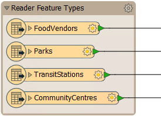
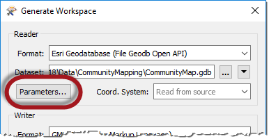
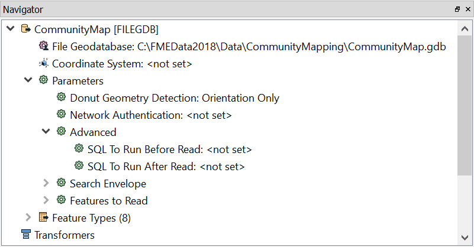
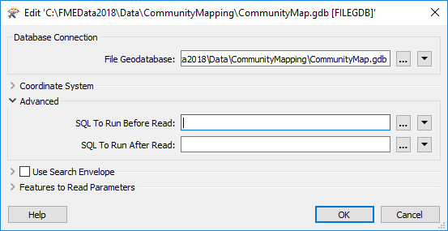

# 读模块参数

我们知道，工作空间包含一个读取数据集的读模块，该数据集中的每个图层都显示在工作空间画布中：

要控制读模块的操作方式，需要使用**读模块**参数。

## 查找读模块参数

通过在生成新工作空间时单击“参数”，可以定位和设置读模块参数：

它们也可以在Workbench的导航r窗口中找到：

因为参数是指相关格式的特定组件和特征，所以不同格式的读模块具有不同的控制参数集。

## 设置读模块参数

要在“导航”窗口中编辑参数，请双击任何参数。这样做会打开一个对话框，其中可以设置参数的值：

|  Workbench博士说.... |
| :--- |
|  读模块参数控制数据集中的所有要素类型。把它想象成酿造一壶咖啡。咖啡机的强度控制会影响所有倒入的杯子。 |

