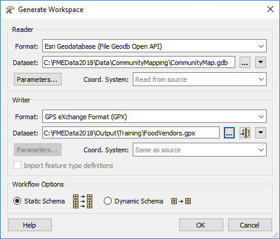
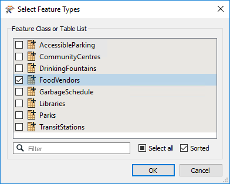
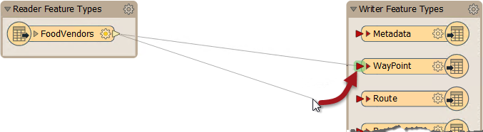
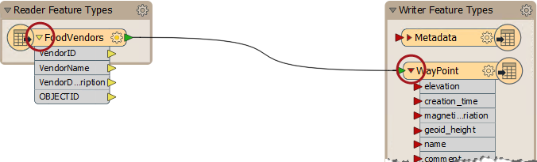
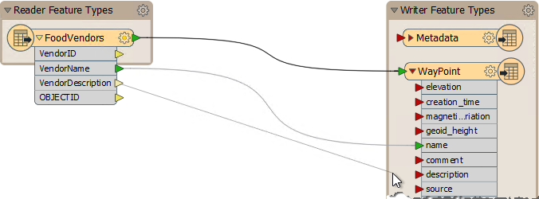
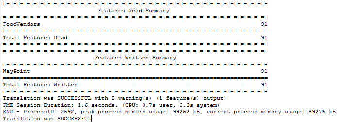
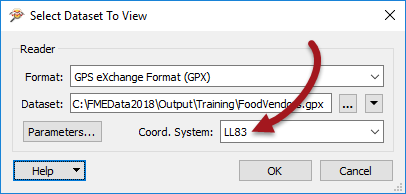
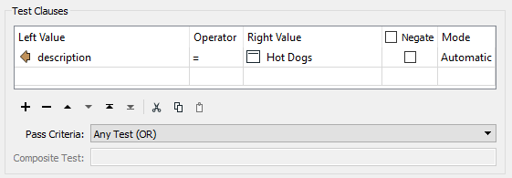

# 练习：旅游局项目

|  练习5 |  旅游局项目 |
| :--- | :--- |
| 数据 | 社区测绘/食品供应商（Esri Geodatabase） |
| 总体目标 | 为当地旅游局创建与GPS兼容的食品供应商数据集 |
| 演示 | 基础数据转换和数据检查 |
| 启动工作空间 | 无 |
| 结束工作空间 | C:\FMEData2018\Workspaces\DesktopBasic\Basics-Ex5-Complete.fmw |

你刚刚开始你的新工作，但要求来的很快!

当地旅游局正在进行促销活动，为游客提供GPS设备，帮助他们访问该市的街头食品摊贩。您的经理想知道您是否可以使用FME生成此方案中使用的数据。

我们马上开始吧，好吗?

  
**1）启动FME Workbench**  
启动FME Workbench。在“开始”窗口的“创建工作空间”部分中，选择“生成（工作空间）”选项。提示时使用以下参数生成转换：

| 读模块格式 | Esri地理数据库（File Geodb Open API） |
| :--- | :--- |
| 读模块数据集 | C:\FMEData2018\Data\CommunityMapping\CommunityMap.gdb |
| 写模块格式 | GPS交换格式（GPX） |
| 写模块数据集 | C:\FMEData2018\Output\Training\FoodVendors.gpx |

单击“确定”接受参数。当提示从源数据中使用哪些表（有几个）时，取消选择除FoodVendors之外的所有表，然后单击“确定”以创建工作空间。

  
**2）连接读/写模块**  
首次创建时，读模块和写模块未连接到此工作空间。通过将连接从读模块要素类型的输出端口拖动到标记为WayPoint的写模块要素类型的输入端口来连接它们：

单击两个对象上的展开按钮以显示每个对象的属性列表：

现在拖动读模块属性_VendorName_和写模块属性_名_之间的连接。对_VendorDescription_和_描述_重复此过程：

连接这样的对象的技术称为模式映射，稍后我们将对它进行更多的了解。

  
**3）运行工作空间**  
保存工作空间，以便获得它的副本，然后按绿色运行按钮运行工作空间。工作空间运行，数据写入Garmin POI数据集：

  
**4）检查数据**  
转到FMEData Inspector。从菜单栏中选择“文件”&gt;“打开数据集”。这样做会打开标题为“选择要查看的数据集”的对话框。

设置格式类型并选择GPX数据集。但是，GPX格式不会在数据集内记录其坐标系，因此要包含背景贴图，还必须在此对话框中设置坐标系（LL83）。

_**注意：**_ _由于此格式的坐标系限制，您无法使用Workbench中的检查选项。那是因为数据将直接传递给Data Inspector，而无需设置坐标系。您必须如上所述手动打开它。_

单击“确定”，将打开数据集以验证其是否正确。

  
**5）过滤数据**  
所有关于食物的谈话都让你感到饥饿。一定是午餐时间。要找到一个快速午餐的地方，过滤数据以显示该市的热狗供应商：

<table>
  <thead>
    <tr>
      <th style="text-align:left">恭喜</th>
    </tr>
  </thead>
  <tbody>
    <tr>
      <td style="text-align:left">
        
通过完成本练习，您证明了您知道如何：
           
        

        <ul>
          <li>在FME Workbench中创建并运行工作空间</li>
          <li>在FME Workbench中执行基本的“模式映射”</li>
          <li>在FME Data Inspector中打开数据集</li>
        </ul>
      </td>
    </tr>
  </tbody>
</table>