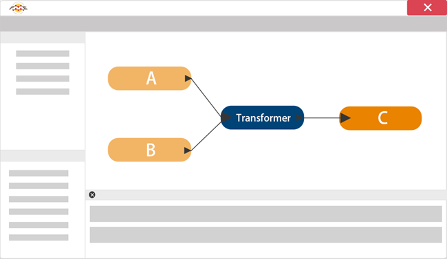
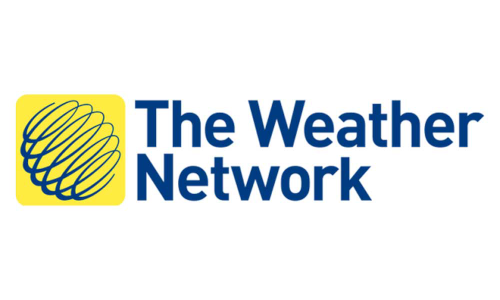
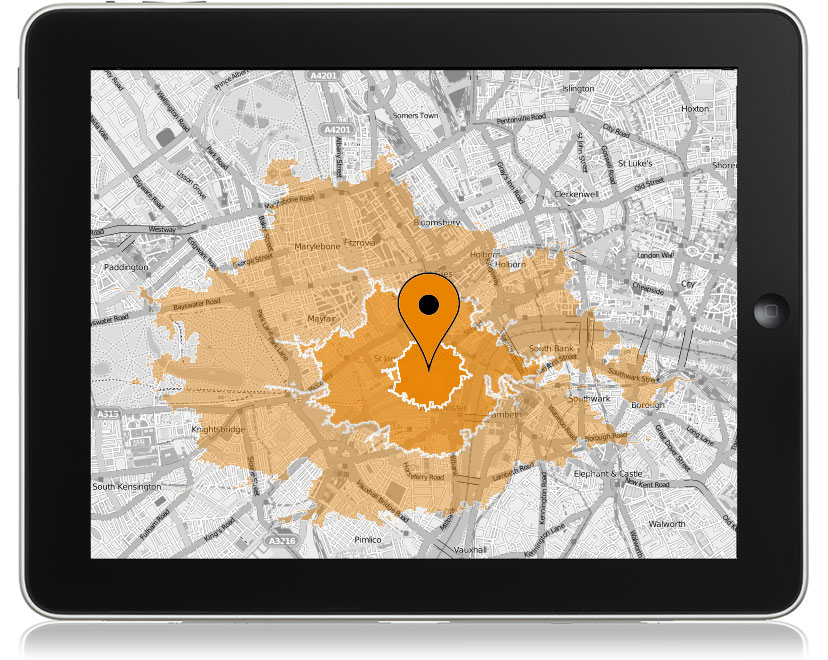

# 什么是FME？

**FME (the Feature Manipulation Engine)** 是一种用于转换数据的数据集成工具

## 历史

Safe Software于1993年在地下室开始，帮助林业公司与省政府交换地图。当然，从技术上讲，在那时共享地图是可能的，但只有在与数据斗争数小时之后。通常，在此过程中丢失了大量的信息。

简而言之，没有人高兴。我们建立FME就是为了改变这一点。

我们没有从商业计划开始，但我们确实希望提供帮助。我们释放数据的热情被点燃了，从那以后，我们一直致力于帮助人们体验这种自由。我们正在继续扩展FME的可能性，FME是一种具有世界上最佳空间支持的数据集成软件。

## 数据集成

> “从互联网上获取信息就像从消防水管里喝水。”

>-- [Mitchell Kapor](https://www.kaporcenter.org/co-chairs-and-staff/), [Lotus](https://en.wikipedia.org/wiki/Lotus_Software)的联合创始人 以及[Electronic Frontier Foundation](https://www.eff.org/)的联合创始人。

<tag></tag>
> “你可以没有信息就有数据，但你不可能没有数据就有信息。”

>-- [Daniel Keys Moran](https://en.wikipedia.org/wiki/Daniel_Keys_Moran), 美国计算机程序员和科幻作家。

<tag></tag>
> “信息是21世纪的石油，分析是内燃机。”

>-- [Peter Sondergaard](https://www.gartner.com/analyst/12/Peter-Sondergaard), Gartner公司执行副总裁。

正如上面的引文所示，数据的创建，操作和分析是当代组织面临的重大挑战。从未有过如此多的机器可读数据，但组织仍在努力寻找利用这些大量信息来帮助决策的方法。

### 什么是数据集成？

数据集成意味着将各种来源的信息组合成有用的东西。 它是关于有效管理数据并将其提供给需要它的人。无论是技术流程还是业务流程，IBM都将其定义为“从各种来源发现，清理，监控，转换和交付数据” 。数据集成允许跨越孤立“孤岛”的数据组合和分析，在那里通常很难协作。它允许具有多个部门，设施，软件和工作流程的组织将所有数据整合在一起。

### 与FME的数据集成

<!-- Re-write this with updated marketing language -->

FME通过从多个源（此处为A和B）读取数据来完成数据集成，使用转换器工具更改或重组数据以满足用户的需求，并将其写入目标（C）：

FME的数据处理功能可用于变换数据，转换文件格式或同时执行这两种操作。虽然许多数据集成工具仅处理电子表格（即表格）数据，但FME可以处理空间数据。它还使用图形界面，因此无需编码。

## FME如何工作

FME的核心是一个支持一系列数据类型和格式的引擎：Excel，CSV，XML和数据库，以及各种类型的映射格式，包括GIS，CAD，BIM 等等。

通过处理所有可能的几何对象和属性类型的富数据模型，可以支持如此多的数据类型。

## 谁使用FME？

FME已帮助全球数以千计的客户利用他们的数据，因此可以准确地用于需要的地点，时间和方式。我们的许多客户都在以下行业：

- 建筑与工程
- 联邦政府
- 地方政府
- 石油和天然气
- 电信
- 公用事业

以下是人们如何使用FME的一些示例，以及指向更多详细信息的链接。

### 温哥华国际机场

温哥华国际机场（YVR）希望通过移动应用程序为乘客提供室内地图数据。但是，他们的室内测绘数据全部都在CAD图纸中。YVR成为首批通过使用FME将其CAD图纸和商业信息转换为[室内地图数据格式](https://www.safe.com/integrate/indoor-mapping-data-format-imdf/).来提供室内Apple地图的机场之一。 

[观看视频](https://www.youtube.com/watch?v=pHaLPP6Vj4c&feature=youtu.be)有关此示例。
[观看演示](https://www.safe.com/presentation/indoor-mapping-trials-and-tribulations/?)有关此示例。

### 气象网络或Pelmorex公司

The Weather Network or Pelmorex Corp. 使用FME创建[Pelmorex Lightning Detection Network (PLDN)](http://data.twncs.com/Solutions/Lightning/lightning.html). 他们使用FME Server为客户提供来自加拿大各地传感器的雷击数据。

[阅读博客文章](https://blog.safe.com/2010/09/fme-server-and-the-weather-network/?)有关此示例。

### Tetrad Sitewise

[Tetrad](http://www.tetrad.com/)的[Sitewise](http://www.tetrad.com/software/sitewisepro/) 供市场分析解决方案，以使用FME帮助客户选择新的商业地点软件。Sitewise可以分析竞争，停车，交通可达性，组合多个数据集以进行有根据的评估。有关更多信息，请参阅[此录制的在线讲座](https://www.safe.com/webinars/market-analysis/).

[观看在线讲座](https://www.safe.com/webinars/market-analysis/)有关此示例。

访问我们的网站了解更多[客户案例](https://www.safe.com/customers/).

## 数据集成平台

本单元介绍如何使用FME Desktop在桌面级别进行数据转换和变换。FME Desktop是FME数据集成平台中的一个软件：

- [**FME Desktop**](https://www.safe.com/fme/fme-desktop/) 允许您连接和转换数据。
  - 例如，获取业务信息和地址的Excel电子表格，并将其添加到MySQL数据库，该数据库是允许搜索业务许可证信息的公民数据访问门户的后端。
- [**FME Server**](https://www.safe.com/fme/fme-server/) 提供企业级自动化。
  - 例如，允许为市政府工作的业务许可官员通过发送电子邮件或填写Web表单来实时向数据库添加新的业务许可证。
- [**FME Cloud**](https://www.safe.com/fme/fme-cloud/) 是云中FME Server的托管版本。
  - 例如，上述市政府可以使用FME Cloud帐户而不是托管他们自己的FME服务器。
