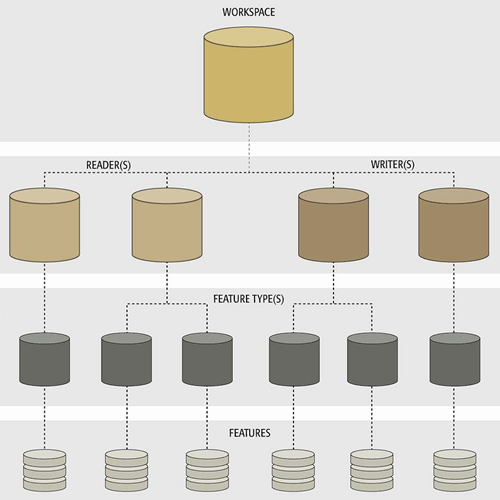
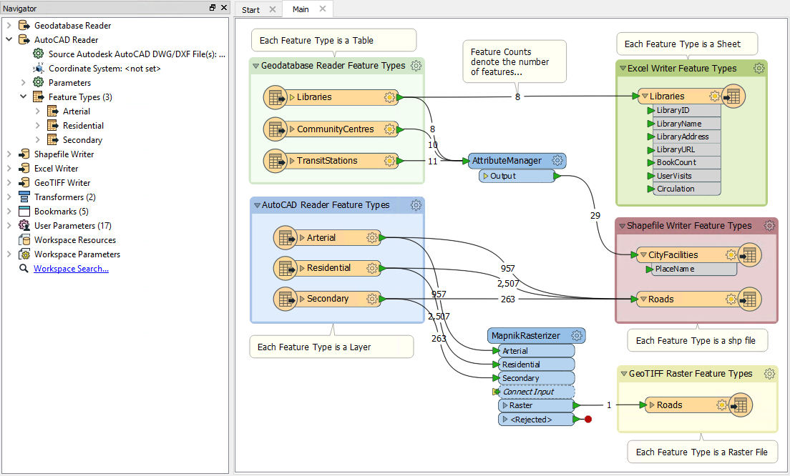
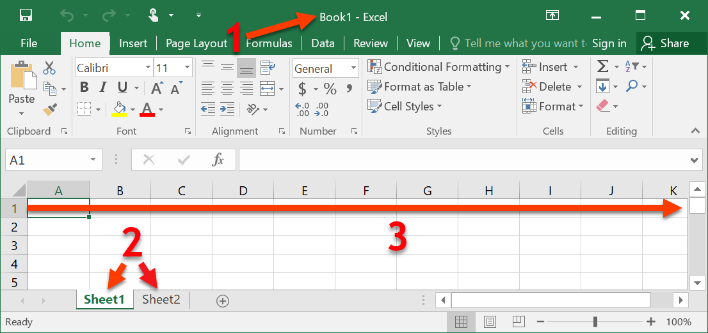

# FME组件

FME用户需要了解几个概念。这些概念对于在FME支持的多种格式之间创建公共语言是必要的。此外，他们需要描述FME转换的不同组成部分。

## 工作空间组件

工作空间是FME转换中的主要元素，负责存储转换定义。工作空间是转换所有要素的容器。它包含以下组件：

### 读模块和写模块

**读模块**是转换中读取源数据集的组件的FME术语。同样，**写模块**是写入目标数据集的组件。

读模块和写模块由“导航”窗口中的条目表示。

### 要素类型

**要素类型**是描述记录子集的FME术语。此术语的常见替代方法是*图层*，*表*，*表格*，*要素类*和*对象类*。例如，Excel工作簿中的每个工作表，数据库中的表或空间数据文件中的图层都由FME中的要素类型定义。

要素类型由Workbench画布上显示的对象表示。

### 要素

**要素**是FME转换的最小单个组件。

他们不在工作空间中单独表示，除非通过对完整转换的要素计数。

### 关系

每个工作空间可以包含多个读模块和写模块，每个读模块和写模块可以具有多个要素类型，具有多个要素。它们存在于如下所示的层次结构中：

具有多个读模块和写模块的工作空间可能如下所示：

此工作空间有两个读模块（每个具有三种要素类型）和三个写模块（具有一个，两个和一个要素类型）。每个读模块都是一种不同的格式，每种格式的要素类型都有不同的名称。

### 例子

下面的表格显示了在FME中默认处理常见格式的一些示例。

|格式|数据集|读/写模块|要素类型|要素|
|-|-|-|-|-|
|Excel|.xls或.xlsx文件，也称为工作簿|工作空间中如何读取/写入数据集的定义，读取或写入的路径|工作簿中的工作表（单个表）|工作表中的行|
|CSV|.csv文件（单个表）|工作空间中如何读取/写入数据集的定义，读取或写入的路径|单个表*|表中的行|
|Esri地理数据库|.gdb文件（[系统文件夹或数据库]（企业级地理数据库））|工作空间中如何读取/写入数据集的定义，读取或写入的路径|单个ArcGIS要素类型或地理数据库中的表|单个几何要素加上属性（例如点，线或多边形）或表格中的行|
*注意：CSV数据存储在纯文本文件中，没有细分方法。因此，FME中的每个要素类型表示不同的CSV文件，而不是单个文件中的不同部分。有关每种格式的更多信息，请参阅[R+W文档](https://docs.safe.com/fme/html/FME_Desktop_Documentation/FME_ReadersWriters/Home.htm)。
	
#### Excel细分

这是一个使用Excel的可视示例。在下图中：

1.数据集=XLS或XLSX文件（又名工作簿）
2.要素类型=工作表（又称工作表或表格）
3.要素=行（列为属性）

