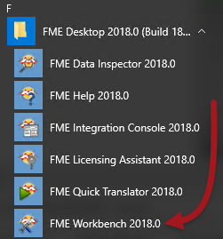
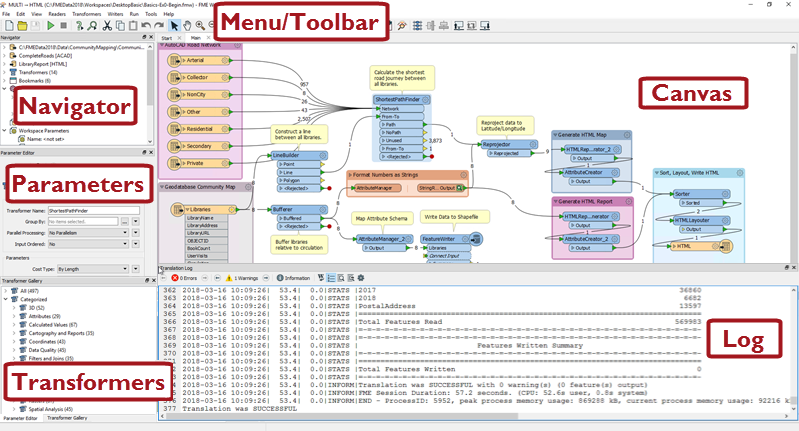
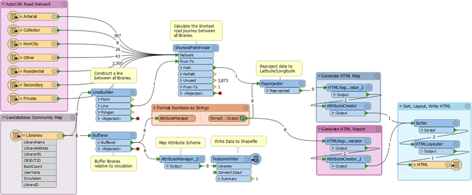

# FME Workbench

让我们仔细看看FME Workbench。您可以在Windows开始菜单中找到Workbench：

如果您愿意，可以在这些信息部分中随意使用Workbench。或者，您可以在每个单元中完成动手练习，这将说明练习之间显示的概念。

如果您使用的是提供培训的虚拟机，我们建议您立即打开Workbench，因为第一次在新机器上打开需要一些时间。

## FME Workbench的主要组件 ##

FME Workbench用户界面有许多主要组件：

### 画布 ###

FME Workbench画布是定义转换的位置。它是Workbench中的主要窗口：

默认情况下，工作空间从左到右读取;左侧的数据源，中间的转换工具和右侧的数据目标。每个项目之间的连接表示数据流，可以分支在不同的方向，合并在一起，或两者兼而有之。

### 菜单/工具栏 ###

菜单栏和工具栏包含许多工具：例如，用于在Workbench画布中导航，控制管理任务以及添加或删除读模块/写模块的工具：

### 导航窗口 ###

“导航”窗口是一个结构化的参数列表，用于表示和控制转换的所有组件：

### 转换器库 ###

转换器库是用于定位和选择FME转换工具的工具。转换器的数量(下面，497)将根据FME的版本和安装的任何可选定制转换器而有所不同：

### 转换日志 ###

转换日志报告转换和其他操作。信息包括任何警告或错误消息，转换状态，转换长度以及处理的要素数量

### 参数编辑器窗口 ###

参数编辑器窗口用于编辑画布窗口上对象的参数：

