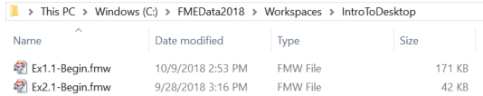
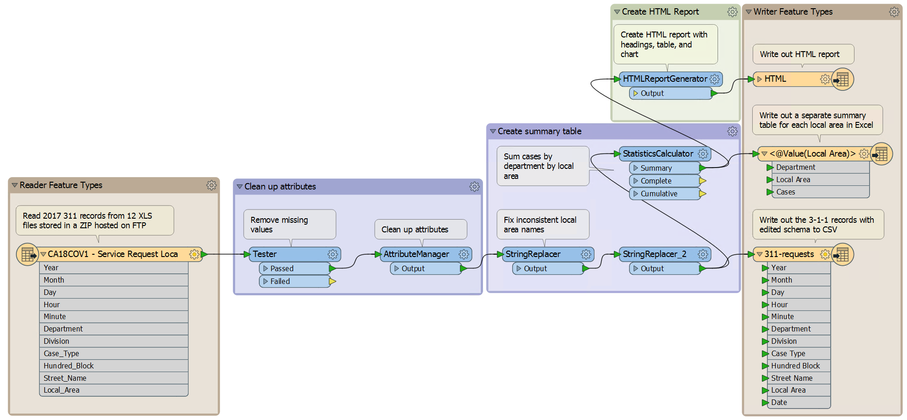
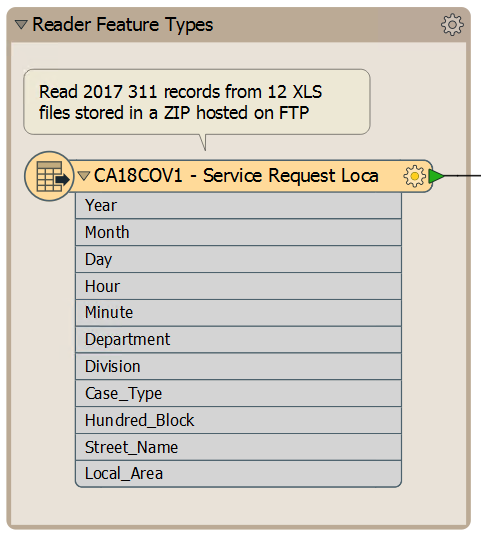
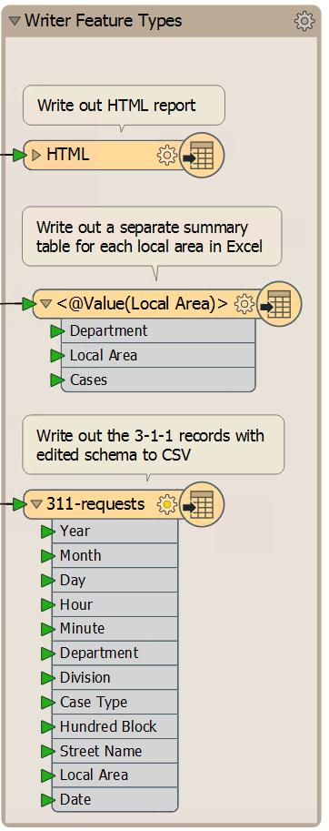
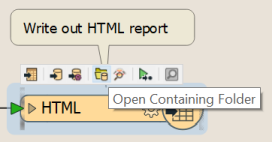
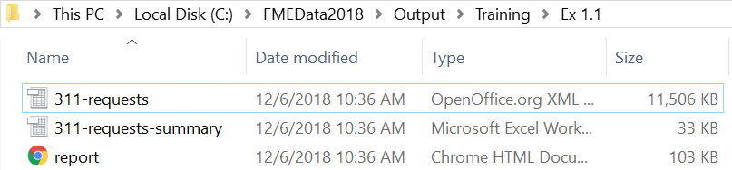
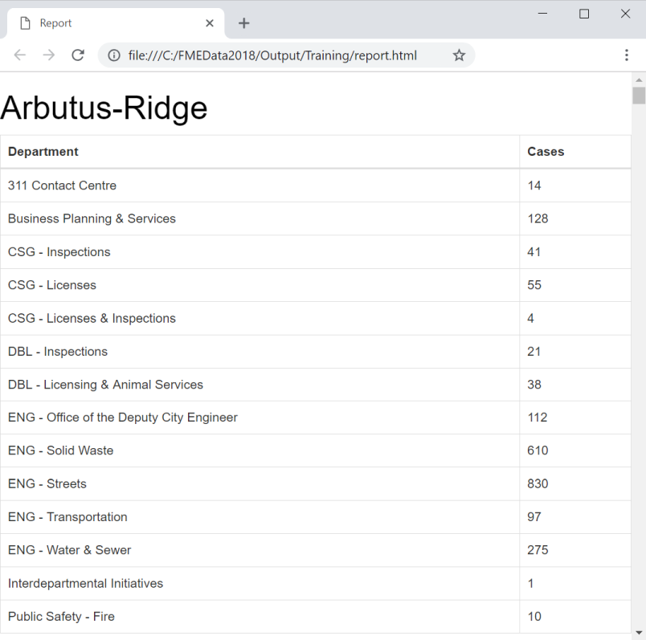

不要试图解释FME是什么和做什么，而是让我们自己尝试一下！在本练习中，您将打开将在本单元练习中创建的FME工作空间的完整版本。我们将探索它，运行它，并查看输出。

工作空间提供了一个示例，说明市政府如何使用FME来总结3-1-1呼叫记录。[3-1-1](https://en.wikipedia.org/wiki/3-1-1)是加拿大和美国各城市用于管理非紧急市政服务电话的特殊电话号码。

# 1) 找到工作空间文件

FME中的翻译和转换在FMW文件中定义。

使用文件资源管理器，浏览到文件C：\\FMEData2019\\Workspaces\\IntroToDesktop\\Ex1.1-Begin.fmw：

双击该文件。它将打开一个名为FME Workbench的应用程序。

#2) 探索FME工作空间

当FME Workbench打开时，您将看到完成入门练习的选项。如果您愿意，您现在可以完成这些，或者稍后再回来。现在，单击“X”关闭窗口。

应用程序的核心部分如下所示：

这部分我们称之为画布。它是以图形方式定义数据的转换和转换的地方。虽然它可能看起来很复杂，但使用FME创建此类型的工作流并不需要太多练习。

检查画布的左侧：

这个区域是我们读取数据的地方。此对象是存储在Excel工作簿(XLSX)中的3-1-1调用记录的电子表格。

现在看右边：

这个区域是我们写数据的地方。这里的对象将调用记录的报告表示为一个简单的网页(HTML)和一个Excel文件(<@Value(Local Area)>)，以及一个包含经过清理和编辑的数据的CSV文件(311-请求)。

读模块和写模块之间是转换数据的对象。当数据从左向右移动时，它们改变数据的结构(例如，属性名称)和内容(例如，属性的值)。

标签和其他注释向我们展示了工作空间的功能：

-从CSV读取3-1-1数据
-通过删除缺失值并修复不一致的值来清洗数据
-删除报告中不需要的属性
-将编辑过的原始数据写入CSV
-按部门总结每个本地规划区域的案例数量，将结果写入Excel
-生成HTML报告，其中包含每个本地区域的表格和图形
-将报告写入HTML

#3) 运行FME工作空间

我们来运行这个工作空间。

在此之前，我们希望控制_如何_来运行工作空间。默认情况下，启用名为**Run with Prompt**的功能。我们在本课程中不需要这个，所以让我们点击工具栏上的Run with Prompt按钮将其关闭：

好的，现在我们准备好运行工作空间了。单击Workbench工具栏上的Green run按钮：

工作空间现在将运行。当它这样做时，您将在日志窗口中看到消息传递。您还可能会在画布连接上看到数字，并在每个对象上看到绿色带注释的图标。我们稍后会讨论这些！

#4) 找到并检查输出

转换完成后，单击HTML写模块要素类型。选择打开包含文件夹的选项：

在打开的资源管理器对话框中，您将找到新的HTML，Excel和CSV数据集：

打开Firefox或Chrome等Web浏览器。打开由FME创建的report.html文件(通常<kbd>Ctrl</kbd>+<kbd>O</kbd>或文件>打开是最简单的方法)。您将看到每个本地计划区域的按部门划分的案例总数的表格和图表。FME从原始Excel电子表格生成所有这些：

这个小型演示展示了FME的强大功能。此工作空间从多个数据集中读取数据，并以空间和电子表格(即表格)格式将其写入数据集。在它之间进行了一系列的变换，创造了附加价值和信息。

保持此报告开放-您将需要它用于下一部分，这是对此部分内容的测验。

<UL>
<li>打开FME工作空间</li>
<li>运行FME工作空间</li>
<li>找到FME工作空间的输出</li>
</UL>
