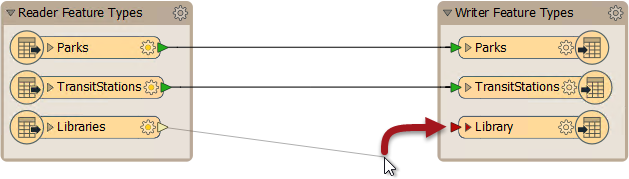
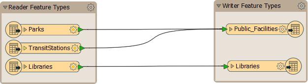
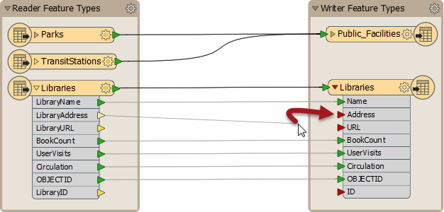
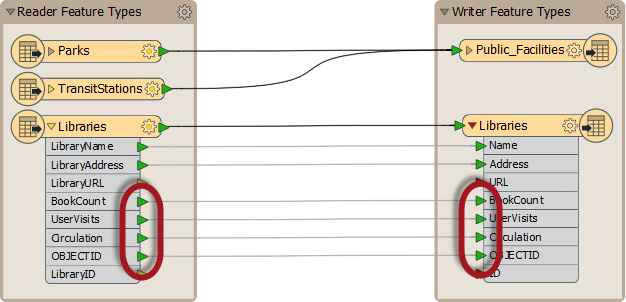

# 模式映射

模式映射是FME数据重组的第二个关键部分。

在FME Workbench中，工作空间的一侧显示读模块模式（_“我们拥有”_），另一侧显示写模块模式（_“我们想要的”_）。最初，创建工作空间时会自动连接这两个模式，但是在编辑时，这些连接通常会丢失。

_**模式映射**_是将读模块模式连接到写模块模式的过程，其方式是确保将正确的读模块要素发送到正确的写模块要素类型，并将正确的读模块属性发送到正确的写模块属性。

FME允许以任何所需的布置从源到目的地的映射。可以映射哪些要素类型或属性没有限制。

|  分析师女士说...... |
| :--- |
|  你好。我是分析师，你在这个城市的同事之一。我认为模式编辑和模式映射是重组数据的一种手段。  一个很好的类比是衣柜里装满了衣服。当衣柜重新组织时，你扔掉你不再需要的东西，为你计划得到的新衣服预留空间，并将现有物品移至更有用的布置中。  空间数据重组也是如此：它是重组数据以使其更有用的行为。 |

## 要素映射

_**要素映射**_是将源要素类型连接到目标要素类型的过程。

通过单击读模块要素类型的输出端口，将箭头拖动到写模块要素类型的输入端口，然后释放鼠标按钮来执行要素映射。粗黑线表示连接。

这里，通过将箭头从源拖动到目标，创建从源到目标要素类型的连接线：

允许合并和拆分数据：

在这里，用户要求Parks，TransitStation和Libraries都在输出中的单个图层上，因此将这三种读模块要素类型合并为一个写模块要素类型（PublicFacilities）。

## 属性映射

_**属性映射**_是将读模块属性连接到写模块属性的过程。

通过单击读模块属性的输出端口，将箭头拖动到写模块属性的输入端口，然后释放鼠标按钮来执行属性映射。属性连接显示为更细的灰线。

这里已经进行了要素映射，并且正在进行属性连接：

请注意绿色，黄色和红色颜色编码，指示连接了哪些属性。

绿色端口表示已连接的属性。黄色端口表示未与写模块连接的读模块属性。红色端口表示未与读模块连接的写模块属性。

读模块和写模块要素类型中具有相同名称的属性会自动连接，即使连接线可能不可见; 端口颜色是关键：

|  警告 |
| :--- |
|  名称区分大小写，因此ROADS与roads，Roads或rOADS不同。 知道您是否依赖自动属性连接，这一点很重要！ |

