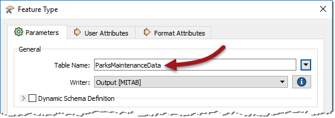
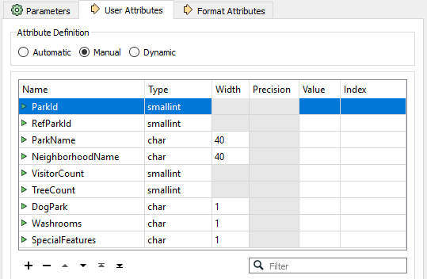
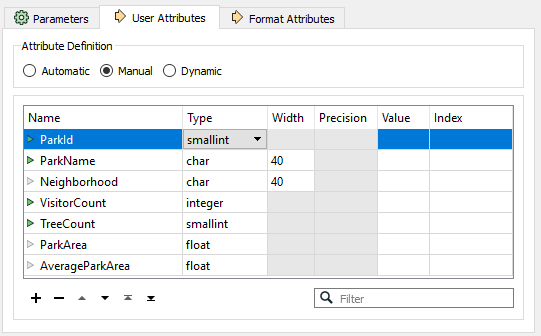
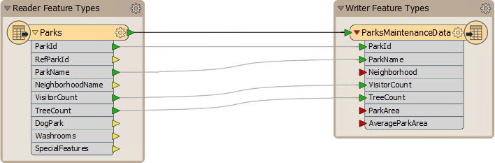
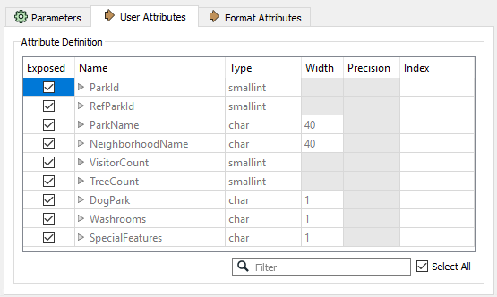
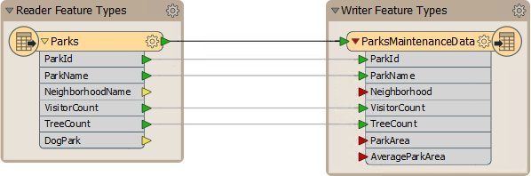

# 练习：地面维护项目 - 模式编辑

|  练习1 |  地面维护项目 - 模式编辑 |
| :--- | :--- |
| 数据 | 城市公园（MapInfo TAB） |
| 总体目标 | 计算城市中每个公园的大小和平均大小，以用于草地切割，树篱修剪等的地面维护估算。 |
| 演示 | 结构转换，模式编辑 |
| 启动工作空间 | 无 |
| 结束工作空间 | C:\FMEData2018\Workspaces\DesktopBasic\Transformation-Ex1-Complete.fmw |

您刚刚在当地城市的GIS部门担任技术分析师。

负责维护公园和其他草地区域的团队需要了解每个公园的面积和设施，以便计划下一年的预算。您已被分配到此项目，并将使用FME提供此信息的数据集。

此示例的第一步是重命名现有属性并创建新属性，以便为以后的面积计算做准备。

  
**1）启动Workbench**  
使用“生成工作空间”对话框，使用以下参数创建工作空间：

| 读模块格式 | MapInfo TAB（MITAB） |
| :--- | :--- |
| 读模块数据集 | C:\FMEData2018\Data\Parks\Parks.tab |
| 写模块格式 | MapInfo TAB（MITAB） |
| 作家数据集 | C:\FMEData2018\Output\Training |

是! 在这里，我们回写我们正在读取的相同格式的数据！您可以单击“生成工作空间”对话框中的“参数”按钮以检查读模块/写模块参数，但在本练习中不需要更改它们。请注意，写模块只需要一个文件夹而不是特定的文件名。

  
**2）重命名要素类型**  
 FME创建一个工作空间，其中目标模式与源匹配。但是，数据的最终用户已请求清除部分模式。

检查写模块要素类型参数。单击标记为表名的字段（请记住此标签是特定于格式的，并在MapInfo中处理“表”）并将名称从Park更改为ParksMaintenanceData：

  
**3）更新属性**  
现在检查用户属性。它们看起来像这样：

必须清理这些内容，以便删除不必要的信息。需要更新其他属性，并添加一些额外的属性来存储计算结果。因此，请执行以下操作：

| 删除属性 | RefParkID |  |
| :--- | :--- | :--- |
| 删除属性 | DogPark |  |
| 删除属性 | Washrooms |  |
| 删除属性 | SpecialFeatures |  |
| 重命名属性 | 从：NeighborhoodName | 到：Neighborhood |
| 更改类型（VisitorCount） | 从：短整数 | 到：整数 |
| 添加属性 | ParkArea | 类型：浮点数 |
| 添加属性 | AverageParkArea | 类型：浮点数 |

...然后单击参数编辑器“应用”按钮。现在，属性列表应如下所示：

现在，当运行工作空间时，输出将命名为ParksMaintenanceData.tab，并将包含更新的属性模式。

  
**4）取消暴露源属性**  
工作空间现在看起来像这样：

|  技巧 |
| :--- |
|  如果要素类型名称或属性名称太大而无法以默认大小正确显示，则可以调整画布上的对象（如上面的屏幕截图所示）。要素类型周围的棕色标记称为**书签**。它们也可以调整大小以更好地适应其内容。 |

请注意，有几个源属性不会在工作空间中使用或发送到输出。我们可以通过隐藏它们来整理工作空间。

检查读模块要素类型参数上的“用户属性”选项卡。它看起来像这样：

取消选中我们不需要的以下属性的复选框：

* RefParkID
* Washrooms
* SpecialFeatures

这是我们删除的属性列表，除了DogParks，我们将在转换中使用它们。

单击“应用/确定”以确认更改。

  
**5）保存工作空间**  
保存工作空间 - 将在其他示例中完成。它现在应该是这样的：

|  警察局长Webb-Mapp说...... |
| :--- |
|  一些写模块属性（ParkArea和AverageParkArea）有红色连接箭头，因为没有任何内容可以映射到它们，而另一个（Neighborhood）只是未连接。  没关系。如果你保证以后联系他们，我会谨慎地告诉你。您仍然可以运行此工作空间，以查看输出的内容。 |

<table>
  <thead>
    <tr>
      <th style="text-align:left">恭喜</th>
    </tr>
  </thead>
  <tbody>
    <tr>
      <td style="text-align:left">
        
通过完成本练习，您已学会如何：
           
        

        <ul>
          <li>编辑写模块模式的属性</li>
          <li>编辑写模块模式的输出层名称</li>
          <li>隐藏读模块模式上的属性</li>
        </ul>
      </td>
    </tr>
  </tbody>
</table>