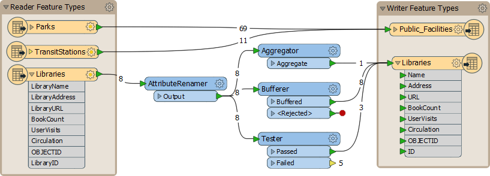

# 并联转换器

“流”是通过在工作空间中的连接表示的数据的流程。FME中的一个关键概念是能够在工作空间内拥有多个并行流。

## 多个流

当用户需要以多种不同方式处理相同数据时，多个流非常有用。工作空间作者可以根据需要将一个流转换为多个，或将多个数据流合并为一个：

在这里，作者正在创建三个数据流，每个数据流分别处理，然后组合回一个流。

## 创建多个流

可以以多种方式创建多个数据流。有时，具有多个输出端口的转换器（Tester转换器就是一个很好的例证）将使用几种可能的输出流来划分（或过滤）数据：

这里数据分为两个流，其中一个流与任何东西都没有连接。

此外，只需从单个输出端口进行多个连接即可复制完整的数据流。实际上，它为每个连接创建一组数据：

这里FME读取8个要素，但由于存在多个连接，因此会创建多个数据副本：

## 将多个流组合在一起

当多个流连接到同一输入端口时，不会发生合并。数据简单地聚合到单个流中。这通常被称为_联合_。

这里，三个数据流汇聚成一个写模块要素类型：

没有合并发生; 数据只会聚合到输出数据集中的12个不同要素中。可以把它想象成三管水排入一个容器。

要进行实际的数据合并，需要使用特定的转换器，例如FeatureMerger或FeatureJoiner。

