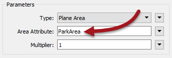

# 练习：地面维护项目 - 计算统计数据

|  练习3 |  地面维护项目 - 计算统计 |
| :--- | :--- |
| 数据 | 城市公园（MapInfo TAB） |
| 总体目标 | 计算城市中每个公园的大小和平均大小，以用于草地切割，树篱修剪等的地面维护估算。 |
| 演示 | 内容转换。模式映射 |
| 启动工作空间 | C:\FMEData2018\Workspaces\DesktopBasic\Transformation-Ex3-Begin.fmw |
| 结束工作空间 | C:\FMEData2018\Workspaces\DesktopBasic\Transformation-Ex3-Complete.fmw C:\FMEData2018\Workspaces\DesktopBasic\Transformation-Ex3-Complete-Advanced.fmw |

让我们继续您的地面维护项目。

如果您忘记了，负责维护公园和其他草地区域的团队需要了解每个公园的面积和设施，以计划下一年的预算。

在项目的这一部分中，我们将计算每个园区的大小和平均大小，并确保信息正确映射到目标模式。

  
**1）启动Workbench**  
 启动Workbench（如有必要）并从练习2打开工作空间。或者，您可以打开C:\FMEData2018\Workspaces\DesktopBasic\Transformation-Ex3-Begin.fmw

  
**2）添加AreaCalculator转换器**  
要测量每个Park功能的面积，必须使用AreaCalculator转换器。“计算器”是FME计算新属性值时的术语。

单击Tester：Passed port和写模块要素类型_ParksMaintenanceData_之间的连接。开始输入字母“areac”。您将看到下方显示匹配转换器的“快速添加”列表。

通过双击选择名为AreaCalculator的转换器：

  
**3）添加StatisticsCalculator转换器**  
使用相同的方法，在AreaCalculator：Output端口和_ParksMaintenanceData_要素类型之间放置StatisticsCalculator转换器。&lt;

**但是！**不要点击其他任何东西！转换器现在看起来像这样：

默认情况下，摘要端口已连接，我们需要连接完整端口。但请注意顶部的小弹出图标。单击右侧图标（带有？字符的图标）。这样做会弹出更多端口列表：

单击Summary端口条目以断开连接，然后在Complete端口条目上连接：

请注意连接如何从错误的摘要端口更改为正确的完整端口。

|  技巧 |
| :--- |
|  这些弹出菜单对模式映射和其他要素连接有很大帮助。 |

工作空间的后半部分现在看起来像这样：

  
**4）检查AreaCalculator设置**  
检查AreaCalculator参数：

默认设置会将计算值放入名为\_area的属性中。但是，_ParksMaintenanceData_模式需要一个名为ParkArea的属性，因此请更改此参数以创建正确的属性：

单击“确定”或“应用”后，请注意写模块要素类型上的属性现在标记为已连接。

  
**5）检查StatisticsCalculator设置**  
红色图标表示StatisticsCalculator具有需要定义的参数。

检查StatisticsCalculator转换器的参数。要分析的属性是包含计算面积的属性; 所以选择ParkArea：

检查公园平均大小的属性名称的默认设置。目前，它与_ParksMaintenanceData_模式不匹配，后者需要名为AverageParkArea的属性。

将属性从\_mean更改为AverageParkArea。出于最佳实践原因，删除/取消设置不需要的任何StatisticsCalculator输出属性（例如\_range和\_stdev）。

  
**6）运行工作空间**  
如果需要，添加另一个书签，运行工作空间，并使用FME Data Inspector检查转换结果：

“表视图”窗口显示每个公园的面积和所有公园的平均面积。

  
**7）保存工作空间**  
保存工作空间 - 它将在后面的示例中完成。

|  高级练习 |
| :--- |
|  请注意，表视图中的数字显示结果已计算为12位小数。这超出了您所需的精度。作为一项高级任务 - 如果你有时间 - 使用AttributeRounder转换器将值减少到只有2位小数。  如果您愿意，您还可以计算最小，最大和总面积; 但是如果希望它们出现在输出中，请不要忘记将它们添加到写模块模式中。 |

<table>
  <thead>
    <tr>
      <th style="text-align:left">恭喜</th>
    </tr>
  </thead>
  <tbody>
    <tr>
      <td style="text-align:left">
        
通过完成本练习，您已学会如何：
           
        

        <ul>
          <li>用转换器进行内容转换（AreaCalculator，StatisticsCalculator）</li>
          <li>使用弹出按钮管理转换器连接</li>
          <li>使用转换器参数创建与写模块模式匹配的属性</li>
        </ul>
      </td>
    </tr>
  </tbody>
</table>