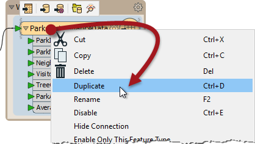
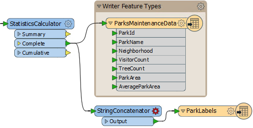
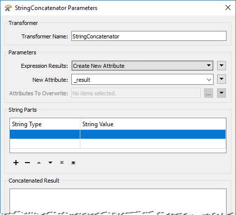
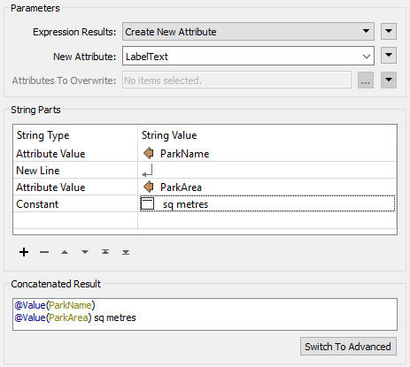
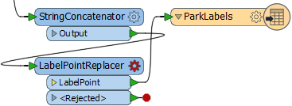
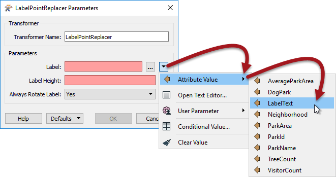
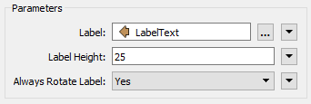
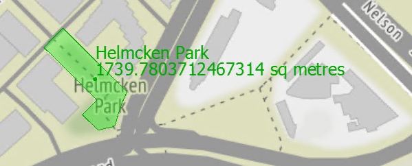
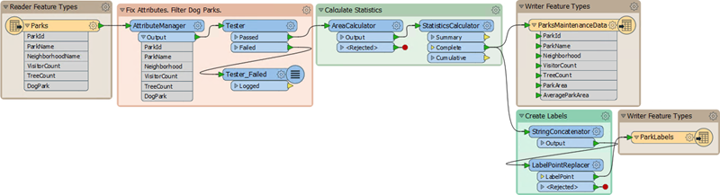

# 练习：地面维护项目 - 标签功能

|  练习4 |  地面维护项目 - 标签要素 |
| :--- | :--- |
| 数据 | 城市公园（MapInfo TAB） |
| 总体目标 | 计算城市中每个公园的大小和平均大小，以用于草地切割，树篱修剪等的地面维护估算。 |
| 演示 | 使用并行变换器进行内容转换 |
| 启动工作空间 | C:\FMEData2018\Workspaces\DesktopBasic\Transformation-Ex4-Begin.fmw |
| 结束工作空间 | C:\FMEData2018\Workspaces\DesktopBasic\Transformation-Ex4-Complete.fmw C:\FMEData2018\Workspaces\DesktopBasic\Transformation-Ex4-Complete-Advanced.fmw |

让我们继续您的地面维护项目。

在项目的这一部分，我们将为每个公园创建一个标签，并将其写入新的输出层。此步骤最好使用并行数据流。

  
**1）启动Workbench**  
 启动Workbench（如有必要）并从练习3打开工作空间。或者，您可以打开C:\FMEData2018\Workspaces\DesktopBasic\Transformation-Ex4-Begin.fmw

之前的练习使用AreaCalculator测量了公园面积。现在我们被要求将此信息作为标签添加到输出数据集中。

可以使用LabelPointReplacer转换器实现此步骤。

  
**2）创建新的写模块要素类型**  
因为我们想要将标签要素写入输出中的单独层（表），我们需要在画布上创建另一个要素类型对象。在后面的章节中有更多相关内容，但是现在，右键单击编写器要素类型并选择“复制”选项。这样做会在输出数据集中创建新要素类型（图层）。

现在清理此要素类型的模式。查看要素类型的对话框，并将新类型重命名为ParkLabels。在“用户属性”选项卡中，删除所有现有用户属性。

  
**3）放置一个StringConcatenator转换器**  
单击画布的空白区域。键入“StringConcatenator”以添加此类型的转换器。

通过将第二个连接从那里拖到新变换器，将其连接到StatisticsCalculator的Complete端口。

从StringConcatenator建立到新要素类型的新连接。

  
**4）检查转换器参数**  
查看StringConcatenator转换器的参数。有基本和高级对话框，基本对话框如下所示：

输入_LabelText_作为要创建的新属性的名称。

在“字符串部件”部分中，设置以下四个部分：

| 字符串类型 | 字符串值 |
| :--- | :--- |
| 属性值 | ParkName |
| 新线 |  |
| 属性值 | ParkArea |
| 不变 |  平方米 |

确保在“sq meters”之前的常量中包含空格字符。

|  技巧 |
| :--- |
|  您可能会发现切换到高级编辑器对话框并直接输入内容更快： @Value（ParkName） @Value（ParkArea）sq meters |

  
**5）放置LabelPointReplacer转换器**  
单击StringConcatenator：Output和ParkLabels要素类型之间的连接。键入“LabelPointReplacer”以添加此类型的转换器。

将添加新转换器并自动连接这两个对象。

  
**6）检查LabelPointReplacer参数**  
检查LabelPointReplacer参数。

首先单击Label参数右侧的下拉箭头：

选择“属性值”&gt;“LabelText”以选择先前在StringConcatenator中定义的标签。

现在单击Label Height字段并键入25（即25个工作单位，在本例中为米）。

“始终旋转标签”参数可以保留其默认值。

|  技巧 |
| :--- |
|  许多参数字段（如Label Height）可以设置为常量值（通过键入）或通过单击下拉箭头并选择属性值设置为属性。  并且 - 您很快就会看到 - 也可以直接在转换器设置中构造参数值 |

  
**7）运行转换**  
如果需要，添加另一个书签，运行转换，并检查输出。

请注意，输出在两个文件中分为两层。使用FME Data Inspector在同一视图中打开两个输出文件。

  
地图瓦片由[Stamen Design](https://stamen.com/)，许可由[CC-BY-3.0](https://creativecommons.org/licenses/by/3.0)。数据提供[OpenStreetMap](http://openstreetmap.org/)，许可由[CC-BY-SA](http://creativecommons.org/licenses/by-sa/3.0)。

保存工作空间 - 将在其他示例中完成。

|  高级练习 |
| :--- |
|  现在您知道如何在输出中创建新要素类型（图层），如何测试数据以及如何使用并行流，为什么不尝试此任务：确定哪些公园小于平均值，哪些公园大于平均值，并将它们写出为于不同的要素类型。 |

<table>
  <thead>
    <tr>
      <th style="text-align:left">恭喜</th>
    </tr>
  </thead>
  <tbody>
    <tr>
      <td style="text-align:left">
        
通过完成本练习，您已学会如何：
           
        

        <ul>
          <li>创建新的写模块要素类型</li>
          <li>在单个工作空间中使用多个转换器流</li>
          <li>使用StringConcatenator构造一个字符串以供其他地方使用</li>
          <li>使用属性作为转换器参数的值</li>
        </ul>
      </td>
    </tr>
  </tbody>
</table>