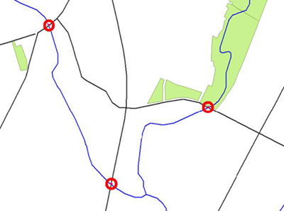

# 内容转换

内容转换是对要素组件进行操作的内容转换。

## 什么是要素？

一个_**要素**_在FME是转换中的单个项目。对于空间数据，要素通常是几何对象（具有或不具有一组相关属性）。

对于表格数据，要素通常是数据库中的记录，电子表格中的行或文本文件中的行。每个列或单元称为_**属性**_。

[](https://github.com/safesoftware/FMETraining/blob/Desktop-Basic-2018/DesktopBasic2Transformation/Images/Img2.026.FeatureGraphic.png)

FME中的要素具有灵活的通用表示，与其源自的格式无关。这意味着任何转换器都可以在任何FME要素上运行，无论其源格式如何。有时内容转换在单个要素上运行，有时在多个要素上运行。

|  分析师女士说...... |
| :--- |
|  您可以将内容转换视为更改或编辑数据。  衣柜类比仍然适用于此。您可以将衣服从衣柜中取出来进行清洁，或改变它们，或修理它们，或将它们染成新的颜色或各种其他任务，然后再将它们送回原位。  对于空间数据转换也是如此：它是将您的数据修复为更干净且符合您真正想要的风格的行为。 |

## 几何转换

_**几何转换**_是重构FME要素的空间组件的行为。换句话说，要素的几何形状经历某种形式的改变以产生不同的输出。

几何转换的一些示例包括以下内容：

* **泛化** - 一种重构数据的制图过程，因此可以在给定的地图比例下轻松显示
* **变形** - 调整一组要素的大小和形状，以更接近地匹配一组参考数据
* **拓扑计算** - 将一组线性要素转换为节点/线结构
* **线交叉** - 计算**线要素**之间的交点

[](https://github.com/safesoftware/FMETraining/blob/Desktop-Basic-2018/DesktopBasic2Transformation/Images/Img2.027.GeometricTransformation.png)

在这里，道路与河流相交，产生了标志着桥梁位置的点。

## 属性转换

_**属性转换**_是重构FME要素的表格组件的行为。换句话说，属性经历某种形式的改变以产生不同的输出。

属性转换的一些示例是：

* **连接** - 将两个或多个属性连接在一起
* **拆分** - 将一个属性**拆分**为多个，这与连接相反
* **测量** - 测量要素的长度或面积以创建新属性
* **ID创建** - 为特定要素创建唯一的ID号

属性连接作为属性转换的示例。

地址的每一行被连接起来以返回单行地址。

> ```text
>  Address1     Suite 2017,+
> Address2     7445-132nd Street,+
> City            Surrey,+
> Province     British Columbia,+
> PostalCode     V3W 1J8
>
> = Address     Suite 2017, 7445-132nd Street, Surrey, British Columbia, V3W 1J8
> ```

|  Vector小姐说...... |
| :--- |
|  你想念我吗？想念？好吧，我会为你解决一些新问题！  哪三种颜色代表检查过，需要检查和取消设置转换器对象的参数？  [1.蓝色，黄色，红色](http://52.73.3.37/fmedatastreaming/Manual/QAResponse2017.fmw?chapter=2&question=2&answer=1&DestDataset_TEXTLINE=C%3A%5CFMEOutput%5CQAResponse.html) [2.绿色，黄色，红色](http://52.73.3.37/fmedatastreaming/Manual/QAResponse2017.fmw?chapter=2&question=2&answer=2&DestDataset_TEXTLINE=C%3A%5CFMEOutput%5CQAResponse.html) [3.红色，绿色，蓝色](http://52.73.3.37/fmedatastreaming/Manual/QAResponse2017.fmw?chapter=2&question=2&answer=3&DestDataset_TEXTLINE=C%3A%5CFMEOutput%5CQAResponse.html) [4.绿色，蓝色，黄色](http://52.73.3.37/fmedatastreaming/Manual/QAResponse2017.fmw?chapter=2&question=2&answer=4&DestDataset_TEXTLINE=C%3A%5CFMEOutput%5CQAResponse.html)  如果我使用转换器去除多边形边界的不规则（如自相交环），它是什么类型的转换？  [1.属性的结构转换](http://52.73.3.37/fmedatastreaming/Manual/QAResponse2017.fmw?chapter=2&question=3&answer=1&DestDataset_TEXTLINE=C%3A%5CFMEOutput%5CQAResponse.html) [2.几何的结构转换](http://52.73.3.37/fmedatastreaming/Manual/QAResponse2017.fmw?chapter=2&question=3&answer=2&DestDataset_TEXTLINE=C%3A%5CFMEOutput%5CQAResponse.html) [3.属性的内容转换](http://52.73.3.37/fmedatastreaming/Manual/QAResponse2017.fmw?chapter=2&question=3&answer=3&DestDataset_TEXTLINE=C%3A%5CFMEOutput%5CQAResponse.html) [4.内容几何的转换](http://52.73.3.37/fmedatastreaming/Manual/QAResponse2017.fmw?chapter=2&question=3&answer=4&DestDataset_TEXTLINE=C%3A%5CFMEOutput%5CQAResponse.html) |

