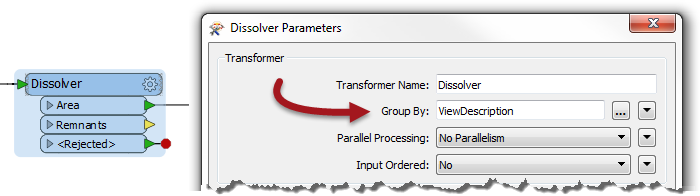
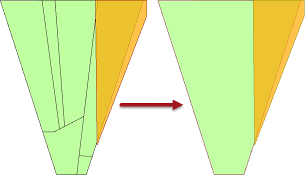

# 分组处理

分组参数允许通过单个FME转换器分组处理要素。

## 什么是组？

FME转换器一次对一个要素进行变换，或一次对一整套要素进行变换。

例如，_AreaCalculator_转换器一次对一个要素进行操作（以测量单个多边形要素的面积）。我们称之为_**基于要素的转换器**_。

_StatisticsCalculator_一次处理多个要素（以计算所有这些的平均值）。在FME中，我们将这组要素称为_**组**_，转换器是基于_**组的转换器**_。

## 创建组

因此，组只是由转换器处理的一组已定义的要素。默认情况下，基于组的转换器会将其作为单个组提供的所有要素视为一个组。

但是，此类转换器也具有_**Group-By**_参数。此参数允许用户根据属性的值定义多个组。

|  Statistics-Calculator先生，首席财务官说...... |
| :--- |
|  你好。我想我们还没见过面。我是Statistics-Calculator先生。我打赌你猜不到我最喜欢的转换器！  为了说明组，我们考虑计算FME用户的平均年龄。别担心，我会分门别类的（哈哈）！计算的默认组包括**所有** FME用户。  但是你可以把所有人分成男女，创建两组，并计算每个性别的平均年龄。或者你可以将每个人分成他们的国籍，并计算每个国家的平均年龄。  这与在数据集中具有性别（或国籍）属性并在FME group-by参数中选择该属性相同。 |

这里，Dissolver转换器用于溶解（合并）许多面要素。选定的Group-By属性是_ViewDescription_：

FME创建一系列用于覆盖的组，其中每个组中的要素共享_ViewDescription_属性的相同值。实际结果是多边形溶解只发生在线要素共享相同描述的地方：

|  Vector小姐说...... |
| :--- |
|  让我们看看你是否已经了解了基于群组的转换是什么。  您认为以下哪种转换器是“基于组”的？请随意使用Workbench来帮助您回答这个问题。  [1. StringFormatter](http://52.73.3.37/fmedatastreaming/Manual/QAResponse2017.fmw?chapter=2&question=4&answer=1&DestDataset_TEXTLINE=C%3A%5CFMEOutput%5CQAResponse.html) [2. Clipper](http://52.73.3.37/fmedatastreaming/Manual/QAResponse2017.fmw?chapter=2&question=4&answer=2&DestDataset_TEXTLINE=C%3A%5CFMEOutput%5CQAResponse.html) [3. Rotator](http://52.73.3.37/fmedatastreaming/Manual/QAResponse2017.fmw?chapter=2&question=4&answer=3&DestDataset_TEXTLINE=C%3A%5CFMEOutput%5CQAResponse.html) [4. AttributeRounder](http://52.73.3.37/fmedatastreaming/Manual/QAResponse2017.fmw?chapter=2&question=4&answer=4&DestDataset_TEXTLINE=C%3A%5CFMEOutput%5CQAResponse.html) |

