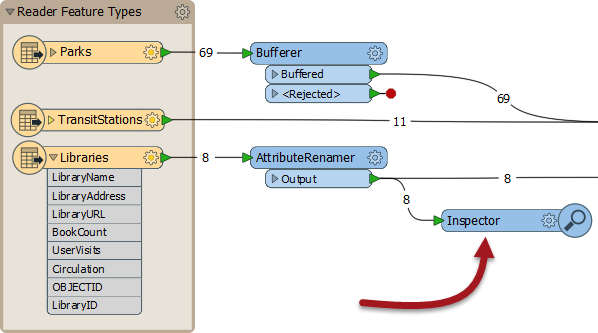
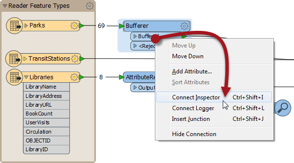
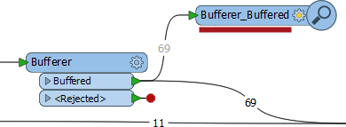
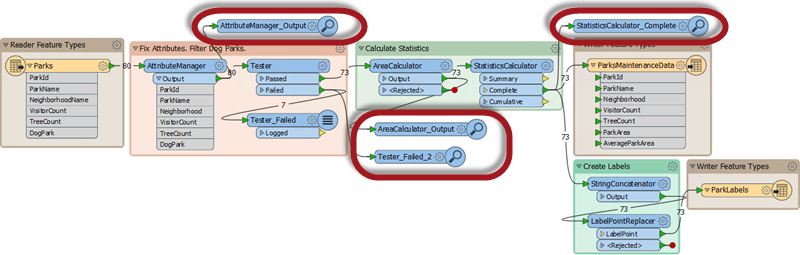

# Workbench的数据检查

为了帮助检查数据，Workbench可以将数据从各个转换器路由到FME Data Inspector。

## 使用Inspector转换器

一个_**Inspector**_是一个具有独特外观和风格的Workbench转换器，它导致输入数据的数据被定向到FME Data Inspector，甚至在转换中间。

Inspector - 与任何转换器一样 - 可以应用于转换中的任何点，并且不会阻止数据输出到写模块。它还允许用户选择应检查哪些要素：

在这种情况下，它也是一种并行流形式，因为数据是重复的，但不一定是这种情况。

## 放置Inspector转换器

应用Inspector的最佳和最简单的方法是右键单击工作空间中对象的输出端口，然后选择“连接检查器”选项。

在这里，用户右键单击Bufferer转换器的缓冲端口，然后选择Connect Inspector选项：

请注意，使用转换器和输出端口名称自动命名Inspector。这里将是“Bufferer\_Buffered”：

此名称有助于在FME Data Inspector中识别此Inspector中的数据（而不是其他任何数据）。

请注意，Inspector转换器仅在有要查看的要素时打开FME Data Inspector。如果要素为零，则数据检查器将无法打开！

|  技巧 |
| :--- |
|  Inspectors对于要投入生产的工作空间没有用，特别是在FME Server上。FME服务器引擎不具有打开Data Inspector的能力。因此，FME Server工作空间的作者倾向于使用Logger转换器而不是Inspector。 |

|  E. Dict先生（FME律师）说...... |
| :--- |
|  根据您的培训课程协议中的第d30条（第43条），您需要重新打开上一个示例中的工作空间，并使用此要素添加Inspector转换器进行练习。   |

