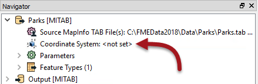
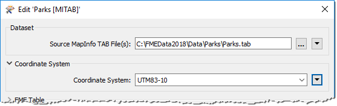
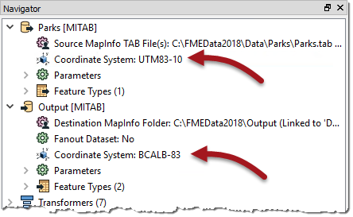
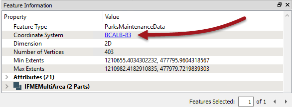

# 练习：地面维护项目 - 数据重投影

|  练习6 |  地面维护项目 - 数据重投影 |
| :--- | :--- |
| 数据 | 城市公园（MapInfo TAB） |
| 总体目标 | 计算城市中每个公园的大小和平均大小，以用于草地切割，树篱修剪等的地面维护估算。 |
| 演示 | 数据重投影 |
| 启动工作空间 | C:\FMEData2018\Workspaces\DesktopBasic\Transformation-Ex6-Begin.fmw |
| 结束工作空间 | C:\FMEData2018\Workspaces\DesktopBasic\Transformation-Ex6-Complete.fmw C:\FMEData2018\Workspaces\DesktopBasic\Transformation-Ex6-Complete-Advanced.fmw |

让我们继续您的地面维护项目。

公园团队已决定输出数据应采用Albers Equal Area投影（坐标系= BCALB-83）。他们认为设置它需要很长时间！我们将以不同的方式展示它们。

  
**1）启动Workbench**  
 启动Workbench（如有必要）并从练习5打开工作空间。或者，您可以打开C:\FMEData2018\Workspaces\DesktopBasic\Transformation-Ex6-Begin.fmw

  
**2）编辑读模块坐标系**  
在导航器窗口中找到Parks \[MITAB\]读模块，然后展开其设置列表。

找到标有“坐标系”的设置。原始值应&lt;设置&gt;：

[](https://github.com/safesoftware/FMETraining/blob/Desktop-Basic-2018/DesktopBasic2Transformation/Images/Img2.238.Ex6.CoordSysParamNavigator.png)

双击读模块“坐标系”参数以打开编辑对话框。

在“坐标系”字段中输入名称UTM83-10，或者从下拉列表底部选择“更多坐标系...”从坐标系统库中选择它：

[](https://github.com/safesoftware/FMETraining/blob/Desktop-Basic-2018/DesktopBasic2Transformation/Images/Img2.239.Ex6.CoordSysParamEditDialog.png)

|  技巧 |
| :--- |
|  请记住，当读模块的坐标系参数定义为&lt;未设置&gt;时，FME将自动尝试从数据集本身确定正确的坐标系。  当源数据集采用存储坐标系信息的格式时（就像在此示例中一样），您可以安全地保留参数未设置。所以这一步并非真的有必要。  但是，当您希望重投影不存储坐标系信息的源数据时，必须设置此参数; 否则转换中会出错。 |

  
**3）编辑目标坐标系**  
现在找到目标（写模块）数据集的坐标系设置。

同样，当前值应该是&lt;not set&gt;的默认值。

双击参数并输入坐标系名称BCALB-83，或通过从下拉列表底部选择“更多坐标系...”从坐标系统库中选择它。

Navigator窗口现在看起来像这样：

[](https://github.com/safesoftware/FMETraining/blob/Desktop-Basic-2018/DesktopBasic2Transformation/Images/Img2.240.Ex6.CoordSysParamsSet.png)

  
**4）运行工作空间**  
保存，然后运行工作空间。

在日志文件中，您应该能够找到：

```text
FME配置：读模块MITAB_1 [MITAB]的源坐标系设置为“UTM83-10”
FME配置：目标坐标系设置为“BCALB-83”
```

  
**5）检查输出**

打开新的重投影数据集并查询要素。“要素信息”窗口应报告数据现在位于BCALB-83中。（可选）单击该窗口中的坐标系名称; 将打开一个新对话框以显示所有坐标系参数。

[](https://github.com/safesoftware/FMETraining/blob/Desktop-Basic-2018/DesktopBasic2Transformation/Images/Img2.241.Ex6.CoordSysResultInDI.png)

|  技巧 |
| :--- |
|  如果在打开数据集时激活背景地图，则该数据集的内容将自动重投影到Spherical Mercator以匹配背景地图。如果您希望查看其自身坐标系中显示的数据，请**在**打开源数据集**之前**使用工具&gt; FME选项关闭背景地图。 |

|  高级练习 |
| :--- |
|  为什么不使用Reprojector（或CSMapReprojector）转换器尝试这个练习，而不是在导航器窗口中使用读模块/写模块参数？转换器应放在工作空间的哪个位置，为什么这很重要？ |

<table>
  <thead>
    <tr>
      <th style="text-align:left">恭喜</th>
    </tr>
  </thead>
  <tbody>
    <tr>
      <td style="text-align:left">
        <p>通过完成本练习，您已学会如何：
          <br />
        </p>
        <ul>
          <li>使用坐标系参数重投影空间数据</li>
          <li>查询Data Inspector中的要素以检查坐标系信息</li>
        </ul>
      </td>
    </tr>
  </tbody>
</table>