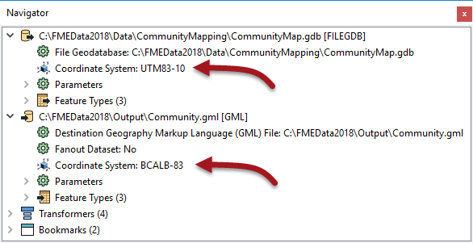
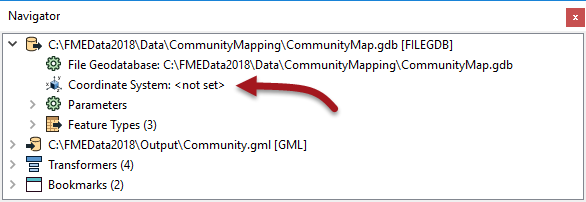

# 坐标系转换

为了定位在地球表面上的特定空间中，大多数空间数据与特定空间基准有关。

一些用户将这个数据位置称为“投影”，但投影只是我们称之为**坐标系**. 的一个组成部分。坐标系包括坐标系包括投影，基准，椭球，单位，有时还有象限。

## 坐标系设置

可以为FME中的每个读写模块分配一个坐标系。该坐标系在Workbench的导航窗口中或生成工作空间对话框中设置。

与源模式一样，读模块坐标系是 _**“我们拥有的”**_ 而写模块者坐标系是 _**“我们想要的”**_. 这里源坐标系已定义为UTM83-10，目标为BCALB-83：

读模块处理的每个要素都用其参数中定义的坐标系标记。

当一个要素到达一个写模块时，如果它被标记为与该写模块定义的坐标系不同，则FME会自动重新投影数据，以便输出位于正确的位置。

|  技巧 |
| :--- |
|  一旦用坐标系标记，每个要素在整个转换过程中保留这一点; FME始终知道它属于哪个坐标系。  这在执行几何变换（如计算面积）或读取属于不同坐标系的多个数据集时很重要（是的，FME会处理）。 |

## 坐标系的自动检测

并不总是需要手动设置坐标系参数。某些数据格式（例如Esri Shapefile）能够存储有关它们所在的坐标系的信息，FME将在可能的位置检索此信息。

这里，因为读模块坐标系标记为&lt;未设置&gt;，FME将尝试从源数据集确定坐标系。如果不能，则该要素将使用的坐标系标记。

根据可用的坐标系（CS）信息的组合，可能会出现许多重投影情景：

| 数据集CS | 读模块CS | 写模块CS | 重投影 |
| :--- | :--- | :--- | :--- |
| N | Y | Y | 从读模块CS重新投影到写模块CS |
| Y | N | Y | 从数据集CS重新投影到写模块CS |
| N | N | Y | Error: 错误：没有数据集或读模块CS无法重新投影/td&gt; |
| Y | Y | Y | 从读模块CS重新投影到写模块CS |

如果未在写模块上设置坐标系，则除非输出格式需要，否则不会进行重新投影。例如，KML格式要求数据为纬度/经度。如果未定义源数据集或读模块坐标系，则转换将失败。

