# 练习：投票分析项目

|  练习7 |  投票分析项目 |
| :--- | :--- |
| 数据 | 选举映射（GML） 选举统计（Microsoft Excel） |
| 总体目标 | 映射投票模式的统计 |
| 演示 | 数据转换 |
| 启动工作空间 | C：\ FMEData2018 \工作空间\ DesktopBasic \转型-EX7-Begin.fmw |
| 结束工作空间 | C：\ FMEData2018 \ Workspaces \ DesktopBasic \ Transformation-Ex7-Complete.fmw C：\ FMEData2018 \ Workspaces \ DesktopBasic \ Transformation-Ex7-Complete-Advanced.fmw |

在地面维护项目中，市政选举官员已经听说过您的技能，并要求帮助确定上次选举中投票率低的投票分区，或选民难以理解该过程的分区。

他请求您的帮助，并建议您在Google地球中显示结果，以便员工无需使用完整的GIS系统即可查看结果。

  
**1）检查数据**  
启动FME Data Inspector并打开我们将使用的两个数据集：

| 读模块格式 | GML（地理标记语言） |
| :--- | :--- |
| 读模块数据集 | C:\FMEData2018\Data\Elections\ElectionVoting.gml |

| 读模块格式 | Microsoft Excel |
| :--- | :--- |
| 读模块数据集 | C:\FMEData2018\Data\Elections\ElectionResults.xls |

请注意，两个数据集都有一个Division属性，用于标识每个投票分区（区域）。Excel数据是非空间的，但具有一组其他投票属性：

* **选民**：登记选民人数
* **投票**：**投票**的选民人数
* **空白**：投空白票或废弃票的选民数量
* **OverVotes**：投票选举太多候选人的选民人数
* **UnderVotes**：未投票数

OverVotes和UnderVotes属性指示了对投票过程的了解程度。每位选民最多可投票给10名候选人（30名）。

OverVotes是那些投票选出超过十名候选人的选民。UnderVotesUnderVotes是本来可以投出但没有投出的票数; 例如，选民只投了四个候选人而不是十个，有六个未投。

  
**2）启动Workbench**  
 启动Workbench并打开起始工作空间。它已经添加了读模块和作者来处理数据; 我们需要做的就是进行转换：

[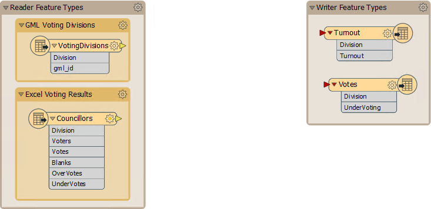](https://github.com/safesoftware/FMETraining/blob/Desktop-Basic-2018/DesktopBasic2Transformation/Images/Img2.242.Ex7.VotingProjectStartingWorkspace.png)

  
**3）添加FeatureJoiner**  
第一个任务是将统计选举数据加入到实际要素中。我们将使用FeatureJoiner转换器来执行此操作。FeatureJoiner是一种连接或合并要素的方法。在这种情况下，我们将选举结果记录合并到选举边界要素上。

添加FeatureJoiner转换器。将VotingDivisions数据连接到Left端口，将Councilors（结果）数据连接到Right端口：

[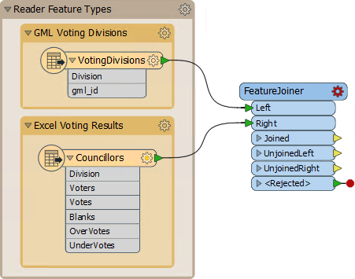](https://github.com/safesoftware/FMETraining/blob/Desktop-Basic-2018/DesktopBasic2Transformation/Images/Img2.243.Ex7.FeatureJoinerOnCanvas.png)

|  新东西 |
| :--- |
|  FeatureJoiner是FME2018的新转换器，旨在最终取代FeatureMerger。 |

  
**4）设置参数**  
查看FeatureJoiner参数。因为我们想要所有的投票分区要素，我们将进行左连接; 因此将Join Mode设置为Left。

对于“左”和“右”连接字段，单击该字段并从下拉列表中选择“Division”属性。此属性是我们加入数据的公共密钥：

[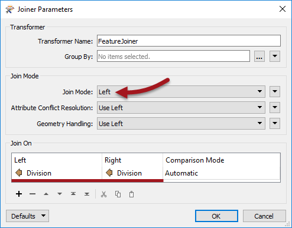](https://github.com/safesoftware/FMETraining/blob/Desktop-Basic-2018/DesktopBasic2Transformation/Images/Img2.244.Ex7.FeatureJoinerParameters.png)

  
**5）添加Inspector转换器**  
在FeatureJoiner：Joined输出端口之后**添加Inspector转换器**。运行工作空间，忽略报告意外输入的任何警告或日志消息。

在FME Data Inspector中检查数据，以确保所有分区多边形现在包含从Excel电子表格复制的一组属性数据：

[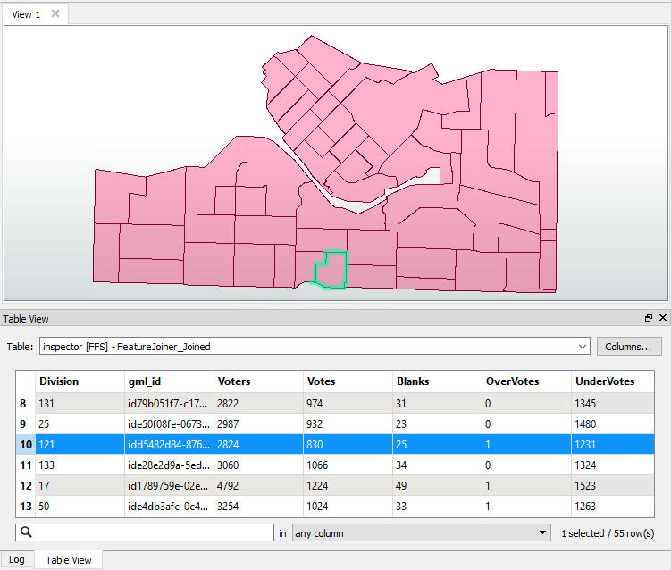](https://github.com/safesoftware/FMETraining/blob/Desktop-Basic-2018/DesktopBasic2Transformation/Images/Img2.245.Ex7.MergedDataInDI.png)

  
**6）添加ExpressionEvaluator**  
现在我们有了需要的数字，我们就可以开始计算一些统计数据了。为此，我们首先使用ExpressionEvaluator转换器来计算每个分区的选民投票率百分比。

在FeatureJoiner之后放置一个ExpressionEvaluator转换器 - 将它连接到FeatureJoiner:Joined输出端口。查看转换器的参数。将New Attribute设置为Turnout（以匹配我们在目标模式上的内容）：

[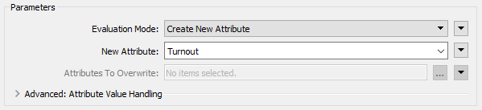](https://github.com/safesoftware/FMETraining/blob/Desktop-Basic-2018/DesktopBasic2Transformation/Images/Img2.246.Ex7.ExpressionEvaluatorNewAttr.png)

在表达式窗口中，将表达式设置为：

[](https://github.com/safesoftware/FMETraining/blob/Desktop-Basic-2018/DesktopBasic2Transformation/Images/Img2.247.Ex7.ExpressionEvaluatorMathsEditor.png)

```text
(@Value(Votes)/@Value(Voters))*100
```

您无需键入此内容 - 可以通过双击左侧列表中的该属性来获取@Value（投票）和@Value（选民）部分。

如果您愿意，可以重新连接Inspector并重新运行转换，以查看结果。

  
**7）添加ExpressionEvaluator**  
使用类似的技术，添加第二个ExpressionEvaluator来计算每个选民的UnderVotes数量，并将其放在与输出模式匹配的属性中（例如UnderVoting）。表达式将是这样的：

```text
@Value(UnderVotes)/@Value(Voters)
```

_**注意：**_ _这不是百分比，就像之前的计算一样。_

随意在两个ExpressionEvaluator转换器周围添加书签。

  
**8）添加AttributeRounder**  
将我们的统计数据计算到13位小数或更多位置有点过分了。我们应该截断这些数字。为此，在第二个ExpressionEvaluator之后放置一个AttributeRounder转换器。

对于参数，在“要舍入的属性”下，选择新创建的Turnout和UnderVoting属性。将小数位数设置为2：

[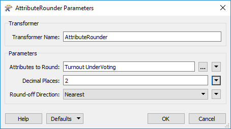](https://github.com/safesoftware/FMETraining/blob/Desktop-Basic-2018/DesktopBasic2Transformation/Images/Img2.248.Ex7.AttributeRounderParameters.png)

再次，如果您愿意，运行工作空间以检查结果。

  
**9）添加注释**  
将标签添加到AttributeRounder是没有意义的，因此右键单击转换器并选择Attach Annotation选项。

这样做会为转换器添加标签。编辑内容，例如“将道岔和投票结果舍入到小数点后两位”：

[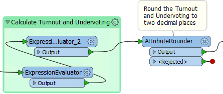](https://github.com/safesoftware/FMETraining/blob/Desktop-Basic-2018/DesktopBasic2Transformation/Images/Img2.249.Ex7.AttributeRounderOnCanvas.png)

  
**10）连接模式**  
最后一步让我们将AttributeRounder连接到输出模式。只需从AttributeRounder连接到两种写模块要素类型：

[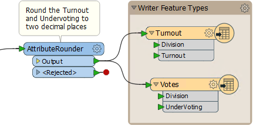](https://github.com/safesoftware/FMETraining/blob/Desktop-Basic-2018/DesktopBasic2Transformation/Images/Img2.250.Ex7.AttributeRounderSchemaConnections.png)

运行工作空间并检查Google地球中的输出，以证明它具有正确的属性并位于正确的位置。

|  技巧 |
| :--- |
|  所以这显然是一种并行数据流，但一直持续到最后一步。另一种布局是在FeatureJoiner之后拆分数据，如下所示： 输出没有区别，因此唯一的考虑因素是哪个更容易创建，哪个更好。使用的主要方法应该在两个方面都胜出。  [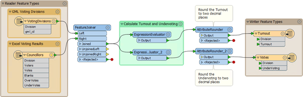](https://github.com/safesoftware/FMETraining/blob/Desktop-Basic-2018/DesktopBasic2Transformation/Images/Img2.251.Ex7.AlternativeLayout.png)   |

|  高级练习 |
| :--- |
|  该项目已完成，但输出非常简单。改善结果的外观会好得多，有几种方法可以用KML来完成。  我们可以根据他们的投票率/总票数简单地对投票部门进行着色，但更令人印象深刻的方法是使用三维块。  按照以下步骤在输出KML数据集中创建三维形状... |

  
**10）添加ExpressionEvaluator**  
每个块的高度应该与该分区的道岔成比例。但是，为了看到差异，垂直比例需要夸大一些。

在AttributeRounder和Turnout要素类型之间放置一个ExpressionEvaluator。设置参数以将Turnout属性乘以值50.将其放入名为TurnoutScaled的新属性中。

[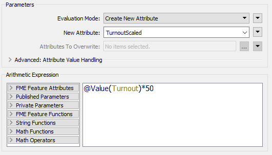](https://github.com/safesoftware/FMETraining/blob/Desktop-Basic-2018/DesktopBasic2Transformation/Images/Img2.252.Ex7.ExpressionEvaluatorExaggeratedScale.png)

  
**11）添加3DForcer**  
在新的ExpressionEvaluator之后添加一个3DForcer转换器。这会将要素提升到所需的高度。在参数对话框中，将高程设置为“属性值”&gt;“TurnoutScaled”。

[](https://github.com/safesoftware/FMETraining/blob/Desktop-Basic-2018/DesktopBasic2Transformation/Images/Img2.253.Ex7.3DForcerParameters.png)

  
**12）添加KMLPropertySetter**  
在3DForcer之后添加KMLPropertySetter转换器。该转换器允许我们在输出中设置3D块。设置几何东西参数如下：

* 高度模式:绝对值
* 挤压：是的

[](https://github.com/safesoftware/FMETraining/blob/Desktop-Basic-2018/DesktopBasic2Transformation/Images/Img2.254.Ex7.KMLPropertySetterDialog.png)

  
**13）添加KMLStyler** 最后，添加一个KMLStyler转换器。工作空间现在看起来像这样：

[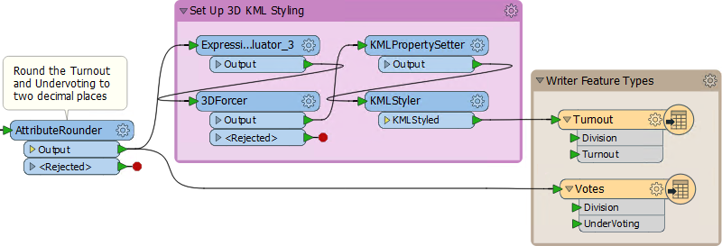](https://github.com/safesoftware/FMETraining/blob/Desktop-Basic-2018/DesktopBasic2Transformation/Images/Img2.255.Ex7.KMLStylerOnCanvas.png)

检查参数。选择颜色并填充要素的颜色。将填充不透明度增加到0.75左右。

[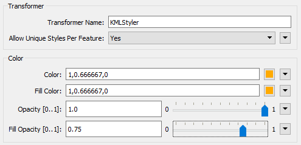](https://github.com/safesoftware/FMETraining/blob/Desktop-Basic-2018/DesktopBasic2Transformation/Images/Img2.256.Ex7.KMLStylerParameters.png)

保存并运行工作空间。在Google地球中，输出现在应如下所示：

[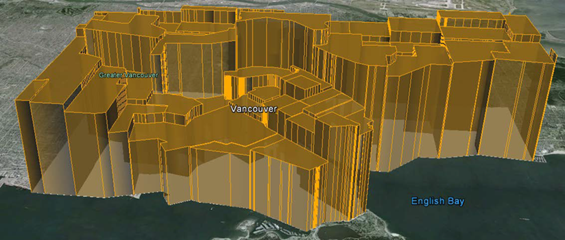](https://github.com/safesoftware/FMETraining/blob/Desktop-Basic-2018/DesktopBasic2Transformation/Images/Img2.257.3DKMLInGoogleEarth.png)

这些3D块将向用户显示城市选民投票率高/低的情况。

如果您愿意，请重复这些步骤，为UnderVoting统计数据提供3D表示。

<table>
  <thead>
    <tr>
      <th style="text-align:left">恭喜</th>
    </tr>
  </thead>
  <tbody>
    <tr>
      <td style="text-align:left">
        <p>通过完成本练习，您证明了您知道如何：
          <br />
        </p>
        <ul>
          <li>使用转换器进行内容转换（ExpressionEvaluator，AttributeRounder，3DForcer）</li>
          <li>使用转换器参数创建与写模块模式匹配的属性</li>
          <li>在单个工作空间中使用多个转换器流</li>
        </ul>
        <p>您还学会了如何：
          <br />
        </p>
        <ul>
          <li>使用公共密钥合并多个数据流（FeatureJoiner）</li>
          <li>使用FME的内置数学编辑器对话框</li>
          <li>使用转换器为输出要素设置符号系统（样式）</li>
        </ul>
      </td>
    </tr>
  </tbody>
</table>