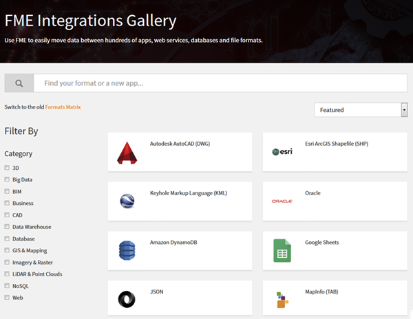

# FME转换
  
## 学习目标
 
完成本单元后，您将能够：
- 定义工作空间，并在FME Workbench中生成工作空间。
- 使用FME Data Inspector检查数据。
- 解释FME Workbench和FME Data Inspector之间的区别。
- 解释模式是什么，并在FME Workbench中对其进行编辑。
- 解释什么是模式映射，并使用转换器来完成。
- 打开和关闭要素缓存，并在构建工作空间时使用它。
- 使用带有要素缓存的部分运行。
 
## 转换
 
从本质上讲，FME是一种数据转换工具，这通常是用户希望学习的第一个方面。

 
**数据转换**是我们Safe Software用来指代将数据从一种格式转换为另一种格式的术语。您是否曾遇到过在您的首选应用程序中以不常见格式打开数据的问题？您是否曾经需要以系统的方式将电子表格数据加载到数据库中？您是否曾想过以HTML，JSON和XML等格式提取和转换Web数据而无需编码？那么你来对地方了！FME使数据转换变得简单，允许您在400多种不同格式之间进行转换。
 
我们提到**转换**来强调无缝地让数据以不同格式的语言说话的目标。FME旨在让您不仅可以将数据从一种格式转换为另一种格式，还可以根据您的确切规格创建输出数据。
 
在本单元中，您将学习如何使用FME自行进行基本数据转换。
