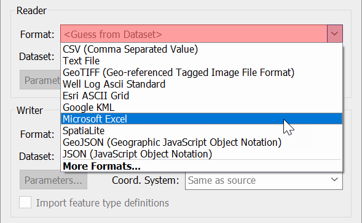
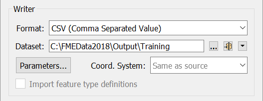

# 生成工作空间

Workbench的直观的界面便于设置和运行一个简单的格式，并进行一个以格式到格式(”快速')的转换。

##  开始标签

FME Workbench中的“开始”标签包含创建或打开工作空间的不同方法。最简单的方法是Generate Workspace：

您还可以通过File > Generate Workspac来生成工作空间。

Generate Workspace用于快速设置工作流以从单一格式转换文件。如果您有多种输入格式，则可以在生成的工作空间上构建，也可以从空白画布开始。在本课中，我们将开始使用一个文件;我们将在稍后的模块中介绍多种格式。

##  生成工作空间对话框

“生成工作空间”对话框将所有选项压缩到单个对话框中。它具有用于定义要读取的数据和要写入的数据的格式和位置的字段。

FME对话框中的红色着色表示必填字段。用户必须在这些字段中输入数据才能继续。在大多数对话框中，在完成必填字段之前，不会激活“确定”按钮。

### 格式和数据集选择

关键要求是源数据的格式。所有格式选择字段都允许您键入搜索格式，或使用下拉菜单进行浏览。

您可以键入格式名称以搜索可用格式。此外，下拉列表显示了一些最常用的格式，因此可以立即获得许多喜爱的格式：

单击“更多格式”，将打开一个表格，显示**FME支持的所有**格式。

源数据集是另一个关键要求。数据集选择字段是文本输入字段，但具有浏览按钮以打开类似于资源管理器的文件选择对话框。

同样，此对话框定义写模块格式和数据集：

##  要素类型对话框

单击“生成工作空间”对话框上的“确定”会导致FME生成已定义的工作空间。但是，只要源数据集包含多个要素类型，就会首先提示用户选择要转换的数据。

您可以通过“选择要素类型”对话框选择要包括的要素类型。正如[前面提到的那样](/1.getting-started/1.03.fme-components.md)，***要素类型***是*图层*，*表*，*工作表*，*要素类*以及*对象类*的另一个术语。例如，DWG文件中的每个图层或Oracle数据库中的每个表都被定义为FME中的要素类型。工作空间中仅显示选定的要素类型。通过此对话框，您可以控制要从源中使用的数据组。

例如，这是一个“选择要素类型”对话框，用户已选择在工作空间中包含所有可用图层：

