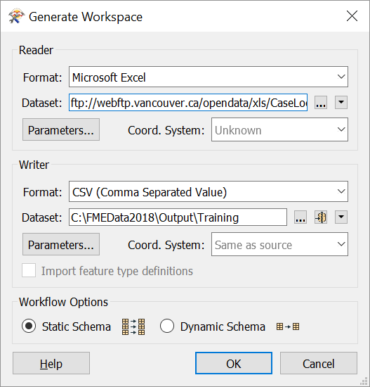
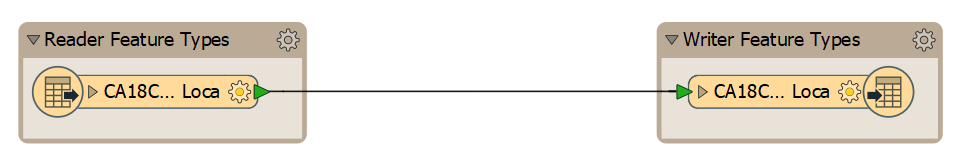
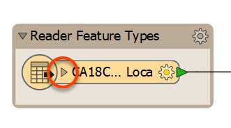
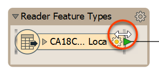
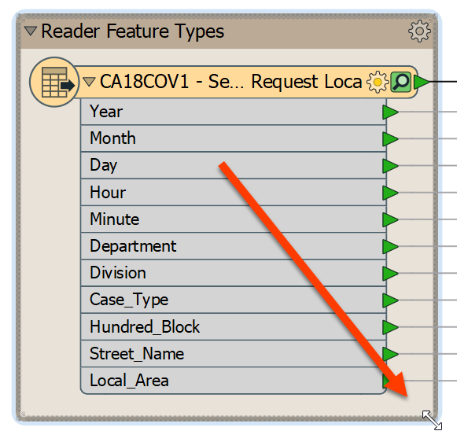
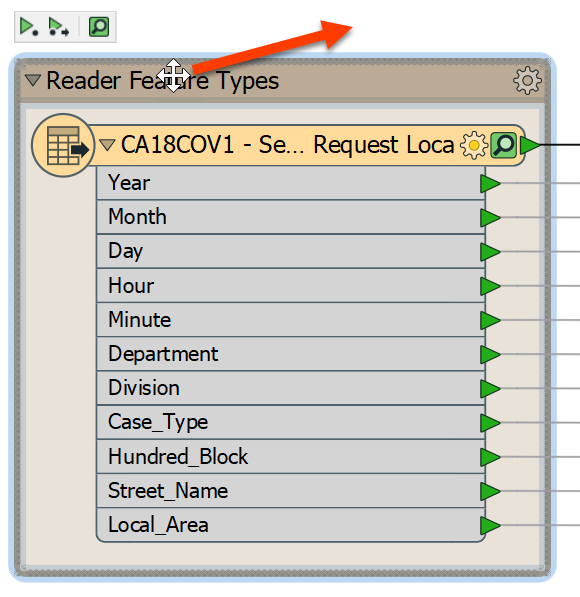
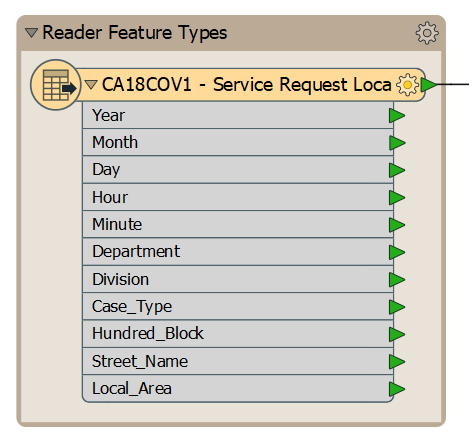
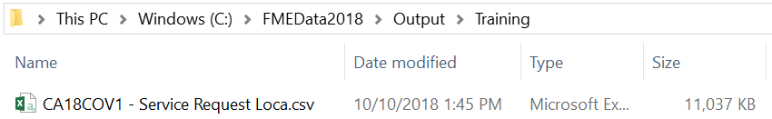

恭喜！您刚刚在当地城市的数字和联络中心服务部门担任技术分析师。您将努力管理和分析他们从3-1-1联络中心收集的数据。[3-1-1](https://en.wikipedia.org/wiki/3-1-1)是一个本地电话号码，广泛用于美国和加拿大各城市，供市民呼入和请求服务。大多数城市现在也在线收集这些数据。

在第一天，您被要求进行简单的文件格式转换。3-1-1案例数据当前存储为XLS文件，每个月存储一个。这些文件存储在城市的[FTP服务器](https://en.wikipedia.org/wiki/File_Transfer_Protocol)中。为了以任何人都可以访问的格式托管此公共数据，您的经理希望您将2017年的12个XLS文件转换为覆盖整年的单个CSV文件。

我们已经列出所有你需要采取的行动，然而FME的界面非常直观，您应该能够在不需要这些逐步说明的情况下执行该练习。

# 1)启动FME Workbench

如果它尚未打开，请从Windows开始菜单中选择它来启动FME Workbench。你将会发现它在Start > FME Desktop 2019.0 > FME Workbench 2019.0.下。

如果Workbench已打开，请单击主画布上方的“开始”选项卡。

# 2)选择Generate Workspace

在“开始”页面的“创建工作空间”部分中，选择“生成(工作空间)”选项。或者，您可以使用快捷键<kbd>Ctrl</kbd>+<kbd>G</kbd>。


# 3) 定义转换

Generate Workspace工具打开一个对话框，用于定义要执行的转换。填写此对话框中的字段，如下所示：

<table style=“border：0px”>

<TR>
<td style=“font-weight：bold”>读模块格式</td>
<td style=“”>Microsoft Excel</td>
</TR>

<TR>
<td style=“font-weight：bold”>读模块数据集</td>
<td style=“”><a href="ftp://webftp.vancouver.ca/opendata/xls/CaseLocationsDetails_2017_XLS.zip">ftp://webftp.vancouver.ca/opendata/xls/CaseLocationsDetails_2017_XLS.zip</a><br><i>注意：</i>您也可以在C：\FMEData2019\Resources\311\CaseLocationsDetails_2017_XLS.zip本地访问数据</td>
</TR>

<TR>
<td style=“font-weight：bold”>写模块格式</td>
<td style=“”>CSV(逗号分隔值)</td>
</TR>

<TR>
<td style=“font-weight：bold”>Writer Dataset</td>
<td style=“”>C：\FMEData2019\Output\Training\</td>
</TR>

</TABLE>

对话框如下所示：



请记住，您可以通过键入名称，从下拉列表中选择格式，或选择“更多格式”并从完整格式表中选择格式来设置格式。请注意，写模块只需要一个文件夹而不是特定的文件名。

您可以单击“生成工作空间”对话框中的“参数”按钮来检查读模块/写模块参数，但在本练习中不需要更改它们。目前，您还可以忽略“坐标系”设置和“工作流选项”。

# 4)生成并检查工作空间

单击“确定”关闭“生成工作空间”对话框。FME Workbench在画布上生成一个新工作空间：



您可以通过单击每个对象上的箭头图标来公开属性列表：



您还可以通过将鼠标悬停在要素类型的一侧，直到获得一个expander箭头，然后双击，将该要素类型展开以适合整个名称:



# 5)检查书签

现在您已经展开了要素类型，您可能会注意到它不再适合以前包含的棕色矩形，标记为“读模块要素类型”。这是**书签**。其中两个是使用Generate Workspace自动创建的，但为了遵循FME最佳实践，我们建议使用这些来封装工作空间的各个部分。其中包含的对象在“导航”窗口中分组，可以在画布上一起移动。

书签就像工作空间的段落一样，将它们分成几个部分以保持组织性，并帮助其他用户理解每个部分的作用。

我们稍后会在模块中使用书签，但是现在让我们调整它的大小以包含整个要素类型。您只需将鼠标悬停在右下角，直到看到展开箭头，然后单击并拖动以更改书签大小以包含要素类型：



尝试通过单击“读模块要素类型”的位置并拖动来移动书签。您会注意到对象随书签移动。



现在您的读模块要素类型应如下所示：



# 6)保存工作空间

将工作空间保存在您想要的任何位置。我们将在以后的练习中使用它。请记住，有一个工具栏保存按钮，在菜单上有文件>另存为。

如果在没有调整的情况下立即运行转换，则称为“快速转换”。因为FME是一个“语义”转换器，具有增强的数据模型，考虑到目标格式的功能，快速转换的输出尽可能接近结构和含义上的源数据。

# 7)运行工作空间

单击工具栏上的“运行”按钮，或使用菜单栏上的“运行”>“运行转换”运行工作空间。工作空间运行，转换日志窗口报告成功转换：

```
=-=-=-=-=-=-=-=-=-=-=-=-=-=-=-=-=-=-=-=-=-=-=-=-=-=-=-=-=-=-=-=-=-=-=-=-=-=-=-
使用关键字“CSV2_1”为“CSV2”写模块输出特征输出：
=-=-=-=-=-=-=-=-=-=-=-=-=-=-=-=-=-=-=-=-=-=-=-=-=-=-=-=-=-=-=-=-=-=-=-=-=-=-=-
写入要素
=-=-=-=-=-=-=-=-=-=-=-=-=-=-=-=-=-=-=-=-=-=-=-=-=-=-=-=-=-=-=-=-=-=-=-=-=-=-=-
CA18COV1-服务请求Loca 97345
==============================================================================
总写入要素97345
=-=-=-=-=-=-=-=-=-=-=-=-=-=-=-=-=-=-=-=-=-=-=-=-=-=-=-=-=-=-=-=-=-=-=-=-=-=-=-
=-=-=-=-=-=-=-=-=-=-=-=-=-=-=-=-=-=-=-=-=-=-=-=-=-=-=-=-=-=-=-=-=-=-=-=-=-=-=-
要素读取摘要
=-=-=-=-=-=-=-=-=-=-=-=-=-=-=-=-=-=-=-=-=-=-=-=-=-=-=-=-=-=-=-=-=-=-=-=-=-=-=-
CA18COV1-服务请求Loca 97345
==============================================================================
总要素读取97345
=-=-=-=-=-=-=-=-=-=-=-=-=-=-=-=-=-=-=-=-=-=-=-=-=-=-=-=-=-=-=-=-=-=-=-=-=-=-=-
=-=-=-=-=-=-=-=-=-=-=-=-=-=-=-=-=-=-=-=-=-=-=-=-=-=-=-=-=-=-=-=-=-=-=-=-=-=-=-
要素写入摘要
=-=-=-=-=-=-=-=-=-=-=-=-=-=-=-=-=-=-=-=-=-=-=-=-=-=-=-=-=-=-=-=-=-=-=-=-=-=-=-
CA18COV1-服务请求Loca 97345
==============================================================================
总写入要素97345
=-=-=-=-=-=-=-=-=-=-=-=-=-=-=-=-=-=-=-=-=-=-=-=-=-=-=-=-=-=-=-=-=-=-=-=-=-=-=-
转换是成功的，0警告(97345要素输出)
FME会话持续时间：9.6秒。(CPU：7.9s 用户，1.1s系统)
END-ProcessID：21560，峰值进程内存使用量：98484 kB，当前进程内存使用情况：50760 kB
转换是成功的
```

# 8)定位输出

在Windows资源管理器中找到目标数据，以证明它已按预期写入(不要忘记练习1中的“打开包含文件夹”按钮)：



现在，让我们使用记事本来确保数据看起来像我们期望的那样。右键单击*CA18COV1-服务请求Loca.csv*，然后选择打开方式>记事本。如果查看顶行，您应该会看到我们在写模块要素类型下看到的属性名称：

`年，月，日，时，分，系，部，Case_Type，Hundred_Block，STREET_NAME，Local_Area`

在接下来的工作中，我们'会介绍如何使用FME数据检查来检查数据。

<UL>
<li>生成FME工作空间</li>
<li>运行FME工作空间</li>
</UL>

