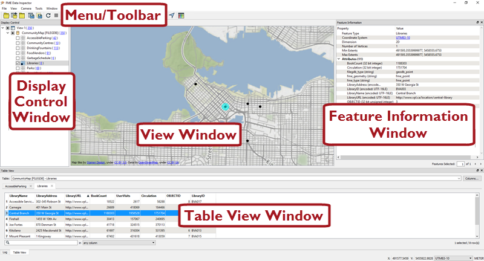
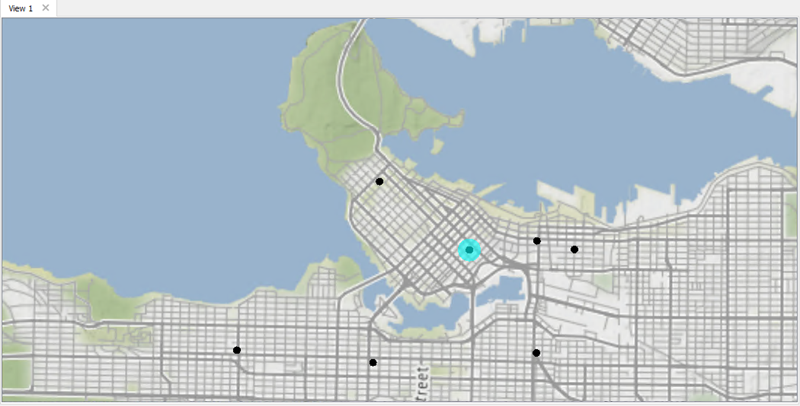
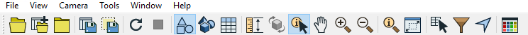
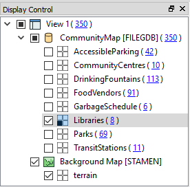

# 检查数据

# 数据检查简介

为确保您处理正确的信息，您需要在转换过程的每个阶段都清楚地查看数据。

数据检查满足了这一需求：它是在转换之前，期间或之后查看数据以进行验证和调试的行为。

# FME Data Inspector简介

在FME中开始检查数据的最佳位置是在一个称为FME Data Inspector的补充应用程序中。

## 什么是FME Data Inspector？

FME Data Inspector是一个实用程序，允许以任何FME支持的格式查看数据。它主要用于在转换之前预览数据或在转换后进行验证。

FME Data Inspector与FME Workbench密切相关，因此Workbench可以将数据直接发送给Inspector。它还与FME Workbench紧密相连，通过在*转换期间*检查数据来帮助设置和调试工作空间。

## FME Data Inspector不是什么！

FME Data Inspector不是要设计成为功能齐全的电子表格、数据库或映射应用程序。它没有分析或编辑功能，用于符号系统修改或打印的工具用于数据验证而不是生成输出。

## 启动FME Data Inspector

要启动Data Inspector，请在Windows开始菜单中找到它：

## FME Data Inspector的主要组件

当FME Data Inspector打开数据集时，它看起来像这样：

 <a href="https://stamen.com">Stamen Design</a>地图瓦片来自<a href=“https://creativecommons.org/licenses/by/3.0”>CC-BY-3.0</A>。数据来自<a href="http://openstreetmap.org">OpenStreetMap</a>，<a href="http://creativecommons.org/licenses/by-sa/3.0">CC-BY-SA</A>。

### 视图窗口

“视图”窗口是FME数据检查器的空间显示区域。可以在任何时间打开不同数据集的多个视图。

 <a href="https://stamen.com">Stamen Design</a>地图瓦片来自<a href=“https://creativecommons.org/licenses/by/3.0”>CC-BY-3.0</A>。数据来自<a href="http://openstreetmap.org">OpenStreetMap</a>，<a href="http://creativecommons.org/licenses/by-sa/3.0">CC-BY-SA</A>。

## 菜单栏和工具栏

菜单栏和工具栏包含许多工具。一些用于在视图窗口中导航，一些用于控制管理任务(例如打开或保存数据集)，而另一些用于特定功能，例如选择性地过滤数据或创建动态属性。

### 显示控制窗口

“显示控制”窗口显示打开的数据集及其要素类型的列表。此处的工具允许用户在显示中打开或关闭这些工具，更改其符号系统并调整显示顺序。

### 要素信息窗口

在“查看”窗口中查询要素时，“信息”窗口会显示有关该要素的信息。此信息包括要素的意思类型，属性(用户和格式属性)，坐标系和其几何对象的详细信息。

### 表视图窗口

“表视图”窗口是一个类似电子表格的数据集视图，包含所有要素和所有属性，每个要素类型(图层)都有一个单独的选项卡。

