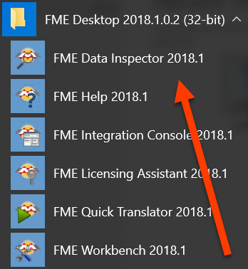

让我们通过检查上一个练习的结果来了解FFME Data Inspector接口是如何工作的。

# 1)启动FME Data Inspector

从Windows开始菜单中选择FME Data Inspector，启动它。你'会发现它在Start > FME Desktop 2019.0 > FME Data Inspector 2019.0下。

# 2)在FME Data Inspector中打开数据集

FME Data Inspector将启动并以空视图显示开始。

要打开数据集，请从菜单栏中选择“文件”>“打开数据集”，单击工具栏中的“打开数据集”图标，或使用<kbd>Ctrl</kbd>+<kbd>O</kbd>：

出现提示时，填写“选择数据集”对话框中的字段，如下所示：

<table style=“border：0px”>

<TR>
<td style=“font-weight：bold”>读模块格式</td>
<td style=“”>CSV(逗号分隔值)</td>
</TR>

<TR>
<td style=“font-weight：bold”>读模块数据集</td>
<td style=“”>>C:/FMEData2019/Output/Training/CA18COV1 - Service Request Loca.csv</td>
</TR>

</TABLE>

单击“确定”，您将看到“表视图”窗口中出现一个表。主视图将为空白，并显示“此视图中没有几何对象”。视图显示此消息，因为我们已加载没有几何对象的数据。正如您稍后将看到的，如果我们加载空间数据(如地图图层，CAD绘图或3D模型)，它将在此处显示。如果滚动表视图，则可以看到3-1-1请求属性的不同值：

# 3)在FME Data Inspector中添加数据集

使用Open Dataset始终在Data Inspector的新视图中显示数据，显示在View窗口上方的选项卡界面中：

您还可以将另一个数据集添加到打开的视图中。让我们通过添加我们将在后面的单元中使用的数据集来尝试此功能：本地规划区域。该数据集是温哥华当地规划区域的[KML文件](https://en.wikipedia.org/wiki/Keyhole_Markup_Language)，由城市指定用于规划和开发。它包含它们的几何对象，即它们所覆盖的区域，以及它们的属性，例如它们的名称。

要将数据集添加到打开的视图，请从菜单栏中选择“文件”>“添加数据集”，单击工具栏上的“添加数据集”按钮，或使用<kbd>Ctrl</kbd>+<kbd>D</kbd>：

出现提示时，请填写“选择要添加的数据集”对话框中的字段，如下所示：

<table style=“border：0px”>

<TR>
<td style=“font-weight：bold”>读模块格式</td>
<td style=“”>Google KML</td>
</TR>

<TR>
<td style=“font-weight：bold”>读模块数据集</td>
<td style=“”>C：/FMEData2019/Data/Boundaries/LocalAreas.kml</td>
</TR>

</TABLE>

单击“确定”，您将在“显示控制”窗口中看到新的要素类型。此外，您将在“视图”窗口中看到本地区域：

# 4)添加底图

当前区域当前没有任何上下文。让我们通过添加底图来改善显示效果。选择工具>FME选项>底图(或在Mac上，FME数据检查器>首选项>底图)。单击“背景格式”旁边的下拉列表：

您会注意到FME支持各种底图服务。大多数都需要现有帐户或服务器，但是对于此示例，我们选择Stamen Maps，我们可以在没有帐户的情况下使用它。

选择Stamen Maps后，单击“参数”。单击省略号按钮以检索可用的底图样式列表。选择terrain并单击OK：

单击“确定”两次以关闭“FME选项”窗口。您应该会看到底图很快出现：

您可以使用工具栏中的平移和缩放工具在地图周围移动视图：

<UL>
<li>在FME Data Inspector的新视图中打开数据集</li>
<li>在FME Data Inspector的打开视图中添加数据集</li>
<li>在FME Data Inspector中添加底图</li>
</UL>
