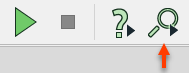
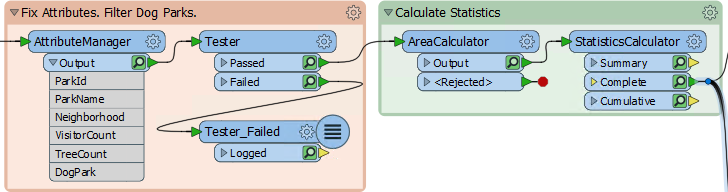
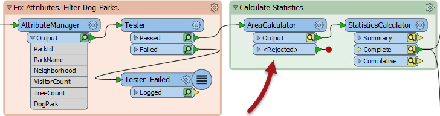
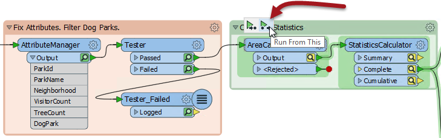
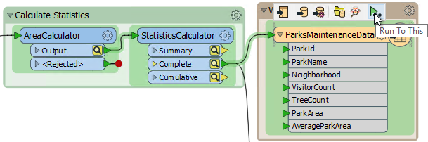

# 要素缓存

有时，能够在转换的任何步骤检查数据都很重要。FME可以选择自动缓存数据：**要素缓存**。您可以通过单击工具栏上的**Run with Feature Caching**按钮将其打开：

启用缓存后，运行转换会导致数据缓存在工作空间的每个部分。在后续运行中，可以使用这些缓存，而不必重新运行工作空间的整个部分。

例如，在此处，已启用工作空间并启用了缓存：

您可以单击绿色放大镜图标以检查转换点的要素。

# 部分运行

部分运行是仅执行工作空间的一个部分。

考虑以上作者是否对AreaCalculator参数进行了更改：

请注意，缓存会在AreaCalculator转换器和后续转换器上更改颜色(变为黄色)。这种颜色表示缓存是陈旧的;他们的数据内容不再与工作空间产生的内容相匹配。

要获得新结果，作者必须重新运行工作空间。但是，他们不必重新运行整个工作空间;他们可以在变化点-AreaCalculator启动工作空间：

**Run From This**导致工作空间仅从该点开始运行，使用缓存到此时为止的数据。注意悬停在选项上的方式如何突出显示所有“下游”转换器。仅有它们会运行。这使转换更快。

另一种选择是**Run To This**。作者可以在写模块要素类型上使用该选项，并获得相同的效果：

...但请注意StatisticsCalculator中的第二个分支如何不突出显示。它不会运行。这展示了如何避免运行特定的工作空间部分。

部分运行对于避免从源头重新读取数据特别有用;特别是当数据来自缓慢的远程位置时，例如Web服务。

此外，当保存为模板时，可以使用工作空间保存缓存。这意味着可以使用先前会话中的缓存或甚至来自其他作者的缓存来重新运行工作空间！

请注意，虽然使用要素缓存和部分运行可以加快工作空间的开发，但缓存数据显然会导致转换速度变慢并使用系统资源(如磁盘空间)。在开发工作空间时缓存非常有用，但在将工作空间投入生成之前应该关闭缓存。

