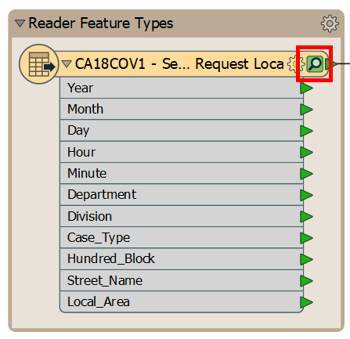
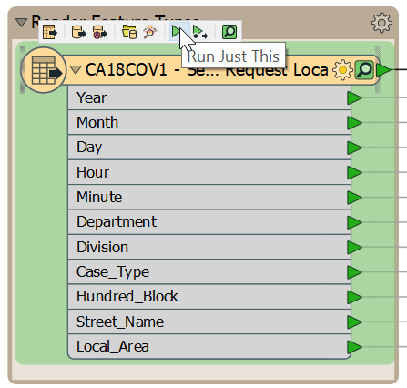
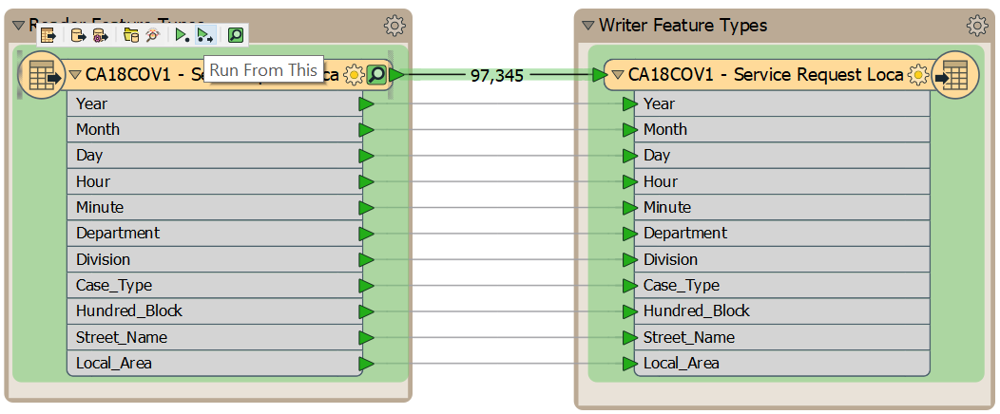
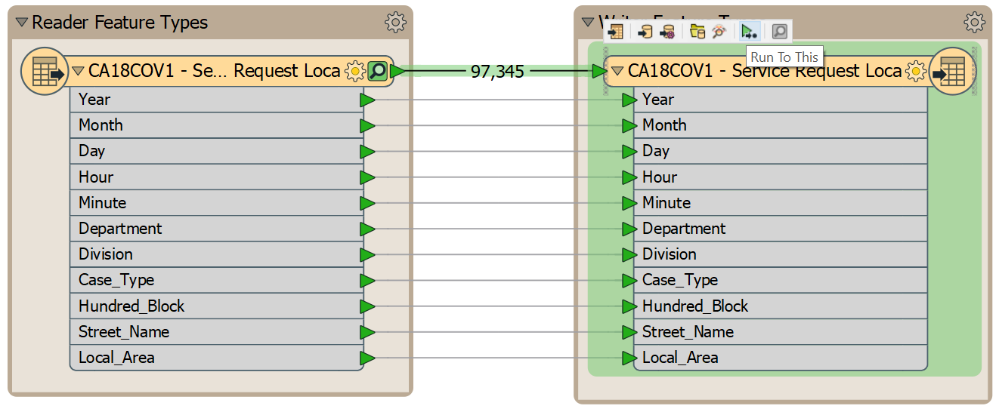
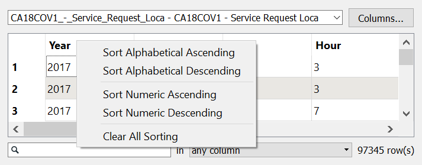
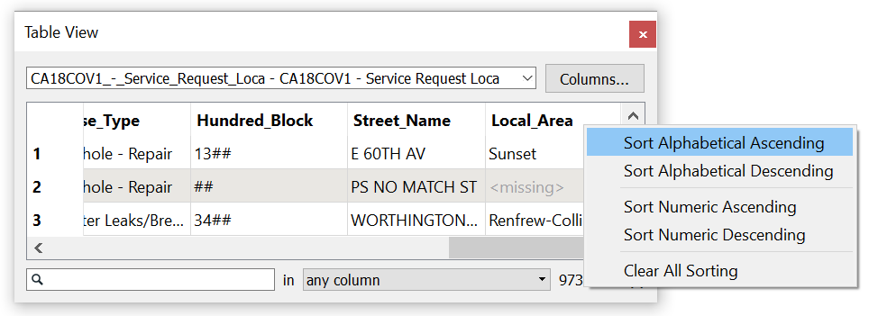
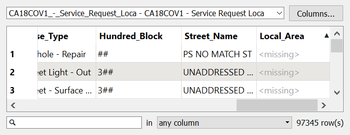
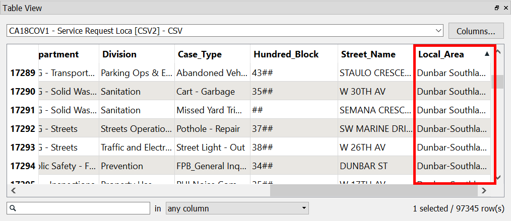
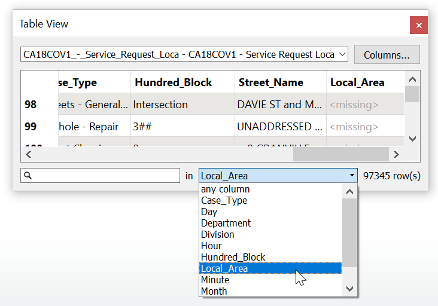
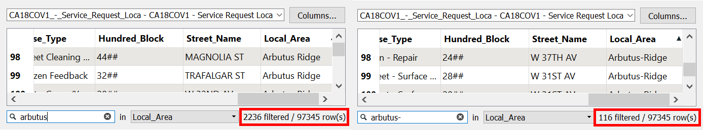

让我们使用要素缓存来检查我们的数据。

# 1）启动Workbench

启动Workbench（如有必要）并从练习2.1中打开工作空间。或者，您可以打开C：/FMEData2019/Workspaces/IntroToDesktop/Ex2.3-Begin.fmw。

# 2）使用要素缓存

默认情况下，要素缓存处于关闭状态;您可以在工具栏的左上角看到放大镜和小播放按钮图标：

单击按钮以打开要素缓存，或转到“运行”>“使用要素缓存运行”。然后重新运行您的工作空间。您应该注意到一个小绿色方块，上面有放大镜填满了您的读模块要素类型：

此图标表示要素缓存。缓存存储转换点的要素，您可以单击它来检查数据。单击绿色图标以检查转换点的数据;您的原始Excel数据将在Data Inspector中打开。

# 3）使用部分运行和要素缓存

要素缓存还允许我们有选择地运行工作空间的各个部分。

如果通过单击选择读模块要素类型，则会在其上方显示一些工具提示图标。这里有两个部分运行选项。因为此要素类型是工作空间中的第一个对象，所以您可以选择**Run Just This**，在这种情况下读取数据并对其进行缓存。您也可以选择**Run From This**，它将从此对象运行到工作空间的末尾，仅运行它所连接的内容。

如果将鼠标悬停在每个选项上，您将看到如果单击突出显示将运行的对象。对于Run From This，只显示读模块要素类型：

对于Run From This，写模块要素类型也将运行：

最后，您可以选择写模块要素类型，并查看选项**Run To This**，它将运行此前面的所有连接对象：

在这个特定场景中，这些工具没那么有用，因为我们的工作空间中只有两个对象。但是，随着工作空间的增长，部分运行可以帮助您一次测试和开发工作空间的一小部分。现在，在您的读模块要素类型上使用**Run Just This**。然后，单击绿色图标以检查读取的数据。

# 4）对表视图进行排序以检查缺失值和不一致的值

现在Data Inspector已打开，让我们使用其表视图来识别源数据中的问题。

表视图中的列标题包含每个属性的名称。如果右键单击它们，您将获得一个包含许多选项的上下文菜单：按字母顺序（升序或降序）或数字（升序或降序）对列进行排序，或清除所有排序：

由于最终我们想要报告本地规划区域的3-1-1电话记录，让我们看看我们的任何要素是否缺少`Local_Area`属性的值。为此，请在表视图中滚动，直到看到“Local_Area”属性。然后，右键单击并选择**按字母顺序排序升序**：

如果向下滚动，您会发现有4,122个要素缺少“本地区域”的值！

如果你花时间仔细研究，结果发现我们有两种缺失的数据：

1.有些记录没有街道地址，导致它们与本地区域无关。
2.每个月的记录之间还有两行缺失数据。您可以通过向下滚动来查找每个月之间的间隙（“月”属性从“1”变为“2”，“2”变为“3”等等）来验证这一点。

如果您对数据问题有敏锐的洞察力，您可能还会发现“Local Area”属性中值的命名不一致。其中两个区域名称的值在某些值中带有连字符，但不是全部：Dunbar Southlands和Dunbar-Southlands以及Arbutus Ridge和Arbutus-Ridge：

您可以使用表视图左下角的搜索栏来验证此问题。单击下拉列表并选择“Local_Area”：

比较用放大镜在文本框中输入“Arbutus”和“Arbutus-”的结果（在右下方可见）。你会发现在Arbutus-Ridge局部区域的2,236个要素中，116个字之间有一个连字符：

我们将在稍后的练习中解决这些数据质量问题。

这种对数据的视觉检查是良好的第一步，但通常需要更彻底的数据验证。由于这是介绍，我们不会详细介绍验证。如果您想了解有关使用FME进行数据验证的更多信息，请查看<a href=“https://knowledge.safe.com/articles/32707/tutorial-data-validation-and-qa-with-fme.html”>文章</a>。

<UL>
<li>使用FME Workbench要素缓存在FME Data Inspector中打开数据集</li>
<li>在FME Data Inspector表视图中对数据进行排序</li>
</UL>

