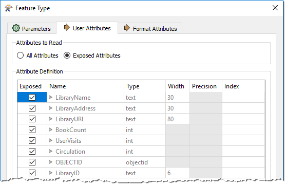

# 模式和数据模型

变换数据集的结构需要使用FME来操作*模式*。FME使用术语“模式”，但您可能将其视为*数据模型*。

## 模式概念

***模式*** 定义数据集的结构。每个数据集都有其独特的模式;它包括定义或限制其内容的图层，属性和其他规则。

例如，本地银行链的（简化)业务数据的Excel工作簿的模式可能如下所示：

|工作表|栏|类型|
|-|-|-|
|客户|名称|字符串|
|客户|地址|字符串|
|客户|电话|字符串|
|客户|帐号|整数|
|客户|分支机构ID|整数|
|位置|分支名称|字符串|
|位置|分支ID|整数|
|位置|地址|字符串|
|地址|电话|字符串|
|位置|销售|整数|

FME允许您在将数据转换为新格式时保留数据模式，还可以选择更改模式以更改数据结构。例如，您可以从输出数据中删除“位置”工作表，或者创建一个按其销售括号对银行分行进行分类的新属性。

### 模式表示

创建新工作空间时，FME会扫描源数据集。它创建了一个 ***读模块*** ，其要素类型显示在工作空间画布的左侧，***写模块*** 的要素类型显示在工作空间画布的右侧：

此图中的每个对象表示源数据集中的细分。请记住，在FME术语中，这些对象称为<strong>要素类型</strong>。多个要素类型表示源数据集中有多个图层或表。

### 读模块模式

对于读模块，您可以通过单击每个要素类型对象上的齿轮图标来查看有关该模式的更多信息：

此要素类型对话框有几个选项卡。在“参数”选项卡下面是一组常规参数，例如要素类型的名称（在本例中为“Libraries”)允许的几何对象以及父数据集的名称：

“用户属性”选项卡显示属性列表。每个属性都包含有关其名称，数据类型，宽度和小数位数的信息：

每种要素类型都有不同的名称，并且还可以具有完全不同的属性集。所有这些信息都构成了读模块模式。它的字面意思是 ***“我们所拥有的。”*** 

### 写模块模式

与读模块一样，每个写模块都有一组详细的模式信息，可通过打开要素类型的对话框来访问：

默认情况下，写模块模式（ ***“我们想要的”*** )是源的镜像，因此转换的输出将是输入的副本。此功能允许用户无需进一步编辑即可进行格式到格式的转换（*快速转换*)。

## 模式编辑

如果 *“我们想要的”* 与默认模式定义不同，我们必须使用称为 ***模式编辑*** 的技术来更改它。此过程涉及更改写模块模式以自定义输出数据的结构。一个很好的例子是重命名属性字段。

在编辑之后，源模式仍然代表 *“我们拥有的”* ，但目标模式现在确实代表 *“我们想要的东西。”* 

## 模式映射

使用Generate Workspace时，读写模块模式将完全相同。但是，当编辑发生时，这些连接通常会被破坏。

 ***模式映射*** 是将读模块模式连接到写模块模式的过程，其方式是确保正确的读模块要素转到正确的写模块要素类型，并且正确的读模块属性转到正确的写模块属性。

FME允许以任何所需的布置从源到目的地的映射。可以映射哪些要素类型或属性没有限制。

