现在您已创建工作空间以将3-1-1数据转换为CSV，3-1-1部门已请求您从属性名称中删除下划线并添加“Date”属性。我们可以使用转换器对模式进行这些更改。

# 1）启动Workbench

启动Workbench（如有必要）并从练习1打开工作空间。或者，您可以打开C：\FMEData2019\Workspaces\IntroToDesktop\Ex2.3-Begin.fmw。

# 2）重命名要素类型

目前，目标模式与源匹配。但是，数据的最终用户请求更改模式。

通过双击或单击其齿轮来检查写模块要素类型参数。单击标有CSV文件名的字段，将名称从“CA18COV1-服务请求位置”更改为“311-requests”：

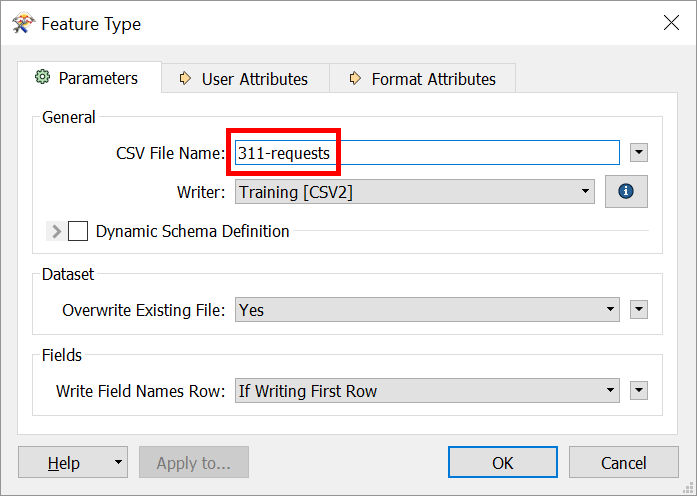

现在，当工作空间运行时，输出将命名为311-requests.csv。

# 3）更新属性

单击“用户属性”选项卡，检查用户属性。它们看起来像这样：

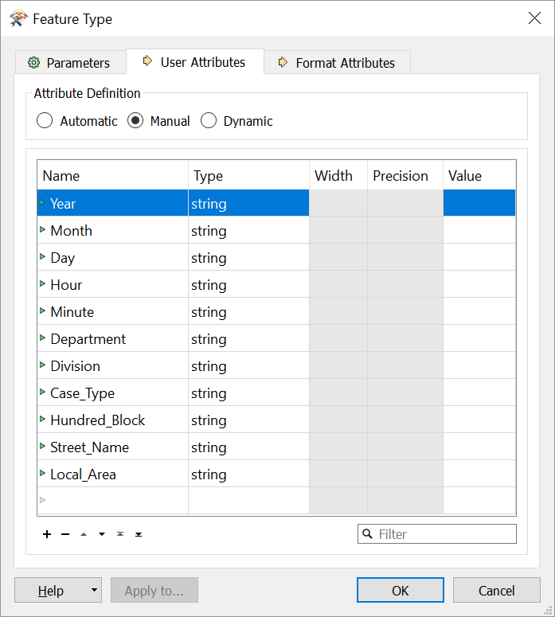

让我们去掉属性名称中的那些下划线，并添加一个名为`Date`的新属性，我们将在稍后提供值。执行以下操作：

|名称|动作|
|-|-|
|`Case_Type`|将属性重命名为`Case Type`|
|`Hundred_Block`|将属性重命名为`Hundred Block`|
|`Street_Name`|将属性重命名为`Street Name`|
|`Local_Area`|将属性重命名为`Local Area`|
|`Date`|创建`string`类型的属性`Date`|

您可以通过单击“名称”单元格并进行编辑来重命名属性。您可以通过单击表格底部的空白名称单元格并输入新的属性名称来添加属性。或者，您可以使用“+”按钮添加新行。您可以通过单击Type下的下拉菜单并选择`string`来为它指定Type`字符串。

对写模块模式进行这些更改后，属性列表现在应如下所示：

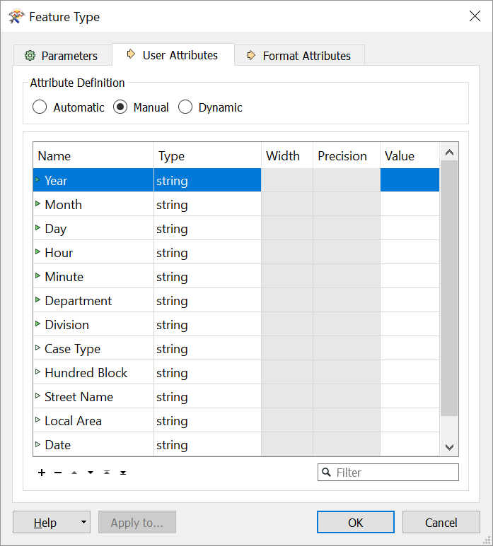

现在单击OK。

您可能会注意到，我们在写模块要素类型上编辑和创建的属性名称旁边的三角形已将颜色更改为红色！我们将这些三角形称为 **端口** 。当它们位于对象的左侧时，它们被称为**输入端口**，而右侧的三角形被称为**输出端口**。您可以注意到我们编辑的属性已将颜色更改为黄色。

彩色端口用于直观地帮助模式映射：

<UL>
<li>绿色▶：此属性已连接。</li>
<li>黄色▶：此读模块要素类型属性未映射到任何写模块要素类型;因此，此属性不会出现在输出中。</li>
<li>红色▶：此写模块要素类型属性未连接;虽然它存在于模式中，但它不会接收任何数据，因此在写入的数据中不会有任何值。</li>
</UL>

# 4）保存工作空间

保存工作空间。它现在应该是这样的：

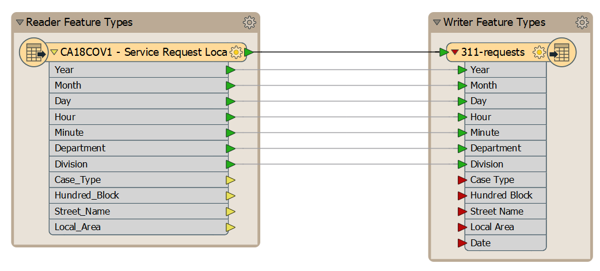

# 5）为模式映射添加转换器

可以通过在端口之间绘制连接来手动执行模式映射。例如，您可以在读模块要素类型上的“Case_Type”旁边的黄色三角形和写模块要素类型上“Case Type”旁边的红色三角形之间单击并拖动：

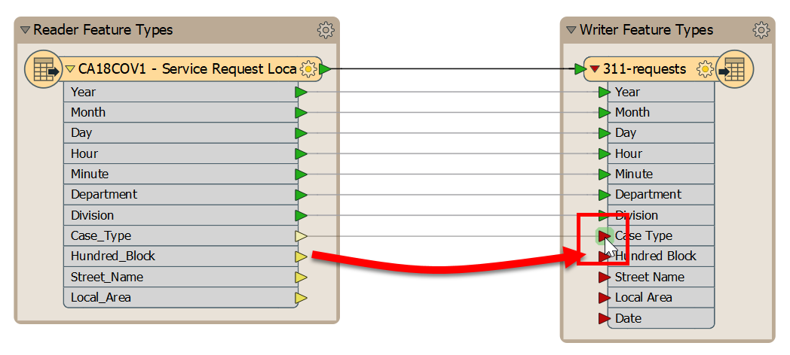

但是，让我们使用**转换器**，这是一种更系统，可重复的方法来处理属性。转换器是我们添加到画布中的对象，用于在转换期间修改我们的数据。FME拥有400多个转换器;我们将在下一个单元中更详细地介绍它们。目前，我们将使用[AttributeManager]（http://docs.safe.com/fme/html/FME_Desktop_Documentation/FME_Transformers/Transformers/attributemanager.htm）。

要添加转换器，请单击从读模块到写模块要素类型的要素连接（深黑色线）：

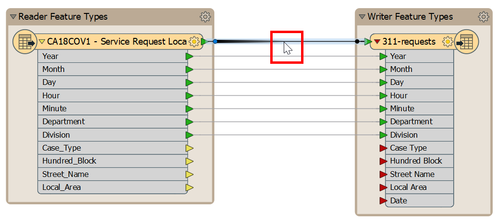

开始输入短语“AttributeManager”。此方法是将转换器放置在工作空间中的一种方法，称为“快速添加”。键入时，FME会搜索匹配的转换器。当列表足够短，您可以看到AttributeManager时，从对话框中选择它（双击它，或按Enter键）：

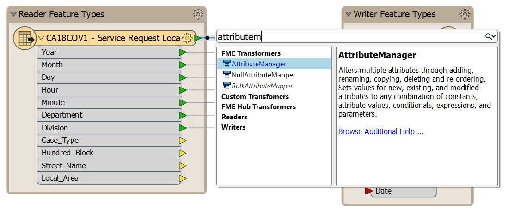

这样做会放置一个AttributeManager转换器：

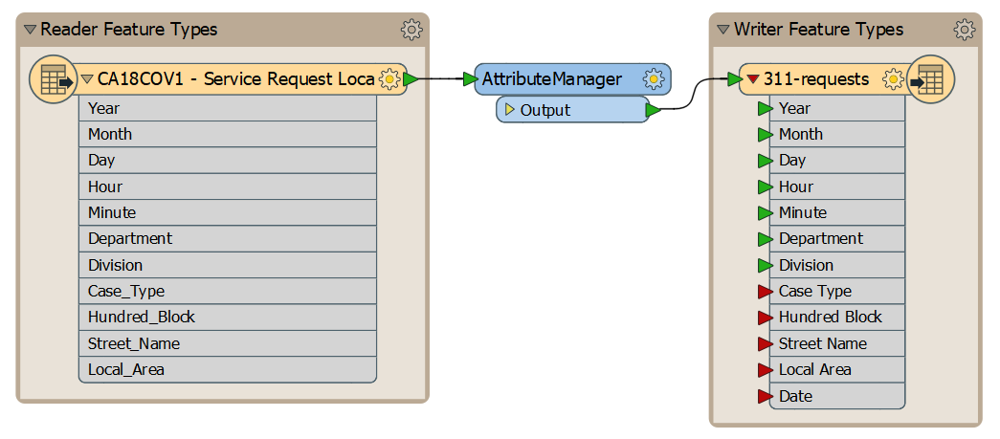

有关添加转换器的重要提示，请参阅<strong><a href="http://blog.safe.com/2014/10/fmeevangelist128/">有史以来十大FME提示列表中的# 5！</A></strong>

# 6）设置参数

双击查看AttributeManager参数。它看起来像这样：

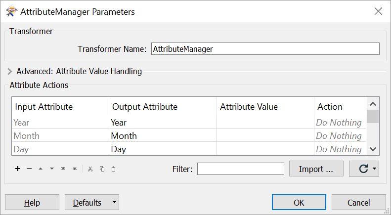

您可能必须调整AttributeManager对话框的大小以查看所有四列。您可以通过在右下角进行操作来调整对话框的大小，直到看到扩展器光标，然后单击并拖动：

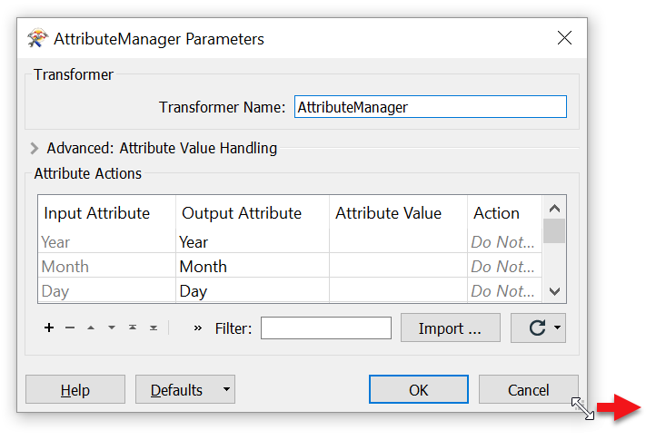

请注意，它所连接的流上的所有属性都会自动显示在对话框中。

如果输入属性字段是“Case_Type”，请单击“输出属性”字段。单击下拉列表的按钮，然后选择`Case Type`作为要使用的新属性名称：

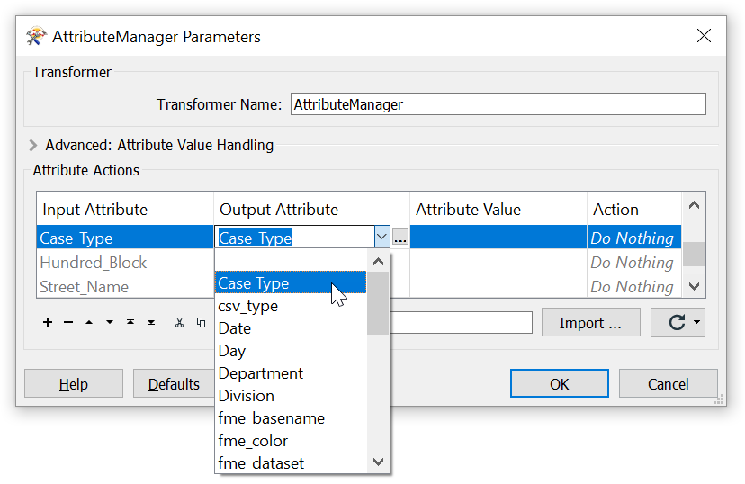

作为响应，Action字段将更改为read*Rename*。

`Case Type`出现在列表中，因为它已存在于写模块要素类型中。如果我们在编辑写模块模式之前完成了此步骤，则必须手动在此对话框中输入新的属性名称。

请注意，此要素（展望写模块要素类型的属性）仅在某些相关转换器中需要，例如AttributeRenamer和AttributeCopier。通常，下拉属性列表仅包含传入要素的属性。

单击“确定”关闭对话框。现在，在Workbench画布窗口中，您将看到`Case Type`属性标有绿色箭头，以确认该属性具有值。

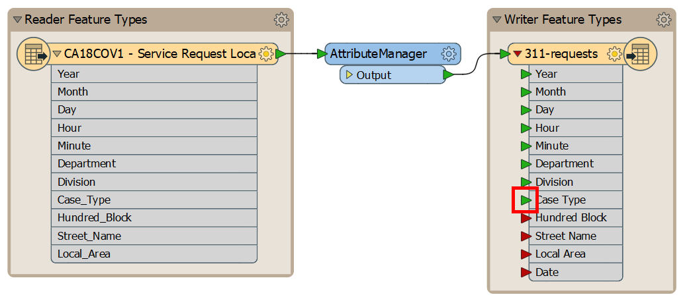

重新打开AttributeManager对话框，对带有下划线的其余属性重复此步骤。

# 8）创建一个`Date`属性

我们还想添加一个新属性`Date`。我们可以使用几种不同的转换器来实现这一目标; 同样，对于FME中的问题，通常有许多解决方案。例如，我们可以使用[[ExpressionEvaluator](http://docs.safe.com/fme/html/FME_Desktop_Documentation/FME_Transformers/Transformers/expressionevaluator.htm) 或 [StringConcatenator](http://docs.safe.com/fme/html/FME_Desktop_Documentation/FME_Transformers/Transformers/stringconcatenator.htm)。在这种情况下，让我们通过在AttributeManager中创建属性来保持工作空间的高效。

转到Attribute Actions表的底部，注意最后一行是空的，除了文本`<Add new Attribute>`。单击此文本并键入“Date”。您可能会看到它作为下拉菜单中的一个选项出现；FME将展望您的写模块模式，以帮助您找到属性。以帮助您查找属性。输入或选择“Date”后，Action单元格将变为“Set Value”：

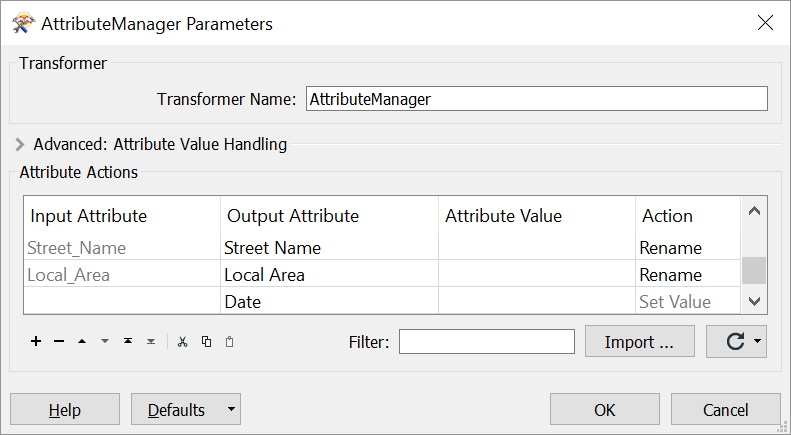

单击“确定”后，您应该看到写模块要素类型上的输入端口全部变为绿色。请注意，我们的源数据中没有“Date”属性;因此，我们将不会映射该属性，其端口将保持红色。

# 9）运行工作空间并检查输出

保存工作空间。

然后，让我们使用要素缓存和部分运行。单击AttributeManager将其选中，然后单击Run To This：

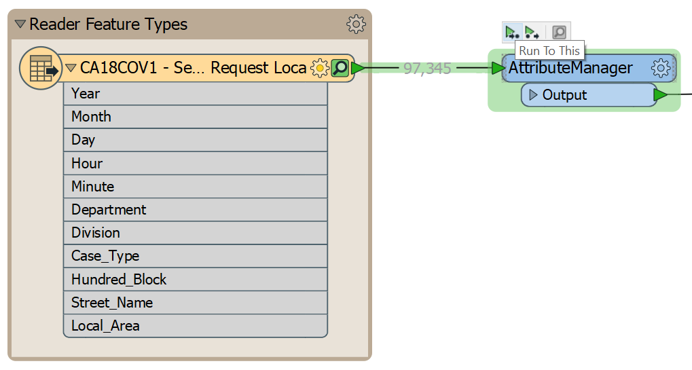

缓存更新后，单击AttributeManager上的绿色图标以检查对模式的更改。

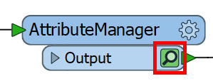

查看表视图，我们可以看到我们的模式已被编辑以从属性名称中删除下划线并添加Date属性（现在为空）：

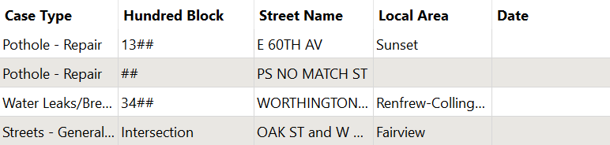

<UL>
<li>编辑写模块模式的属性</li>
<li>编辑作者模式上的输出图层名称</li>
<li>将转换器添加到工作空间</li>
<li>使用AttributeManager转换器</li>执行模式映射
</UL>

