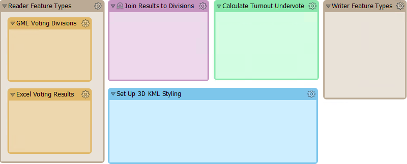
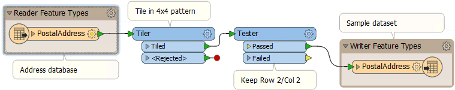

# 增量发展

FME工作空间的关键开发技术是[增量更新](https://en.wikipedia.org/wiki/Incremental_build_model)。

这种技术的步骤是：

* 把你的项目规划成一系列小的部分，每一部分都可以放在FME的书签里
* 在FME Workbench中设计并实现一个部分。理想情况下，它应该在3-10个转换器之间。
* 完成后立即测试每个部分。这样，您可以在早期识别问题，并更容易识别问题，因为在任何增量中只进行了一些更改。
* 重复此过程，保存工作空间并在添加新部分时对其进行测试

虽然3-10转换器的范围是任意数字，但是添加的转换器越多，识别任何问题的根源就越困难。超过十个转换器是您应该考虑将该过程切割成更小的部分的点。

在这里，作者通过将其作为一组书签放在画布上来计划他们的工作空间：

现在，作者可以一次完成并测试每个部分，同时牢记整体目标。

|  警告 |
| :--- |
|  开始开发工作空间并忘记保存工作空间是非常容易的!一旦第一次保存工作空间，FME就会保留恢复文件，但在此之前您将面临无法挽回的损失风险。 |

## 源数据

当FME项目庞大且复杂时，源数据可能也会很大且复杂。因此，当以小增量创建工作空间，依次测试每个部分时，最好避免使用整个数据集。

最好使用源数据样本进行测试。实际上，最好创建一个小的数据样本 - 从源中提取数据并写入FFS等中性格式 - 而不是为每次测试运行随机抽样数据。

采样对数据库特别有用，因为它还避免了等待网络流量和数据库响应的问题。

这里工作空间作者通过从数据库中读取，将其拆分为瓦片并仅将一个瓦片写入FFS格式来提取源数据的一部分。这一个瓦片可用于以代表整个源数据库表的方式对解决方案进行原型设计。

要使用的另一个转换器是Sampler，尽管它选择的要素在空间上不会相邻。

## 版本控制

对工作空间进行一组增量更改时，只能在单个工作空间文件上进行操作。但是，这有各种各样的问题：

* 无法轻松跟踪故障，因为没有记录已更改的内容以及何时更改
* 为不同的平台创建不同的版本并不容易
* 如果工作空间文件丢失或损坏，则整个项目将丢失

因此，最好保留版本化的工作空间，其中为每组修订保留不同的副本。可以在文件系统中手动执行此预防措施，也可以使用Git等存储库工具。

事实上，保留和版本化与FME项目相关的所有材料是一个好主意，包括：

* 工作空间文件
* Python文件
* 日志文件
* 来源数据集

最好不要存储任何个人信息或包含密码的信息。此外，无需存储临时文件。

|  技巧 |
| :--- |
|  FME Server内置了版本控制系统。即使您没有FME Server许可证，您仍然可以将其安装用作工作空间和相关文件的存储库系统。 |

