# 练习：住宅垃圾收集区

|  练习1 |  住宅垃圾收集区 |
| :--- | :--- |
| 数据 | 地址（Esri地理数据库），区域（MapInfo TAB） |
| 总体的目标 | 为住宅垃圾收集创建边界 |
| 演示 | 工作空间原型设计 |
| 启动工作空间 | C:\FMEData2018\Workspaces\DesktopBasic\Design-Ex1-Begin.fmw |
| 结束工作空间 | C:\FMEData2018\Workspaces\DesktopBasic\Design-Ex1-Complete.fmw |

城市维护部门有一个垃圾收集计划数据集，用于指定居民在特定的一天收集:：

[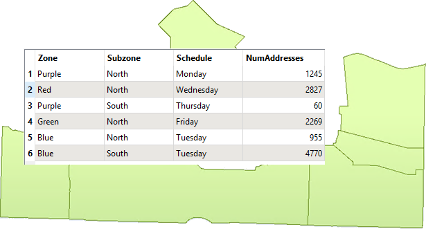](https://github.com/safesoftware/FMETraining/blob/Desktop-Basic-2018/DesktopBasic3WorkspaceDesign/Images/Img3.200.Ex1.ExistingZones.png)

然而，因为人口结构和分区的变化，他们决定应该绘制新的边界。

您的任务是使用FME创建新边界。您必须创建五个多边形，彼此相邻，并且每个多边形的居民数量大致相同。分析将基于城市的地址数据库。将根据其所属的区域类型估算每个地址的居民数量：

* 独户住宅：2名成人
* 两户住宅：4名成人
* 多户住宅：12名成人
* 综合开发区：8名成人
* 商业地产：1名成人

输出格式应为OGC GeoPackage。

要开发此工作空间，有必要考虑可能需要哪些不同的步骤。然后我们可以创建带有书签的部分，并在进行过程中填充它们。

  
**1）规划工作空间**  
让我们一起规划这个工作空间。

我们需要读取地址数据（或其示例）并将输出写入OGC GeoPackage。我们需要知道每个地址落入哪个区域类型，这需要分区数据和转换器来执行空间连接。

我们还需要根据区域类型创建居民计数，然后将居民划分为五个不同的区域。最后，我们需要将地址分组，并在它们周围形成边界形状。

简而言之，我们需要这套行动：

* 读取/采样地址数据库
* 读取分区数据
* 创建空间连接
* 计算居民数量
* 将居民分为五组
* 将地址聚合到他们的组中
* 创建边界形状
* 写入OGC GeoPackage

因此，选择“文件”&gt;“打开”，然后选择开始工作空间（C：\ FMEData2018 \ Workspaces \ DesktopBasic \ Design-Ex1-Begin.fmw）。它已经有一组书签来表示要执行的这些步骤，但是，到目前为止，我们无法确定哪些部分会更大，因此所有书签的大小都相同：

[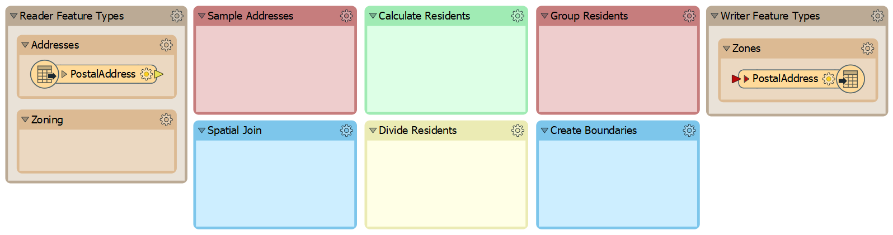](https://github.com/safesoftware/FMETraining/blob/Desktop-Basic-2018/DesktopBasic3WorkspaceDesign/Images/Img3.201.Ex1.StartingWorkspace.png)

您还可以找到包含练习所需的所有转换器的书签：

[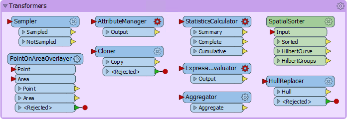](https://github.com/safesoftware/FMETraining/blob/Desktop-Basic-2018/DesktopBasic3WorkspaceDesign/Images/Img3.202.Ex1.RequiredTransformers.png)

或者至少，这些是我们认为练习所需的转换器！

  
**2）样本源数据**  
地址数据库中的要素比工作空间构建和测试需要的要多，所以让我们将其减少到更小的样本。

这里我们将使用Sampler转换器，而不是创建测试数据集。“转换器”书签中有一个采样器转换器，只需将该转换器移动到“示例地址”书签中，并将PostalAddress要素类型连接到它：

[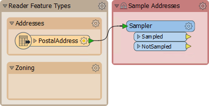](https://github.com/safesoftware/FMETraining/blob/Desktop-Basic-2018/DesktopBasic3WorkspaceDesign/Images/Img3.203.Ex1.SamplerOnCanvas.png)

检查Sampler的参数。将其设置为每25个要素进行采样

[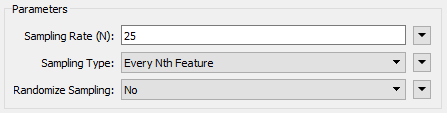](https://github.com/safesoftware/FMETraining/blob/Desktop-Basic-2018/DesktopBasic3WorkspaceDesign/Images/Img3.204.Ex1.SamplerParams.png)

添加一个Inspector转换器（到Sampler：Sampled输出端口）并运行工作空间以确保它正确地采样数据。在13,597个地址中，应该有543个选择使用。

  
**3）将数据划分为组**  
在尝试将分区数据集添加到工作空间之前，让我们尝试从基本数据集创建组。我们可以使用FME Hub中的自定义转换器（称为SpatialSorter）来完成此操作。

因此，将SpatialSorter从“转换器”书签移动到“Divide Residents”书签：

[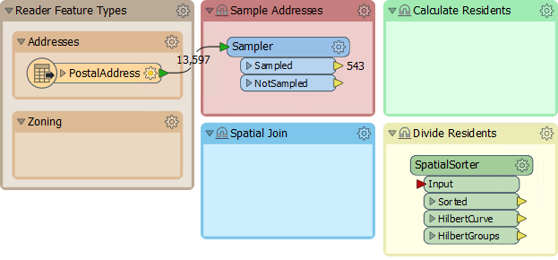](https://github.com/safesoftware/FMETraining/blob/Desktop-Basic-2018/DesktopBasic3WorkspaceDesign/Images/Img3.205.Ex1.SpatialSorterOnCanvas.png)

SpatialSorter在空间上对数据进行排序（因此在地理位置上的要素在排序的输出中更接近）并创建组。

检查此转换器的参数。请注意，group参数要求组大小，而不是组数。因此，我们需要计算分成五组时的地址数。

  
**4）计算组大小**  
要计算每组的地址数，我们需要地址数，然后除以5。我们可以使用StatisticsCalculator和ExpressionEvaluator的组合来完成此操作。

因此，根据需要放大Divide Residents书签，并从“转换器”书签中移动StatisticsCalculator和ExpressionEvaluator转换器。将它们连接到Sampler：Sampled端口，如下所示：

[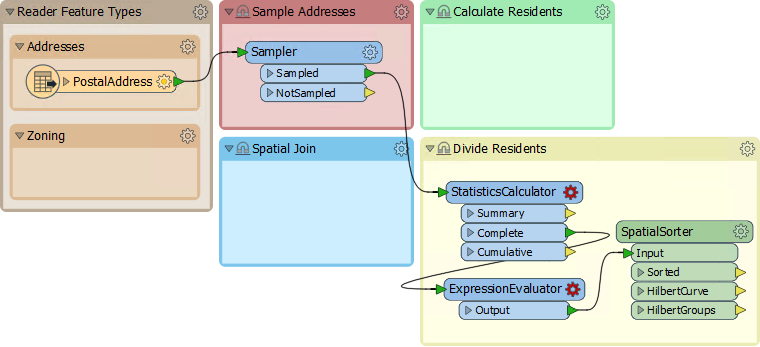](https://github.com/safesoftware/FMETraining/blob/Desktop-Basic-2018/DesktopBasic3WorkspaceDesign/Images/Img3.206.Ex1.StatsExprOnCanvas.png)

  
**5）计算组大小**  
检查StatisticsCalculator的参数。此转换器将告诉我们有多少要素（总计数）。选择要分析的属性参数的属性。因为我们只想计算不创建真实统计的要素，所以它可以是您喜欢的任何属性。

在Total Count Attribute参数下，输入名称TotalResidents。删除其余的计算属性字段，以便不计算它们：

[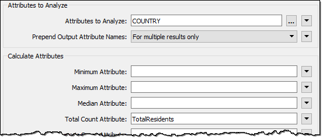](https://github.com/safesoftware/FMETraining/blob/Desktop-Basic-2018/DesktopBasic3WorkspaceDesign/Images/Img3.207.Ex1.StatsCalcParams.png)

在ExpressionEvaluator中，在New Attribute参数中输入GroupSize。在算术表达式字段中输入表达式：

```text
@ceil((@Value(TotalResidents)/5))
```

[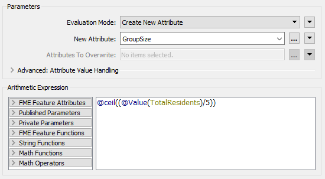](https://github.com/safesoftware/FMETraining/blob/Desktop-Basic-2018/DesktopBasic3WorkspaceDesign/Images/Img3.208.Ex1.ExprEvalParams.png)

最简单的方法是双击ceil函数添加它，然后双击TotalResidents属性，最后手动添加/ 5部分。

这个表达式将居民人数分为五组，四舍五入。舍入部分是必不可少的，它就是ceil函数的作用。将Inspector转换器添加到ExpressionEvaluator并运行转换以证明此部分有效。

  
**6）分组居民**  
现在再次检查SpatialSorter的参数。我们现在将Grid Size保持在16; 这将给我们一个更粗略的结果，但在我们开发工作空间时会更快地运行。在Group Size参数下，单击下拉箭头并选择Attribute Value&gt; GroupSize：

[](https://github.com/safesoftware/FMETraining/blob/Desktop-Basic-2018/DesktopBasic3WorkspaceDesign/Images/Img3.209.Ex1.SpatialSorterParams.png)

这会将组大小设置为刚刚计算的属性。

要创建地址组，请将Aggregator转换器移动到“Group Residents”书签，并将其连接到SpatialSorter：Sorted输出端口：

[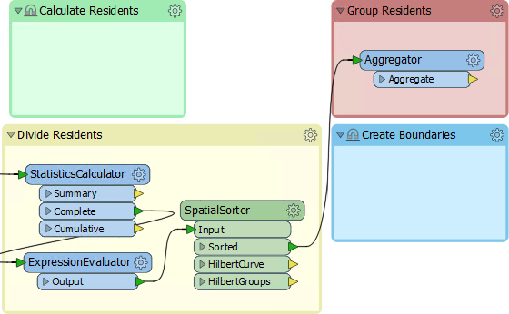](https://github.com/safesoftware/FMETraining/blob/Desktop-Basic-2018/DesktopBasic3WorkspaceDesign/Images/Img3.210.Ex1.AggregatorCanvas.png)

检查 Aggregator的参数。将Group By参数设置为GroupID属性（即，在SpatialSorter创建的组中聚合要素）：

[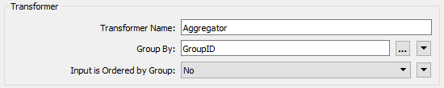](https://github.com/safesoftware/FMETraining/blob/Desktop-Basic-2018/DesktopBasic3WorkspaceDesign/Images/Img3.211.Ex1.AggregatorParams.png)

连接Inspector（将Group By参数设置为GroupID也很有用）并运行转换。您应该会发现输出中有五组点聚合，每个聚合具有大致相同的点要素数：

[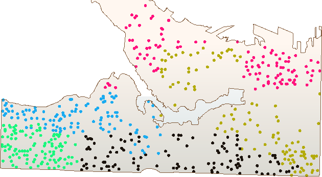](https://github.com/safesoftware/FMETraining/blob/Desktop-Basic-2018/DesktopBasic3WorkspaceDesign/Images/Img3.212.Ex1.AggregatedResults.png)

保存工作空间，将其命名为GarbageCollection.fmw或类似名称。理想情况下，名称将包含版本号（如GarbageCollection-v1.fmw），但此练习不需要。

工作空间的下一步是添加区域划分数据，创建空间连接，并根据每个地址的分区类型计算每个属性中居住的居民数量。

<table>
  <thead>
    <tr>
      <th style="text-align:left">恭喜</th>
    </tr>
  </thead>
  <tbody>
    <tr>
      <td style="text-align:left">
        <p>通过完成本练习，您已学会如何：
          <br />
        </p>
        <ul>
          <li>规划工作空间开发</li>
          <li>逐个部分创建工作空间</li>
          <li>将源数据限制为小样本</li>
          <li>使用FME Hub中的自定义转换器</li>
          <li>进行算术运算</li>
          <li>将数据聚合到组中</li>
          <li>使用版本号保存工作空间</li>
        </ul>
      </td>
    </tr>
  </tbody>
</table>