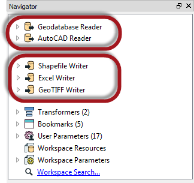
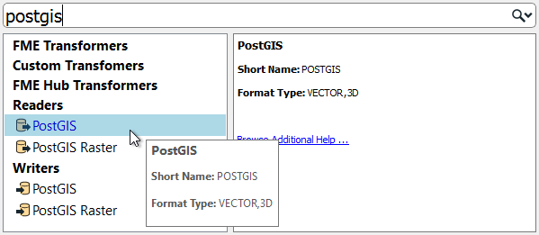
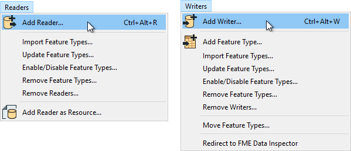
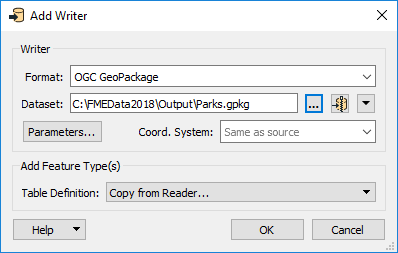
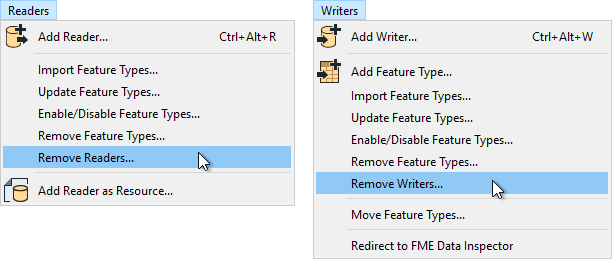
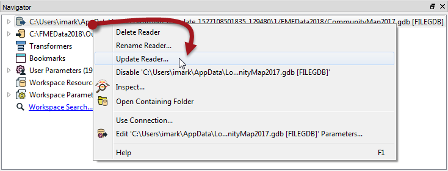

# 多个读模块和写模块

FME工作空间不限于任何特定数量的读模块或写模块; 读模块和写模块可以随时添加到工作区，可以使用任意数量的格式，并且不需要相同数量的读模块和写模块。

例如，“导航”窗口显示此工作空间包含两个读模块和三个不同数据类型和格式的写模块！

|  分析师女士说...... |
| :--- |
|  重要的是要注意，读模块和写模块不会在Workbench画布上显示为对象。它们的要素类型（层）可以，但读模块和写模块却没有。  相反，它们由“导航”窗口中的条目表示，如上面的屏幕截图所示。 |

## 添加读模块和写模块

使用“快速添加”菜单将其他读模块或写模块添加到转换中：

...或者从菜单栏中选择“读模块”&gt;“添加读模块”（写模块&gt;添加写模块）：

此操作将打开一个对话框，类似于“生成工作空间”对话框，其中可以定义新读模块或写模块的参数：

您可以通过这种方式添加任意数量的读模块和写模块。

|  技巧 |
| :--- |
|  还可以通过从文件系统资源管理器拖动数据集并将其放到Workbench画布上来添加读模块。 |

## 删除读模块或写模块

如果不再需要读模块或写模块，则可以使用菜单栏上的选项非常简单地删除它：

或者，可以在“导航”窗口中右键单击读模块/写模块，然后选择“删除”选项。

## 更新读模块或写模块

可以更新读模块和写模块，以便旧版工作空间具有较新版本的FME中可用的速度和功能。您可以通过右键单击“导航”窗口中的读模块/写模块并选择“更新”选项来更新转换器：

对于读模块，此工具提供更新读模块或更新正在读取的要素类型列表的选项。这样，如果源数据发生更改，则可以更新工作空间。更新要素类型的另一种方法是菜单栏上的“读模块”&gt;“更新要素类型”。

