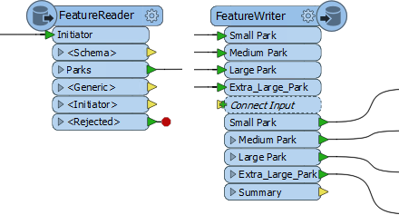
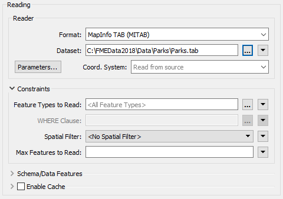
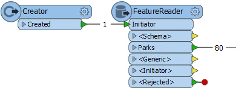
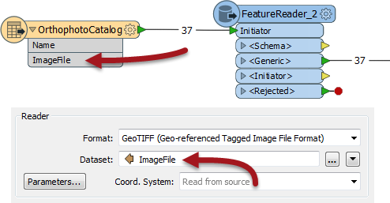
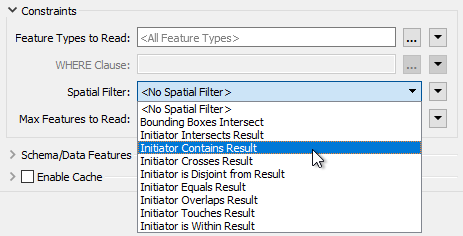
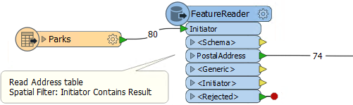
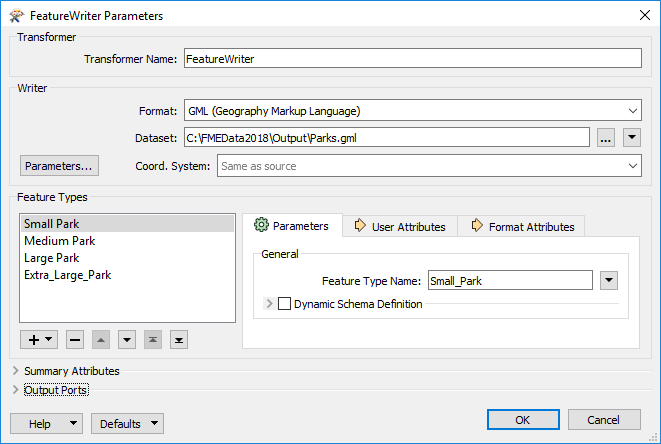
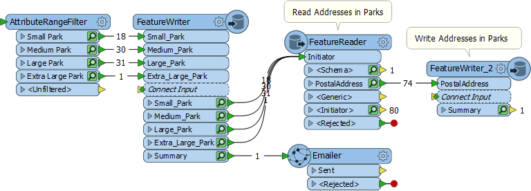

# FeatureReader和FeatureWriter

除了能够使用读模块读取数据外，FME还具有专门用于读写数据的转换器。这些是FeatureReader和FeatureWriter转换器。

这些转换器的优点是它们具有输入端口（FeatureReader）和输出端口（FeatureWriter）。因此，如果读模块始终是工作空间中的第一个操作，并且写模块始终是最后一个，则FeatureReader和FeatureWriter可以在转换中的任何位置读取和写入数据。

## FeatureReader

FeatureReader设置有参数以读取特定数据集：

进入Initiator输入端口的任何要素都将导致数据被读取，就像这里Creator提供一个空要素来触发读取：

Creator创建单个要素，触发FeatureReader读取公园要素的数据集。如果出于某种原因，Creator创建了十个要素，那么数据将被读取十次，从而产生800个输出要素！

### 来自属性的数据集

FeatureReader的一个常见情况是提供数据集作为属性读取：

此示例包括reader和FeatureReader。工作空间读取包含正射影像数据集索引的Shapefile数据集。Shapefile中的每个要素都是一个多边形，表示正射影像边界，其属性指向包含该正射影像的GeoTIFF文件。

FeatureReader设置为使用该属性作为要读取的文件名。结果是从Shapefile中读取了37个要素，并且等效的37个GeoTIFF图像退出FeatureReader。

源要素不需要是空间的。例如，带有要读取的文件列表的Excel电子表格同样有效。

### 空间过滤器

FeatureReader中的关键参数为正在读取的数据设置空间过滤器：

Initiator Contains Result过滤器（例如）表示如果它们的几何对象位于initiator要素的几何对象内，则要素会输出FeatureReader。例子如下：

公园数据集提供触发从数据库地址表读取的输入要素。应用空间过滤器，以便出现的唯一地址是落在公园内的地址。

## FeatureWriter

FeatureWriter使用参数设置以写入特定数据集：

该对话框允许定义要写入的格式和数据集，以及要写入的要素类型及其属性。简而言之，写模块所需的所有参数，设置和模式定义都显示在此单个对话框中。

可以在对话框本身中手动定义要素类型，也可以通过连接到_Connect Input_输入端口自动添加要素类型：

另请注意，FeatureWriter的一个重要部分是其出口可以连接到其他转换器以进行进一步处理。在上面的屏幕截图中，写入了公园数据，以及一个单独摘要要素用于触发Emailer转换器。 Emailer 将数据副本发送给用户。

然后，数据也被用作FeatureReader的输入，以读取落在公园内的所有地址，其结果也随后用FeatureWriter写入。

