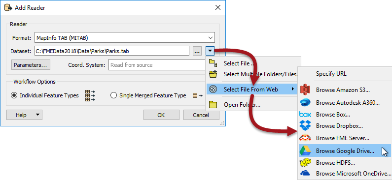
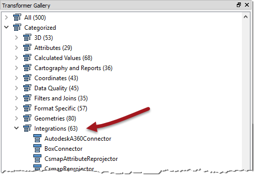
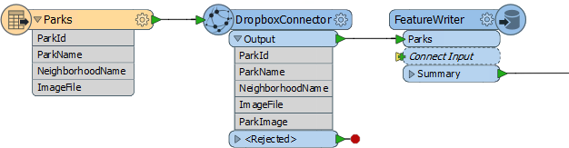

# 使用集成转换器进行读取/写入

读模块和FeatureReader都可以在本地，数据库或使用Web服务读取数据：

但是，有时能够使用转换器读取（或写入）Web或其他集成服务是有用的。有各种原因，但关键的一个是能够自己读取文件，而不是从中读取要素; 例如，能够从Dropbox中提取JPEG文件并将其存储为属性（而不是将其作为实际的栅格要素读取）。

## 集成转换器

转换器库的集成类别中有多个转换器：

其中一些集成转换器用于读取，写入或复制文件，例如：

| **•** AutodeskA360Connector | **•** BoxConnector |
| :--- | :--- |
| **•** DropboxConnector | **•** FMEServerResourceConnector |
| **•** GoogleDriveConnector | **•** OneDriveConnector |
| **•** S3Connector |  |

在此示例中，作者正在读取公园的数据集并将要素传递给DropboxConnector：

每个公园要素都具有存储在Dropbox中的JPEG图像的名称。DropboxConnector转换器设置为读取该图像并将其作为属性（ParkImage）存储在该要素上。

然后将这些要素发送到PostGIS数据库 - 使用FeatureWriter转换器 - 其中ParkImage属性被写入二进制（bytea）列。

|  技巧 |
| :--- |
|  与大多数Connector转换器一样，DropboxConnector也可以将内容作为文件上传，而不是从Dropbox中获取文件。 |

