# 练习：住宅垃圾收集区

|  练习2 |  住宅垃圾收集区 |
| :--- | :--- |
| 数据 | 地址（Esri地理数据库），区域（MapInfo TAB） |
| 总体目标 | 为住宅垃圾收集创建边界 |
| 演示 | 读模块和写模块 |
| 启动工作空间 | C:\FMEData2018\Workspaces\DesktopBasic\Design-Ex2-Begin.fmw |
| 结束工作空间 | C:\FMEData2018\Workspaces\DesktopBasic\Design-Ex2-Complete.fmw C:\FMEData2018\Workspaces\DesktopBasic\Design-Ex2-Complete-Advanced.fmw |

在这里，我们继续一个重新定义垃圾收集计划的项目。

在第一个练习中，我们使用各种变换器将地址划分为五个不同的组。现在的任务是通过估算每个地址的居民数量来根据其所属的区域类型来改进该工作：

* 独户住宅：2名成人
* 两户住宅：4名成人
* 多户住宅：12名成人
* 综合开发区：8名成人
* 商业地产：1名成人

  
**1）打开工作空间**  
从上一个练习中打开工作空间。

如果您在其名称中为该工作空间指定了版本号，则应使用新版本号创建工作空间的副本。例如，如果您将其保存到GarbageCollection-v1.fmw，则创建一个名为GarbageCollection-v2.fmw的副本并打开它进行编辑。

或者，您可以打开工作空间C：\ FMEData2018 \ Workspaces \ DesktopBasic \ Design-Ex2-Begin.fmw：

[](https://github.com/safesoftware/FMETraining/blob/Desktop-Basic-2018/DesktopBasic3WorkspaceDesign/Images/Img3.213a.Ex2.StartWorkspace.png)

“转换器”书签中的其余转换器是：

[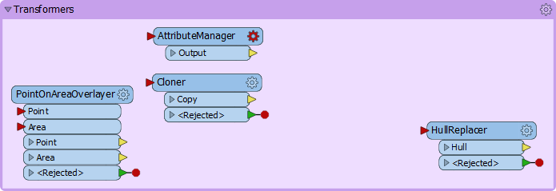](https://github.com/safesoftware/FMETraining/blob/Desktop-Basic-2018/DesktopBasic3WorkspaceDesign/Images/Img3.213b.Ex2.StartWorkspaceTransformers.png)

  
**2）添加读模块**  
这里的第一项任务是确定每个地址属于哪个计划区域。我们需要读取分区数据并执行空间连接。要以不同格式读取新数据数据集，需要新的读模块。

因此，从菜单栏中选择“读模块”&gt;“添加读模块”。出现提示时输入以下参数：

| 读模块格式 | MapInfo TAB（MITAB） |
| :--- | :--- |
| 读模块数据集 | C:\FMEData2018\Data\Zoning\Zones.tab |

读模块将添加到“导航”窗口，并将要素类型添加到画布。将要素类型移动到区域划分书签：

[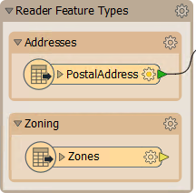](https://github.com/safesoftware/FMETraining/blob/Desktop-Basic-2018/DesktopBasic3WorkspaceDesign/Images/Img3.213.Ex2.ZoningReaderAdded.png)

  
**3）创建空间连接**  
为了执行空间连接，我们将使用PointOnAreaOverlayer转换器; 这是一种称为Point-in-Polygon的连接。

因此，将PointOnAreaOverlayer转换器从“转换器”书签移动到“空间连接”书签。将新添加的分区数据连接到Area端口，将Sampler的输出连接到Point端口：

[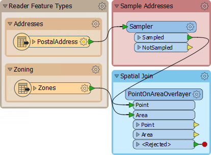](https://github.com/safesoftware/FMETraining/blob/Desktop-Basic-2018/DesktopBasic3WorkspaceDesign/Images/Img3.214.Ex2.POAOCanvas.png)

检查参数并对Merge Attributes进行复选标记：

[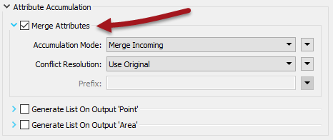](https://github.com/safesoftware/FMETraining/blob/Desktop-Basic-2018/DesktopBasic3WorkspaceDesign/Images/Img3.215.Ex2.POAOParams.png)

这个转换器是我们第一次使用具有实时&lt;Rejected&gt;端口的转换器。现在，我们将留下它来终止转换，因为在测试期间我们想要了解导致转换器故障的任何事情。

将Inspector附加到Point输出端口并运行转换。叠加和属性合并应该使每个地址都被赋予区域名称和类别。

  
**4）计算居民数**  
下一步是根据分区类型设置居住在某个地址的居民数量。

我们知道：

| 区域开始由 | 区域类型 | 居民 |
| :--- | :--- | :--- |
| RS | 独户住宅 | 2 |
| RT | 两户住宅 | 4 |
| RM | 多户住宅 | 12 |
| CD | 综合开发区 | 8 |
| C | 商业地产 | 1 |

例如，区域RS-1，RS-2，RS-3都是独户住宅区域，并且我们假设每个地址总共有两个成年人。这个假设使它稍微复杂一些，因为我们需要使用“开头”字符串比较来匹配区域类型。

可以使用带有**条件值**的AttributeManager来完成此匹配。

这一步稍微复杂，但幸运的是，“转换器”书签中的AttributeManager已经为此目的而设置。因此，将AttributeManager移动到“Calculate Residents”书签并将其连接到PointOnAreaOverlayer：Point输出端口：

[](https://github.com/safesoftware/FMETraining/blob/Desktop-Basic-2018/DesktopBasic3WorkspaceDesign/Images/Img3.216.Ex2.AttrManagerCanvas.png)

如果您对条件值的外观感兴趣，请打开AttributeManager的参数对话框，然后单击Persons属性的Attribute Value字段中的下拉箭头。选择条件值：

[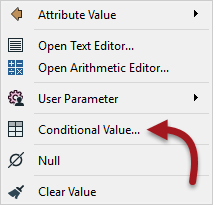](https://github.com/safesoftware/FMETraining/blob/Desktop-Basic-2018/DesktopBasic3WorkspaceDesign/Images/Img3.217.Ex2.AttrManagerParams.png)

这样做会打开一个类似Tester的对话框，其中包含测试每个区域类型的多个条件，以及一个将它们设置为的属性值：

[](https://github.com/safesoftware/FMETraining/blob/Desktop-Basic-2018/DesktopBasic3WorkspaceDesign/Images/Img3.218.Ex2.AttrManagerConditional.png)

  
**5）创建居民**  
我们现在知道（或已经近似）每个地址的居民数量。但是，我们必须以影响输出的方式使用该数字。最简单的方法是创建每个地址的多个副本，每个地址一个。

例如，对于有八个居民的地址，我们将创建八个地址点。

我们可以使用Cloner转换器非常简单地完成这项工作。因此，将Cloner转换器添加到Calculate Residents书签中。将AttributeManager连接到其输入，并将其输出连接到StatisticsCalculator：

[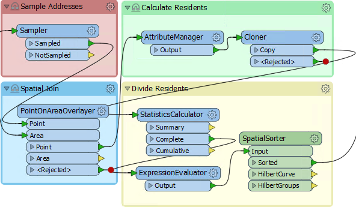](https://github.com/safesoftware/FMETraining/blob/Desktop-Basic-2018/DesktopBasic3WorkspaceDesign/Images/Img3.219.Ex2.ClonerCanvas.png)

检查Cloner参数。对于Number of Copies参数，单击下拉箭头并选择Attribute Value&gt; Persons：

[](https://github.com/safesoftware/FMETraining/blob/Desktop-Basic-2018/DesktopBasic3WorkspaceDesign/Images/Img3.220.Ex2.ClonerParams.png)

这样做会创建原始地址的_&lt;Persons&gt;_副本（请注意，转换器也不会输出原始地址，因此输出为_&lt;Persons&gt;_要素，而不是_&lt;Persons&gt; +1_）。

  
**6）运行转换**  
确保Inspector仍然连接到 Aggregator转换器并运行转换。转换将失败并显示错误消息：

```text
Cloner_&lt;Rejected&gt;: Termination Message: 'Cloner output a &lt;Rejected&gt; feature.'
```

转换失败，因为没有居民（例如，工业）的地址没有人员属性，并且被Cloner转换器拒绝。&lt;Rejected&gt;端口仍设置为终止转换，因此我们收到此错误。

处理这个有多种选择。我们可以：

1. 更改工作空间参数**拒绝要素处理**以_继续转换_
2. 添加转换器以处理Cloner的被拒绝要素
3. 设置条件值为给出0的值，而不是完全不包含值

设置条件值将是直接处理问题的最佳解决方案。但是可能存在被拒绝数据的其他原因，我们希望在没有终止转换的情况下处理这些问题。

设置Rejected Feature Handling参数意味着所有&lt;Rejected&gt;端口都会忽略被拒绝的输出。此设置在制作工作空间中可能很有用，但在测试中，我们可能希望终止转换，以便我们立即意识到问题。

所以对我们来说，更好的解决方案是在Cloner &lt;Rejected&gt;端口添加一个转换器。我们不需要检查或记录这些要素，因为我们知道它们将存在。因此，将&lt;Rejected&gt;端口连接到一个名为Junction的小型转换器：

[](https://github.com/safesoftware/FMETraining/blob/Desktop-Basic-2018/DesktopBasic3WorkspaceDesign/Images/Img3.221.Ex2.JunctionCanvas.png)

这个Junction将处理被拒绝的输出，但会安静地丢弃它，而不会有更多的麻烦。

重新运行转换。输出应该是五组点要素，但是与上一练习结束时的图案不同：

[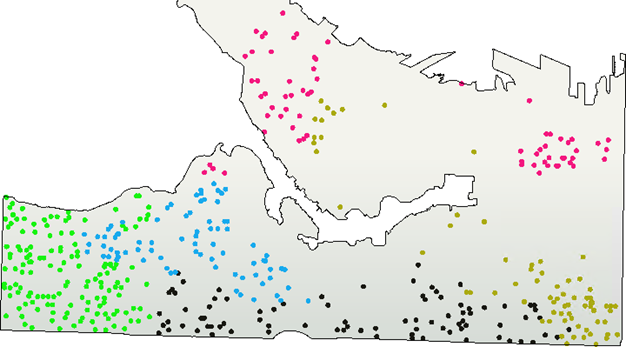](https://github.com/safesoftware/FMETraining/blob/Desktop-Basic-2018/DesktopBasic3WorkspaceDesign/Images/Img3.222.Ex2.ResidentialResults.png)

  
**7）写入输出**  
现在写入一些输出。最简单的方法是将Aggregator输出连接到PostalAddress输出要素类型并重新运行工作空间。

但是，重命名输出要素类型并删除其所有属性也很有用，因为它们来自读模块数据集，因此不适用于此处。因此，打开写模块要素类型参数对话框。在“参数”选项卡中，将要素类型重命名为GarbageZones。在“用户属性”选项卡中，删除正在写入的所有属性：

[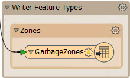](https://github.com/safesoftware/FMETraining/blob/Desktop-Basic-2018/DesktopBasic3WorkspaceDesign/Images/Img3.223.Ex2.EditedWriterFT.png)

此外，每次运行工作空间时，更改GeoPackage写模块参数Overwrite Database以覆盖数据库：

[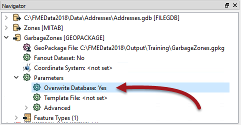](https://github.com/safesoftware/FMETraining/blob/Desktop-Basic-2018/DesktopBasic3WorkspaceDesign/Images/Img3.224.Ex2.EditedWriterParam.png)

这样我们就不会在同一个数据集中积累越来越多的结果。

|  高级练习 |
| :--- |
|  工作空间工作正常，但假设我们希望自动将输出数据集通过电子邮件发送给某人。要做到这一点，需要Emailer转换器。但是，电子邮件必须在写入数据后出现，因此首先我们必须用FeatureWriter转换器替换写模块。 |

  
**8）版本控制工作空间**  
如果要对工作空间进行版本控制，这可能是保存新版本的一个好点。然后，如果FeatureWriter不起作用，我们可以轻松地恢复为简单的写模块。

  
**9）添加FeatureWriter**  
添加FeatureWriter转换器代替写模块要素类型，并将Aggregator连接到它：

[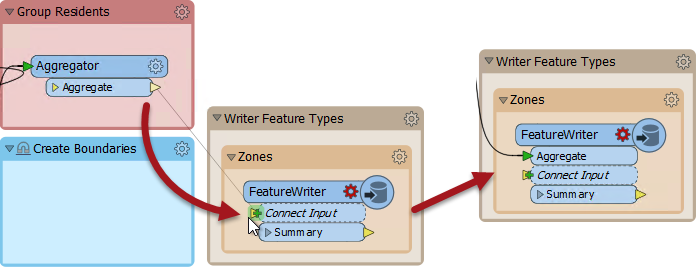](https://github.com/safesoftware/FMETraining/blob/Desktop-Basic-2018/DesktopBasic3WorkspaceDesign/Images/Img3.225.Ex2.FeatureWriterCanvas.png)

这样做会导致添加Aggregate端口。此端口将成为输出中的默认要素类型名称。

  
**10）设置FeatureWriter**  
检查FeatureWriter参数。将写模块格式和数据集参数设置为已定义的GeoPackage输出数据集：

[](https://github.com/safesoftware/FMETraining/blob/Desktop-Basic-2018/DesktopBasic3WorkspaceDesign/Images/Img3.226.Ex2.FeatureWriterParameters1.png)

单击“参数”按钮，并确保将参数设置为“覆盖数据库”：

[](https://github.com/safesoftware/FMETraining/blob/Desktop-Basic-2018/DesktopBasic3WorkspaceDesign/Images/Img3.227.Ex2.FeatureWriterParameters2.png)

在Feature Type定义下，将输出表重命名为GarbageZones：

[](https://github.com/safesoftware/FMETraining/blob/Desktop-Basic-2018/DesktopBasic3WorkspaceDesign/Images/Img3.228.Ex2.FeatureWriterParameters3.png)

然后单击“用户属性”选项卡，将“定义”更改为“手动”，并删除所有属性定义（不需要它们）：

[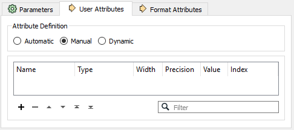](https://github.com/safesoftware/FMETraining/blob/Desktop-Basic-2018/DesktopBasic3WorkspaceDesign/Images/Img3.229.Ex2.FeatureWriterParameters4.png)

接受更改。现在，FeatureWriter设置为写入数据，您可以在“导航”窗口中找到GeoPackage写模块并将其删除。

  
**11）添加集成**  
如果您愿意，并且如果您有可用的帐户，请将集成转换器（如Emailer或DropboxConnector）添加到FeatureWriter的Summary输出端口。

请注意，Summary要素有一个名为\_dataset的属性，用于定义写入的数据集。它可以在Emailer中使用（例如）来定义要附加到电子邮件的文件：

[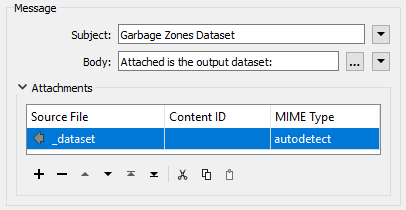](https://github.com/safesoftware/FMETraining/blob/Desktop-Basic-2018/DesktopBasic3WorkspaceDesign/Images/Img3.230.Ex2.EmailerCanvas.png)

现在，当您运行工作空间时，数据将被写入，然后通过电子邮件发送给某人。

|  警告 |
| :--- |
|  与我们使用FeatureWriter写入数据的方式相同，我们可以使用FeatureReader来读取数据。这样做的好处是空间连接内建于流程中。  但是，我们必须考虑这对我们是否有用。当前工作空间在执行空间连接之前对源数据进行采样。FeatureReader会在采样之前进行空间连接，因此可能会更慢。出于这个原因，我们暂时不会这样做。 |

<table>
  <thead>
    <tr>
      <th style="text-align:left">恭喜</th>
    </tr>
  </thead>
  <tbody>
    <tr>
      <td style="text-align:left">
        <p>通过完成本练习，您已学会如何：
          <br />
        </p>
        <ul>
          <li>将读模块添加到工作空间</li>
          <li>执行多边形点空间连接</li>
          <li>在AttributeManager转换器中设置条件值</li>
          <li>使用Cloner转换器创建多个数据副本</li>
          <li>管理被拒绝的要素</li>
          <li>用FeatureWriter替换写模块</li>
        </ul>
      </td>
    </tr>
  </tbody>
</table>