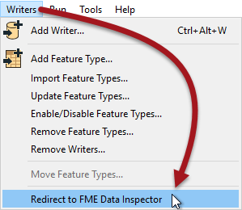
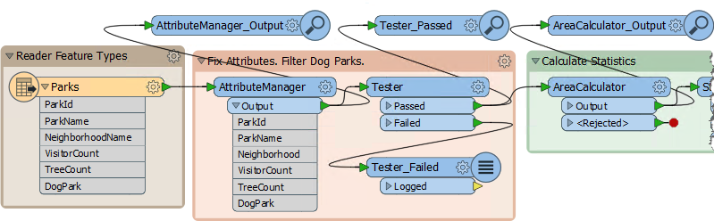
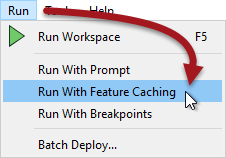
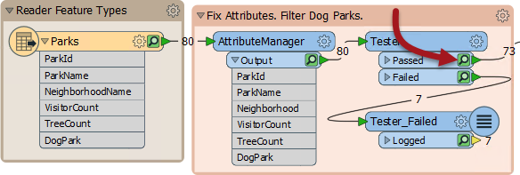
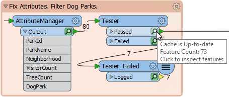
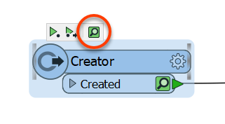

# 综合检查

在开发和测试工作空间时，有必要定期检查生成的数据。有多种方法可以将数据直接发送到数据检查窗口。

## 重定向到Inspector

在写入之前查看输出的最简单方法是使用Redirect to FME Data Inspector选项：

在这种情况下，所有数据都将发送到Data Inspector而不是写入; 没有产生输出，并且可以在写入之前检查数据是否存在缺陷。

## Inspector转换器

在大多数情况下，有必要在工作空间的某些点检查数据 - 而不是在最后 - 这可以通过Inspecto转换器来完成：

例如，作者将Inspector连接到三个不同的转换器。

## 要素缓存

有时，能够在转换的任何步骤检查数据都很重要。在每一步添加Inspector转换器都很烦人，因此FME可以选择自动缓存数据。

使用运行&gt;在菜单栏上运行要素缓存激活此行为：

启用此选项后，FME会在运行工作空间时在转换的每个步骤生成缓存：

缓存由每个对象上的小图标表示。在上面的屏幕截图中，缓存是绿色的，但它们可以更改为黄色或红色，具体取决于数据的新鲜程度。

|  新知识 |
| :--- |
|  使用数据缓存运行与在先前版本的FME中使用完全检查运行基本相同。它已在FME2018中重命名，以更好地匹配利用这些缓存的新要素。 |

## 检查缓存数据

可以通过单击特定对象上的图标来检查缓存数据。

|  2018.1更新 |
| :--- |
|  在2018.1中，您可以使用画布上对象上方弹出图标中显示的新“检查缓存要素”按钮立即检查缓存数据：  |

|  技巧 |
| :--- |
|  设置“使用数据缓存运行”比手动添加Inspecto转换器更快。但是，请注意缓存数据显然会导致转换速度变慢，并使用系统资源（如磁盘空间）。  数据缓存在开发工作空间时非常有用，但在将工作空间投入生产之前应该关闭。 |

