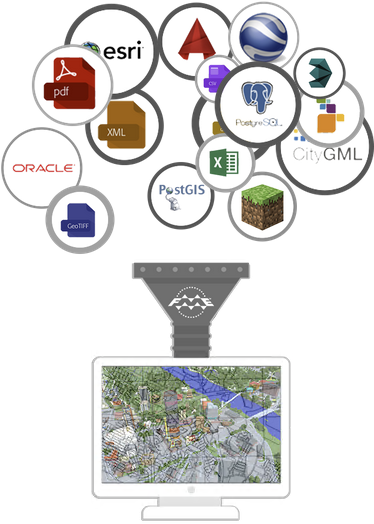

# FME变换
 
## 学习目标
 
完成本单元后，您将能够：
- 解释转换器在FME中的作用。
- 讨论常见的转换器类别。
- 使用“快速添加”找到并放置转换器。
- 设置转换器参数。
 
＃数据变换
 
您已经学会了如何在FME中*转换*数据。在本单元中，您将学习如何根据需要变换数据。

 
＃什么是数据变换？
 
**数据变换**是FME操纵数据的能力。无论何时分析，重组，更改或编辑数据，您都在改变它。变换步骤发生在格式变换过程中。读取，变换数据，然后将数据写入所选格式。

 
## 数据变换的可能性
 
数据变换可以改变数据的结构或内容，或两者兼而有之。变换数据的**结构**可称为“重组”。此过程包括合并数据的能力（如上图所示)，划分数据，重新排序数据和定义自定义数据结构。通过操纵其模式来执行变换数据集的结构。
 
变换数据的**内容**可称为“修订”。操纵要素的几何对象或计算新的属性值是FME如何变换内容的最佳示例。
 
总的来说，变换可以让您获取所拥有的数据并将其变换为您想要的数据。

