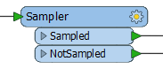
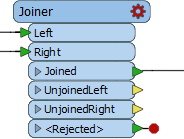
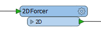
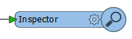
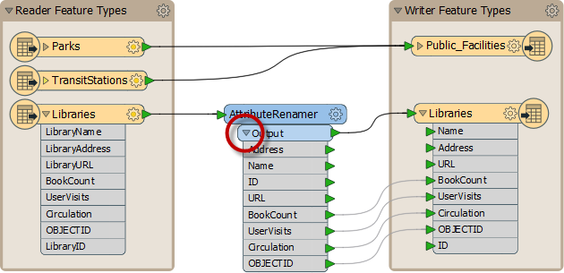

# 转换器

除了Schema Editing和Schema Mapping之外，还可以使用名为 ***转换器*** 的对象进行转换。 

## 什么是转换器？

顾名思义，转换器是一个FME Workbench对象，用于执行要素转换。有许多FME转换器，每个转换器执行许多不同的操作。

转换器连接在读模块和写模块要素类型之间，以便数据从读模块，转换过程流向写模块。

转换器通常在画布窗口中显示为矩形浅蓝色物体。

##转换器参数

每个转换器可能有许多参数（设置)。单击齿轮图标可以访问参数（如要素类型)：

或者，如果参数编辑器窗口打开，可以通过单击转换器（或任何其他画布对象)在那里找到参数：

---

## 颜色编码参数按钮

转换器上的参数按钮采用颜色编码，以反映设置的状态。

蓝色参数按钮表示根据需要检查和修改转换器参数，并且转换器已准备就绪。

黄色参数按钮表示尚未检查默认参数。

红色参数按钮表示至少有一个参数，FME无法提供默认值。在使用转换器之前，必须为该参数提供一个值。

## 转换器端口

转换器不仅没有单个输入和输出，还可以有多个输入端口，多个输出端口或两者。

此2DForcer转换器具有单个输入和输出端口。

这个Clipper有多个输入和输出端口。请注意，并非所有这些都是-或需要-连接。

这个Inspector只有一个输入端口......

......而这个Creator只有一个输出端口！

### 转换器属性

单击转换器输出端口的下拉箭头以查看退出转换器的所有属性。此列表包括转换器中应用的所有更改。

此要素可以显示在转换器中创建，丢失或以其他方式转换的属性。

