我们从[上一个单元](..\2.translations\2.05.ex2.2.md)知道我们的数据中缺少值。我们可以使用过滤转换器来删除缺少值的要素。

# 1）启动Workbench

启动Workbench（如有必要）并从练习2.4中打开工作空间。或者，您可以打开C：\\FMEData2019\\Workspaces\\IntroToDesktop\\Ex3.1-Begin.fmw。

# 2）添加Tester 转换器

单击读模块要素类型和AttributeManager之间的要素连接：

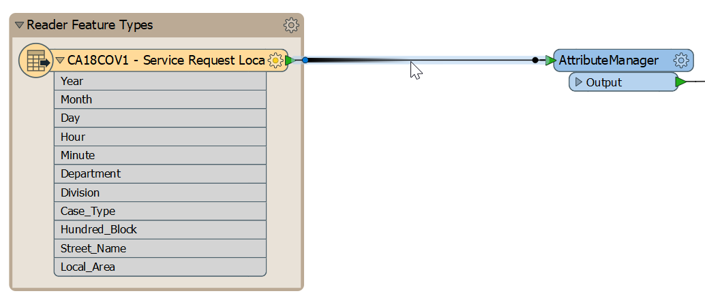

开始输入短语“Tester”。当列表足够短以便您查看测试程序时，从对话框中选择它（双击它）：

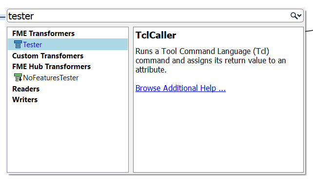

这样做会放置一个Tester转换器：

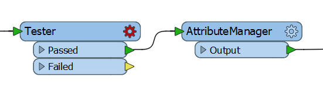

请注意，Passed输出端口是默认连接的输出端口。

# 3）设置参数

检查Tester转换器的参数（其对话框或参数编辑器窗口）。单击左值字段，然后单击向下箭头并选择属性值>`Local_Area`：

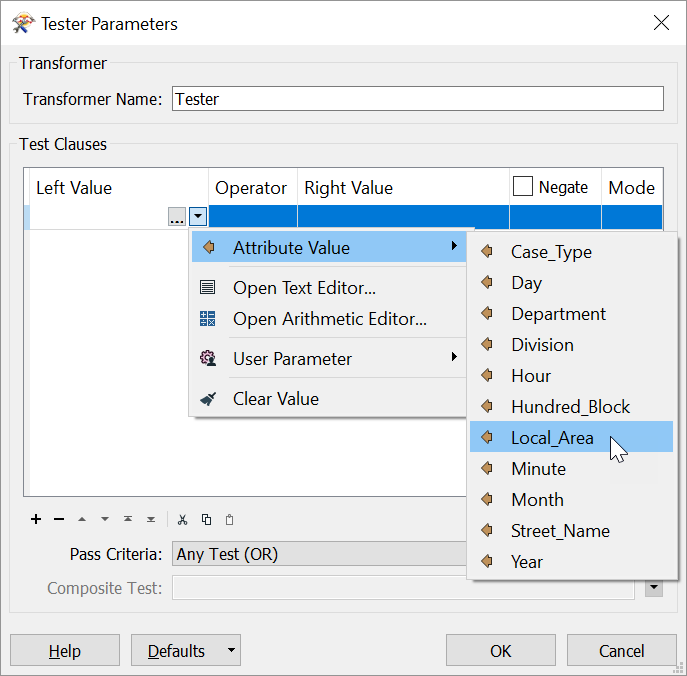

对于“Operator”字段，单击单元格并选择“Attribute Has a Value.”。我们不需要为此运算符填写“Right Value”字段。您的Test Clauses表应如下所示：

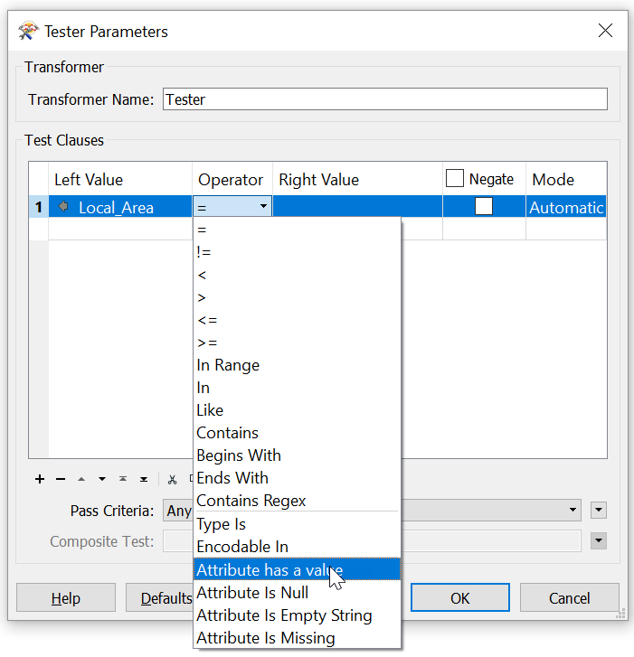

其他属性中可能缺少值，但我们只关注缺少`Local_Area`的情况，因此我们只填写一个test子句。

单击“确定”接受值并关闭对话框。

<P>
您还可以使用<a href="http://docs.safe.com/fme/html/FME_Desktop_Documentation/FME_Transformers/Transformers/nullattributemapper.htm">NullAttributeValueMapper</a>完成此过程。在FME中，通常有多种方法可以解决您的问题。
</p>


# 4）使用要素缓存运行工作空间

既然您已经知道如何使用要素缓存，我们可以使用它来测试我们的新转换器。选择Tester转换器。然后单击“Run To This”图标（请注意，将运行的对象以绿色突出显示）：

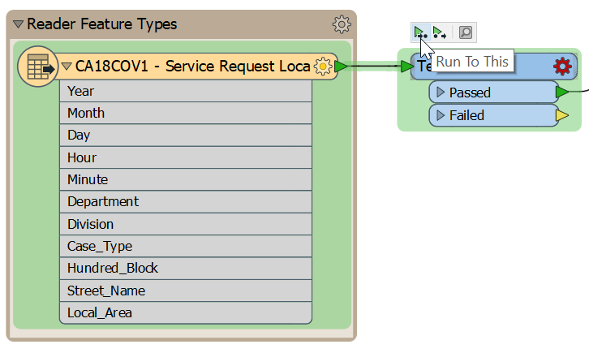

您的工作空间将运行。如果您正确设置了Tester ，它应该没有错误。如果在转换器运行时注意，您可以看到要素计数随着要素在工作空间中流动而增加。转换器完成后，4,122个要素将被过滤到Tester的Failed端口。这些要素没有“Local_Area”的值，并从其余的转换器中删除。

# 5）探索文本编辑器

在[练习2.4](../2.translations/2.09.ex2.4.md)中，我们添加了一个`Date`属性，但它还没有任何值。

您可以在“属性值”列中输入“日期”属性的值。如果您输入“2000年1月1日”，则所有要素都会将该值作为常量接收。但是，我们要做的是创建一个日期属性，它结合（或“连接”）我们现有的日期时间字段：“年”，“月”，“日”，“小时”和“分钟”。

我们可以使用FME的**Text Editor**来做到这一点，它允许我们构造一个表达式来为我们的属性生成值。要打开它，请单击“属性值”单元格，然后单击出现的下拉箭头。您将看到“打开文本编辑器”和“打开算术编辑器”作为选项。单击“打开文本编辑器”：

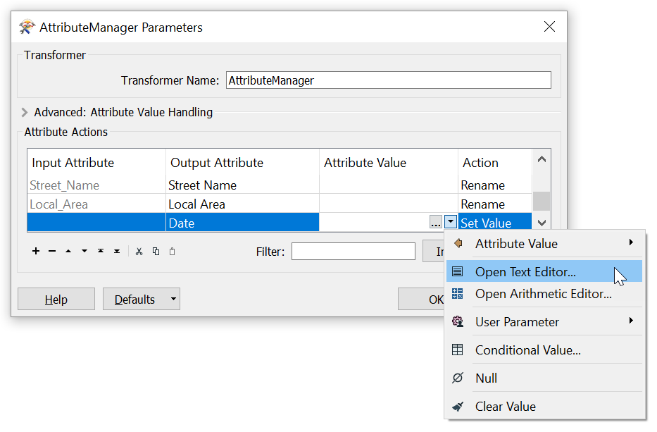

文本编辑器-正如您所期望的那样-允许您构造文本值。它包括您需要的所有常用字符串处理要素，例如连接，剪切，填充和大小写更改。

文本编辑器如下所示：

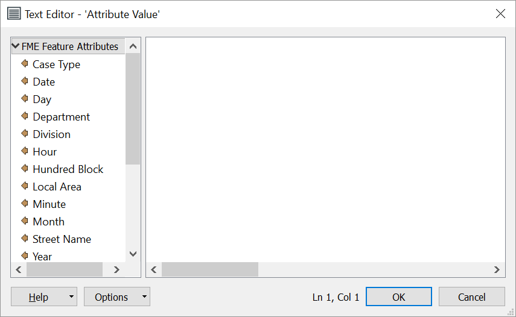

注意左侧的菜单。此处列出了现有属性，并通过双击将其添加到字符串中。另外，请注意其他菜单选项。文本的基本要素是字符串函数：

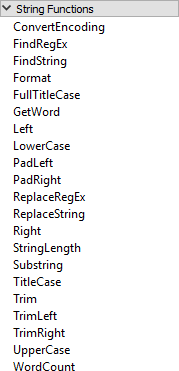

**算术编辑器**包含类似的函数，以及用于计算属性值的数学运算符。

# 6）为`Date`属性创建值

让我们结合现有的属性给`Date`一些值。在“FME Feature Attributes”下的左侧面板中，您将看到列出的所有传入属性。双击属性`Year`。这样做会在文本编辑器窗口中添加`@Value（Year）`。转换运行时，此代码将为每个要素采用“Year”的值。我们可以组合多个属性值来构造日期。在这种情况下，我们将创建一个基本的年/月/日属性，但您可以使用文本编辑器根据需要设置日期格式。

键入正斜杠`/`，然后双击属性`Month`，键入另一个`/`，然后双击属性`Day`。你应该在文本编辑器中看到这个：

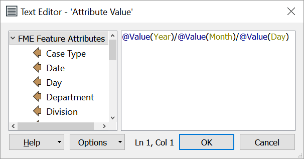

或者，您可以将以下内容复制并粘贴到文本编辑器中：

```
@Value(Year)/@Value(Month)/@Value(Day)

```

单击确定再次单击确定。保存工作空间。然后，在AttributeManager上使用“运行到此”。

许多FME文本和算术编辑器要素来自<a href="https://en.wikipedia.org/wiki/Tcl">Tcl编程语言</a>。如果您不想输入代码，大多数结果也可以使用转换器完成。有关更多信息，请参阅<a href="http://docs.safe.com/fme/html/FME_Desktop_Documentation/FME_Workbench/!Transformer_Parameters/text_editor.htm">文档</a>。


# 7）检查数据

检查AttributeManager要素缓存并检查“表视图”窗口。您可以看到下划线已从属性名称中删除，“Date”属性现在可以正确显示FME标准格式的完整日期/时间：

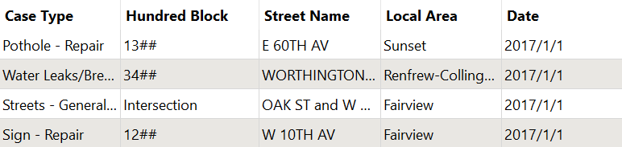

<P>
如果你想使用更现实-但也更复杂-的例子，你可以生成<a href=“https://docs.safe.com/fme/html/FME_Desktop_Documentation/FME_Workbench/!Transformer_Parameters/standard_fme_date_time_format.htm”>标准FME日期/时间戳</a>。为此，请将以下代码复制并粘贴到文本编辑器中：
  <br>
  <code>
    @TimeZoneSet(@Format(%04d,@Value(Year))@Format(%02d,@Value(Month))@Format(%02d,@Value(Day))@Format(<%02d></%02d>,@Value(Hour))@Format(%02d,@Value(Minute))00, local)
  </code>
</p>

<P>
这里的细节并不重要，但如果您需要，请继续阅读。简而言之，我们使用<code>@TimeZoneSet</code>函数将<a href="https://en.wikipedia.org/wiki/UTC_offset">UTC偏移量</a>添加到每个日期/时间戳。我们通过将源数据中的属性组合成匹配​​<a href=“https://docs.safe.com/fme/html/FME_Desktop_Documentation/FME_Workbench/!Transformer_Parameters/standard_fme_date_time_format.htm”的字符串来形成日期/时间戳。>FME日期/时间格式</a>：<code>yyyymmddhhss-UTC</code>。我们的原始数据有单个数字的月，日，小时和分钟缺少前导零，因此我们使用<code>@Format</code>函数来解决该问题。此新属性将更易于在FME工作流程中使用。
</p>

<UL>
<li>使用Tester转换器过滤数据</li>
<li>使用转换器参数创建与writer模式匹配的属性</li>
<li>使用文本编辑器构建属性值</li>
</UL>

