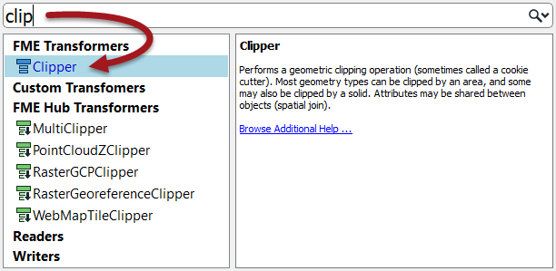
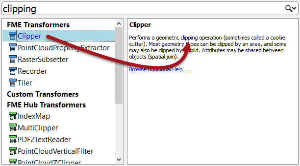
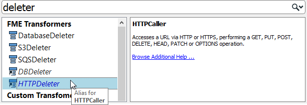
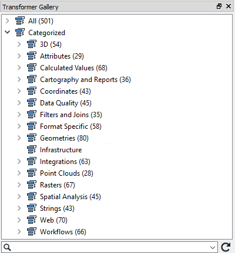
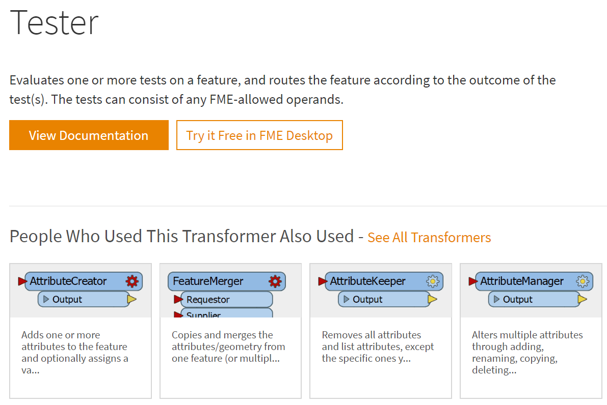
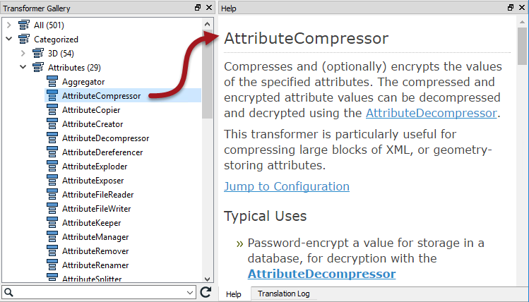

# 定位转换器

即使是经验丰富的FME用户也会发现转换器的完整列表令人望而生畏。拥有超过五百(500)个转换器，FME拥有许多功能;可能比新用户意识到的要多得多，其中很多对他们非常有用。本节帮助您找到您所需要的转换器，即使你并知道你需要它。

虽然转换器列表看起来有点不知所措，但是不要惊慌！现实情况是，大多数用户关注与他们的日常工作流程相关的20-30个转换器。您不需要知道每个转换器也能有效地使用FME。

## 快速添加

查找所需转换器的最简单方法之一是单击画布的空白部分并键入相关关键字。此操作将打开“快速添加”菜单，允许您搜索转换器。

搜索词也可以是完整或部分的单词：

默认情况下，“快速添加”不会查找转换器描述，因此搜索项必须是转换器的实际名称：

但是，如果在打开对话框的情况下按<kbd>Tab</kbd>键，则“快速添加”将搜索转换器描述：

快速添加结果包括别名-例如，备用名称或重命名的转换器-还包括在FME Hub中找到的转换器：

最后，您可以使用CamelCase(驼峰表示法)搜索转换器名称，这对于具有长名称的转换器特别有用，例如，对于RasterCellValueRounder的“rcvr”：

## 转换器库

您还可以在转换器库中查找转换器，它既可以作为Workbench中的窗口，也可以作为[online](https://www.safe.com/transformers/)。有几种方法可以使用库来定位转换器。

### 转换器类别

转换器类别是探索转换器列表的良好起点。转换器按类别分组，以帮助找到与手头问题相关的转换器。

虽然所有这些都很重要，但最常用的转换器属于以下类别：

- **属性** ：属性/列表管理的操作
- **计算值** ：返回计算值的操作
- **过滤器和连接** ：用于分割和合并数据流的操作
- **几何对象** ：创建几何对象或将其转换为不同几何对象类型的操作
- **空间分析** ：返回空间分析结果的操作
- **字符串** ：操作字符串内容的操作，包括日期

单击展开按钮以显示特定类别中的所有转换器。

### 排序转换器

在线转换器库还有一个额外的好处，即允许人们按其受欢迎程度对转换器进行排序（Sort By>Most Used)：

它还允许人们查看相关的转换器。单击转换器将转到其页面。转换器描述下面是相关的转换器部分：

## FME中心

[FME Hub]（https://hub.safe.com/)是一个用于共享FME功能的工具，例如自定义转换器，Web连接和格式：

来自Hub的转换器显示在“快速添加”中，带有绿色和一个小的向下箭头，表示如果选择它们将被下载。

FME Workbench帮助工具显示有关转换器的信息。单击转换器，然后按F1键打开帮助对话框。此工具链接到FME Workbench，以便选择（在库中或画布上)转换器触发要在帮助工具中显示的内容。

另一个有用且可打印的文档是<strong><a href="http://cdn.safe.com/resources/fme/FME-Transformer-Reference-Guide.pdf">FME Transformer Reference指南</a></strong>。

